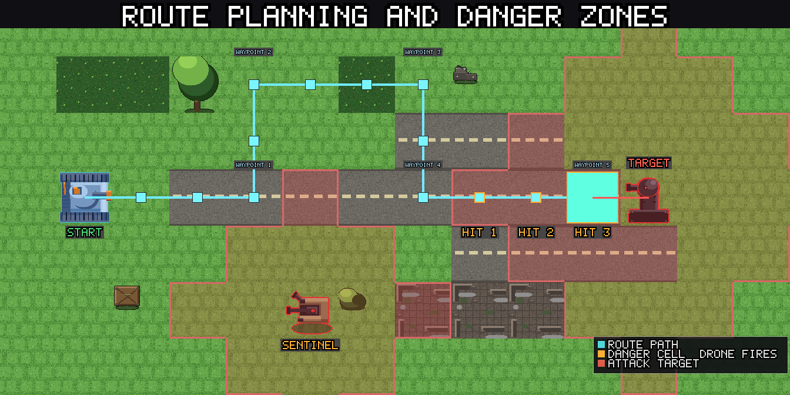
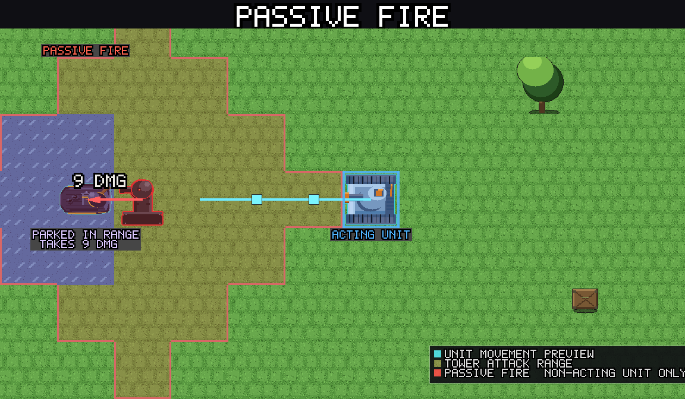
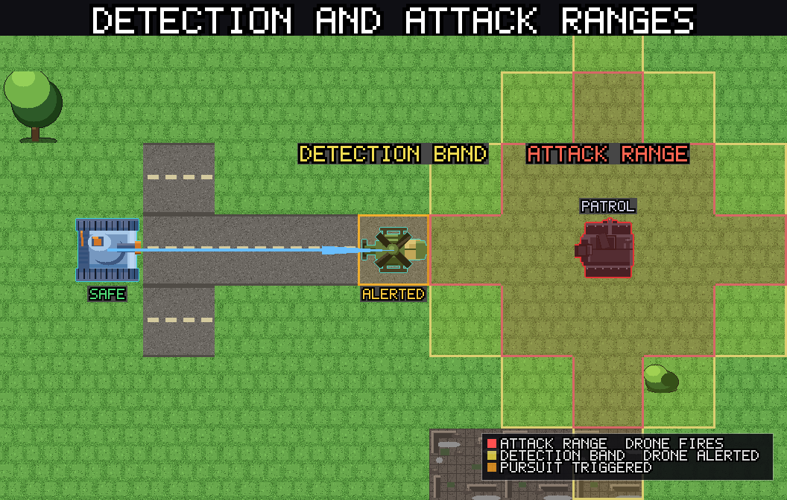

# Advanced tactics

This guide assumes you have finished Chapter 1 and understand the basics. It covers the habits that separate competent play from optimal play: reading multi-step routes carefully, spreading damage deliberately, using limit breaks defensively rather than reactively, positioning before sector transitions, and knowing when destroying a drone is not the right move.

For the full mechanical breakdown of how the reactive system works, see [Reactive Turns](reactive_turns.md).

---

## Reading multi-step routes

The route preview shows total estimated damage for a full path. A useful habit is to read it in segments rather than as a single number.

A route with 30 estimated damage split evenly across 6 steps is very different from one where 25 of those 30 come from a single cell with three guard towers in range. The first route is manageable if your unit has 60 HP. The second route has a single dangerous cell you might be able to avoid with a waypoint.

The detection band matters here too. Pursuit drones shown by the orange outline along your route will close one step every time you move. A patrol shown alerting at step 3 will be in attack range by step 5. The damage the patrol deals does not appear in the "step 3" damage estimate; it appears later in the route because the drone moves toward you. Watch for pursuers that start outside range but will intercept you midway through a long route.

When a route looks expensive, ask: which cell is generating most of the damage? Can a waypoint route around it? Can a different unit take this route and absorb the fire better? Can another unit act first to eliminate the dangerous drone?

---

## Deliberate damage spreading

Passive fire punishes leaving units parked in drone range while another unit acts. The less obvious corollary is that you can use this deliberately: park a unit in range of a drone you want dead, let passive fire trigger a reflex counter, and get a free attack without spending an action.

The most efficient version: position Katyusha within range of a guard tower, then act with Nadeshiko or Maria. The guard tower fires at Katyusha (passive fire, since she is not the acting unit). If the tower is within her attack range, she reflex-counters for free. The tower took a hit and you did not spend Katyusha's action.

This compounds over multi-unit turns. If all three units are positioned within range of different targets before you start acting, each unit can passive-fire and reflex-counter across the action sequence. You can clear two or three drones without any of them being the "acting" unit that drew the fire.

The limit: passive fire still deals damage to your units. This approach trades HP for free attacks. It is most efficient with Katyusha absorbing fire and least efficient with Nadeshiko.

---

## Using limit breaks defensively

Getting Started describes limit breaks as offensive tools. They are often more valuable used defensively.

**Iron Curtain as a survival tool.** When Katyusha is dangerously low on HP and must push through a guarded zone to reach a target, Iron Curtain is sometimes the only way to survive the crossing. Used at the start of an advance rather than at the end, it absorbs the fire that would otherwise destroy her. The counter-attacks are a bonus, not the primary reason to trigger it.

**Storm Run as escape.** Nadeshiko's Storm Run dash can place her anywhere along a straight line within placement range. This includes pulling her backward: if she is surrounded and needs to disengage, Storm Run to a safe cell behind the front line. The dash still damages drones adjacent to the path.

**Broadside as suppression.** Maria's Broadside suppresses drone counterfire during the barrage. This is useful even when the damage alone does not justify it: if Maria needs to fire at a cluster where the counterfire would injure her badly, Broadside lets her deal the hit without taking one back. Think of it as a way to get a free attack turn against a heavily reactive cluster, not just a burst-damage tool.

---

## Charging the limit gauge intentionally

The limit gauge charges faster from taking damage than from dealing it. If you need a limit break for the next sector and the gauge is half-full, routing a unit through one or two reactions is a valid way to top it off.

The calculation: one hit charges the gauge by 10. A full gauge from 50% requires five more hits. If those five hits are absorbed by Katyusha at low incoming-damage cost, you get a limit break into the next sector essentially for free.

Do not try this with Nadeshiko. Her low HP and defense make hit-farming risky. Katyusha and, to a lesser extent, Maria are the appropriate units for deliberate gauge charging.

---

## Sector transition positioning

Your units carry their HP and limit gauge into the next sector. Their position carries over too. The last action in a sector is a setup move for the first action of the next one.

Before the sector ends:

- Move units into terrain cover. Starting a sector exposed to a guard tower on turn one is avoidable if you positioned well at the end of the previous sector.
- Spread units out. Bunched units at the sector start draw passive fire from multiple drones simultaneously. Entering from different directions gives you more angles and reduces overlap.
- Identify the first threat in the new sector, if visible, and position the right unit to address it. If the next sector starts with an artillery drone on a charge, you want to be out of its range or already committed to eliminating it before it fires.

Position is information. A unit in the center of the new sector on turn one can act in any direction. A unit backed into a corner may have only one viable first move.

---

## When not to kill a drone

The instinct is always to destroy threats. Sometimes the right move is to leave a drone alive.

**Patrols on loops.** A patrol following a fixed route that does not overlap with your intended path is harmless as long as you do not cross its detection band. Killing it alerts nearby sentinels and may trigger a chain reaction in a cluster you were not planning to engage. If the patrol is not in your way, leave it.

**Sentinel clusters.** A sentinel does not activate until another drone near it fires. If you can eliminate the guard tower that would wake the sentinel without the sentinel itself activating, the sentinel may remain dormant indefinitely. Waking it deliberately to finish it cleanly is sometimes correct, but so is routing around the entire cluster.

**Repair drones.** If you are about to clear the last drone in a cluster, a repair drone nearby has nothing left to heal. It becomes a low-priority mop-up target rather than an urgent kill. Routing around it to address a more dangerous cluster elsewhere first is often the right call.

**Resource conservation.** Limit breaks are finite per gauge charge. Using Iron Curtain to absorb fire from a single guard tower that Katyusha could survive anyway wastes the gauge on a minor threat. Save the break for the dense cluster or the sector boss.

---

## Pulling patrols

Pursuing drones break off when no unit is within their detection band for one full action. This is exploitable.

Step to the edge of a patrol's detection band, then back away. The patrol alerts and advances one step. If you step back out of range on your next action, the patrol loses you and stops. Repeat this and you can walk a patrol into a position where one of your other units has a clean shot, without committing to the full engagement.

This is most useful for pulling a drone away from a guarded cluster to engage it in isolation, or for repositioning a patrol into terrain where its pursuit path is blocked.

---

## Building toward a hard stage

If you are stuck on a stage, the right response is usually one of three things:

1. **Replay an earlier stage for XP.** Higher unit level means more HP, more attack, and more defense against the same drone HP values. A stage that felt impossible at level 6 may be manageable at level 8.
2. **Reconsider your route.** The route that failed probably had a cell or two generating most of the damage. Approaching from a different angle, or using a unit with better terrain traversal for that specific path, often changes the outcome significantly.
3. **Change the order of operations.** If you are dying on the push to the main cluster, clear one or two flanking drones first to reduce the fire during the main push, even if the flank route costs some HP.

Skill picks can help but are rarely the bottleneck in Chapter 1. A stage that is blocking you at level 5 is usually a routing problem, not a build problem.

See [Getting Started](index.md) for the basics, [Reactive Turns](reactive_turns.md) for the full mechanical breakdown, and [Your Units](characters.md) for unit-specific tactical notes.
