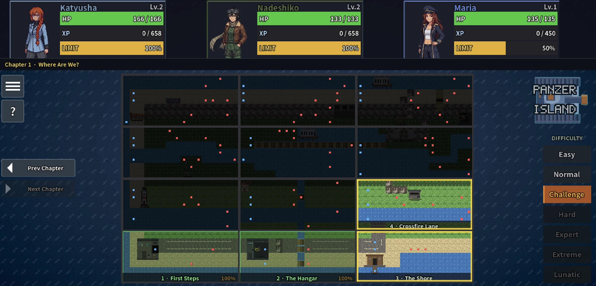
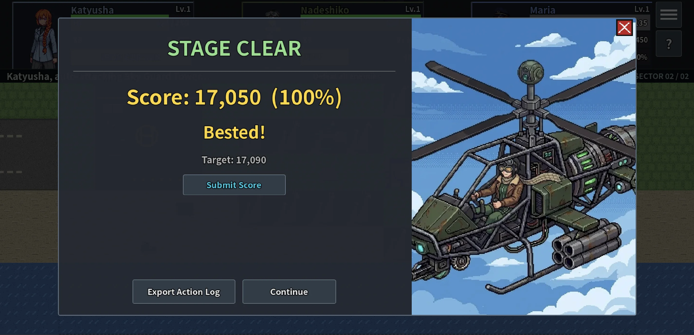

# Challenge mode

Challenge Mode is a separate difficulty track for players who have already cleared a stage and want a tighter, score-based version of it. This guide covers how it differs from the main game, how your score is calculated, and how to submit a run.

---

## How it differs from the main game

Challenge Mode replays the same stages with three changes:

- **Fixed unit stats.** Each stage starts your units at a preset level, HP, and skill loadout instead of whatever you have equipped in your main save. Every player faces the same starting point on a given stage.
- **No limit gauge carry-over.** All three units start every Challenge stage at 0% limit gauge. You have to charge it up yourself during the stage, the same way you would mid-run in the main game.
- **No XP gain.** Challenge Mode progress is entirely separate from your main save. Clearing a stage here does not level up your units or unlock skills there, and vice versa.

Your goal on each stage is not just to clear it, but to clear it efficiently: fewer actions, less damage taken, more kills.

---

## Which stages are available

Challenge Mode covers every stage in the released chapters, not just a curated subset. Any stage you have cleared once in the main campaign unlocks its Challenge Mode version, accessible from its entry on the world map.

Each stage's fixed starting level is chosen to match where a typical playthrough would be by that point, not your own campaign level. A stage late in a chapter starts your units noticeably higher than one near the start, since a normal run would have gained levels along the way.



---

## How the score is calculated

Each stage clear produces a score from three numbers tracked during the run: total kills, total damage taken, and total actions used.

```
score = 10,000 + (kills × 2,000) − (damage taken × 100) − (actions used × 10)
```

The score cannot go below 0. Every kill is worth a lot; taking damage and spending extra actions both cost you, with damage taken being the steeper penalty of the two.

Each stage also has a **target score**, shown on the result screen alongside yours. Your percentage is your score relative to that target. Reaching 100% or more marks the stage as **bested** and unlocks score submission for that run.



---

## How actions are counted

An "action" is counted per command you issue, not per turn or per unit that acts. Moving and attacking are tracked separately, even when they happen in the same motion:

- Moving a unit to a tile is one action, whether it walks one tile or ten.
- Firing a shot is a separate action from the move that set it up. Walking a unit into range and firing counts as two actions: one for the move, one for the shot.
- If a unit is already in range and attacks without moving, that is a single action.
- Auto-attacking through multiple drones in one turn counts each shot on its own, one action per kill.
- Using a limit break is its own action. If the unit has to reposition first, that reposition is a separate action from the limit break itself.

In short, count every move, every shot, and every limit break you commit to during the stage. A unit that walks up and kills something in one motion costs two toward your total, not one.

---

## Where the target score comes from

The target for each stage is produced by an internal solver, a script that plays every stage using a fixed set of priority rules (take a valuable limit break if one is available, otherwise take a free kill, otherwise take a free limit-break kill, and so on down a fixed priority list) rather than search or trial and error. It does not "know" the best possible play; it plays a consistent, disciplined line and reports what score that line achieves. That score becomes the stage's target.

This means the target is a reasonable bar, not a theoretical maximum. Beating it by a wide margin on a stage you know well is entirely possible.

On the hardest stages, taking heavy damage is sometimes unavoidable even when playing well. The score formula cannot go below 0, so on those stages the target itself may show as a low number, or even 0. Bested only requires reaching 100% of that stage's own target, so a stage with a low target is not necessarily an easy 100%; it just means the fixed starting conditions leave little room for a clean run.

Every stage's fixed starting level is checked ahead of time and confirmed clearable before it ships, so a tight-feeling stage is never actually unwinnable. See [Balancing and Math](balancing.md) for how starting levels and difficulty are decided across the whole campaign, Challenge Mode included.

---

## Tips for a better score

- **Prioritize kills over speed.** Each kill is worth more than the actions and damage it usually costs to get it, so trading a couple of extra actions for a confirmed kill is almost always worth it.
- **Avoid damage more than you save actions.** Damage taken is penalized ten times as heavily per point as actions used. Retreating a unit out of range costs one action but can save a much larger score hit.
- **Charge your limit break deliberately.** Since the gauge always starts at 0%, plan when you want it ready rather than assuming it carries over from earlier in the stage.
- **Replay stages you know well.** Familiarity with enemy placement and reaction patterns matters more here than in a first blind clear, since every extra scouting action counts against you.

---

## Submitting a run

When you best a stage (100% or higher), a **Submit Score** button appears on the result screen. Pressing it opens an in-game panel with two steps:

1. **Export your action log.** The same export button used for the run's log saves a JSON file (or, on web, opens a copyable text view).
2. **Email it** to **[panzerisland@proton.me](mailto:panzerisland@proton.me)**, with a button in the panel to copy the address.

Don't have the log handy, or just want to share a good run? A screenshot of the result screen, or even a short email with your score, chapter, and stage, works too. We are happy to get any report of your run.

There is no public leaderboard yet. Submitted runs are read manually and may inform target score tuning in future updates.
