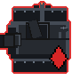
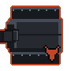
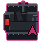
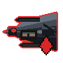
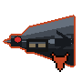
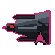
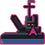
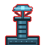

# Drone reference

Drones are autonomous defense units that patrol and protect sectors across Panzer Island. All stat values listed here are base level 1. Stats scale linearly as drones level up with the campaign, but the ratios between drones stay constant: a guard tower is always roughly as dangerous relative to your units at level 20 as it is at level 1.

---

## How to read this page

**HP, Attack, Range** are base level 1 values from the game data.

**Detection band.** Pursuing drones react when a unit enters a zone one cell wider than their attack range. A patrol with attack range 2 has a detection band of 3: it fires at range 2 and pursues when a unit enters range 3. Stationary drones (guard tower, sentinel, artillery) fire when a unit enters their attack range directly; they do not have a wider detection band.

**Pursues.** When a pursuing drone detects a unit, it abandons its route and moves toward the nearest unit each turn until destroyed. Pursuit is permanent once triggered.

**Typed variants.** Many drone types come in anti-ground (`_ag`) and anti-air (`_aa`) variants. Their stats are identical to the base type. The only difference is targeting: `_ag` variants only fire at surface units (Katyusha, Maria), and `_aa` variants only fire at air units (Nadeshiko). Unless otherwise noted, each entry below applies to all three variants of that type.

**Sprite outline and badge colors.** Each sprite below shows the drone exactly as it appears in the game's inspect panel, including the small target-type badge in the lower-right corner. The colors have fixed meanings throughout the game:

- **Red** outline + { .target-badge }: fires at all unit types (base variant)
- **Orange** outline + { .target-badge }: anti-ground only (`_ag`)
- **Pink** outline + { .target-badge }: anti-air only (`_aa`)

Support drones (relay node, spotter, repair drone) have no badge because they do not attack.

---

  <label for="drone-level">Drone level: <strong id="drone-level-display">1</strong></label>
  <input type="range" id="drone-level" min="1" max="100" value="1" step="1">

HP and Attack update to match the selected level. Range and movement type never scale.

---

## Stationary drones

Stationary drones do not move. They fire at any unit that enters their attack range and do not pursue.

### Guard tower

| | | |
|:---:|:---:|:---:|
| { .drone-sprite } | { .drone-sprite } | { .drone-sprite } |
| Guard Tower | Ground Guard Tower | Sky Guard Tower |

| HP | Attack | Range | Moves |
|----|--------|-------|-------|
| 50 | 20 | 3 | No |

**Behavior.** Fires immediately at any unit that enters or acts within range 3. No charge delay. The most common drone in the game.

**Counter.** Maria (range 4) can engage a guard tower from outside its range. Katyusha absorbs the hit well and can turn a guard tower's shot back with Iron Curtain active.

**Watch out for.** Guard towers with overlapping ranges are placed frequently. Moving through one tower's range often puts you inside a second one's range at the same time. The route preview shows cumulative hits from all drones; check the full route before committing, not just the first dangerous cell.

*Typed variants: Ground Guard Tower (`_ag`) fires at surface units only. Sky Guard Tower (`_aa`) fires at air units only.*

---

### Sentinel

| | | |
|:---:|:---:|:---:|
| { .drone-sprite } | { .drone-sprite } | { .drone-sprite } |
| Sentinel | Ground Sentinel | Sky Sentinel |

| HP | Attack | Range | Moves |
|----|--------|-------|-------|
| 55 | 21 | 2 | No |

**Behavior.** Dormant until activated. A sentinel activates when any drone within its detection zone fires. Once active it fires at any unit in range 2 for the remainder of the sector.

**Counter.** Katyusha absorbs sentinel fire well. Maria can reach range-2 sentinels from range 4 if there is water access. Nadeshiko can snipe an isolated sentinel before triggering the adjacent drones that would wake it.

**Watch out for.** Moving through a guard tower's range to reach a target can activate a sentinel nearby that you have not accounted for. Before engaging a cluster, check whether any sentinels sit within range of the drones you plan to trigger. The chain reaction can add unexpected hits to an otherwise clean route.

*Typed variants: Ground Sentinel (`_ag`) activates via surface-targeting fire only. Sky Sentinel (`_aa`) activates via air-targeting fire only.*

---

### Artillery

| | | |
|:---:|:---:|:---:|
| { .drone-sprite } | { .drone-sprite } | { .drone-sprite } |
| Artillery | Howitzer | Flak Battery |

| HP | Attack | Range | Moves |
|----|--------|-------|-------|
| 60 | 19 | 4 | No |

**Behavior.** Detects units at range 5 (detection band). Does not fire immediately: it charges for one player action, then fires at range 4 on the next action. The shot fires at your unit's position during that next action, not where they were when first detected.

**Counter.** Nadeshiko can approach from an unexpected angle by flying over terrain, and can eliminate an artillery drone in one Storm Run pass. The practical approach for other units: bait the charge with a short move, then move out of range before the next action.

**Watch out for.** The shot resolves on your next action after the charge, not at the end of the turn. Moving into range to attack something else and then taking a second action while still in range will take the hit. Clear artillery range before committing to further actions in its zone, not after.

*Typed variants: Howitzer (`_ag`) fires at surface units only. Flak Battery (`_aa`) fires at air units only.*

---

## Pursuing drones

Pursuing drones abandon their route and close distance once they detect a unit. They continue pursuing until destroyed.

### Patrol

| | | |
|:---:|:---:|:---:|
| { .drone-sprite } | { .drone-sprite } | { .drone-sprite } |
| Patrol | Ground Patrol | Sky Patrol |

| HP | Attack | Range | Moves |
|----|--------|-------|-------|
| 45 | 19 | 2 | Ground |

**Behavior.** Follows a fixed route when idle. Detects units at range 3 (detection band). Once alerted, pursues the nearest unit and fires when within range 2.

**Counter.** The most straightforward drone to engage. Any unit can handle a patrol cleanly at close range. Maria can fire from range 3 before it closes in.

**Watch out for.** Once alerted a patrol does not stand still. Plan where it will be on your next action, not where it is now. A patrol that was at medium distance when you moved can be at point-blank range by your next action.

*Typed variants: Ground Patrol (`_ag`) targets surface units only. Sky Patrol (`_aa`) targets air units only.*

---

### Interceptor

| | | |
|:---:|:---:|:---:|
| { .drone-sprite } | { .drone-sprite } | { .drone-sprite } |
| Interceptor | Bomber | Flak Escort |

| HP | Attack | Range | Moves |
|----|--------|-------|-------|
| 50 | 23 | 3 | Air |

**Behavior.** Flies over all terrain, including water, mountains, and forest. Detects units at range 4 (detection band). Once alerted, closes distance aggressively and fires when within range 3. Carries the highest base attack of any standard pursuing drone.

**Counter.** Katyusha. Nadeshiko (10 defense) takes the most damage from interceptors and should not absorb their fire. Katyusha (13 defense, 150 HP) handles interceptors well, and an Iron Curtain counter-attack can kill or severely damage an interceptor in one hit.

**Watch out for.** Interceptors ignore terrain. A patrol is blocked by mountains and water; an interceptor is not. Do not assume Nadeshiko is safe on the far side of impassable terrain from an interceptor.

*Typed variants: Bomber (`_ag`) targets surface units only. Flak Escort (`_aa`) targets air units only.*

---

### Cruiser

| | | |
|:---:|:---:|:---:|
| { .drone-sprite } | { .drone-sprite } | { .drone-sprite } |
| Cruiser | Gunboat | Flak Boat |

| HP | Attack | Range | Moves |
|----|--------|-------|-------|
| 60 | 22 | 4 | Water |

**Behavior.** Water-only. Detects units at range 5 (detection band). Pursues any unit within the water network and fires when within range 4. The highest HP of any standard pursuing drone.

**Counter.** Maria is the natural counter, but cruiser range (4) exceeds Maria's attack range (3). Maria will take a hit any time she engages a cruiser directly. Use Broadside to suppress counterfire while clearing the sector, and budget Maria's HP accordingly for cruiser-heavy stages.

**Watch out for.** Katyusha and Nadeshiko are not targeted by cruisers unless they are on water tiles. Cruisers are almost exclusively Maria's problem, which makes any stage with multiple cruisers expensive for her HP pool. Do not let Maria take avoidable damage earlier in the stage if cruisers are present later.

*Typed variants: Gunboat (`_ag`) targets surface units only. Flak Boat (`_aa`) targets air units only.*

---

## Support drones

Support drones do not attack directly. They amplify the threat of nearby attack drones. Treat them as priority targets when present.

### Relay node

| |
|:---:|
| { .drone-sprite } |
| Relay Node |

| HP | Attack | Buff radius | Moves |
|----|--------|-------------|-------|
| 35 | None | 4 | No |

**Behavior.** Extends the attack range of all attack drones within 4 cells by 1. The buff applies to every drone in radius simultaneously. When the relay node is destroyed, all buffed drones immediately revert to their normal attack range.

**Counter.** Any unit. The relay node has low HP and does not fight back. Killing it first is almost always correct.

**Watch out for.** If a guard tower or patrol seems to be hitting from an unusual distance, a relay node is nearby. The in-game range overlay reflects the buffed range, so the warning indicators look normal: the range diamond is simply wider than the type's base stats would suggest. When drones reach further than their type implies, scan for a relay node before routing.

*First introduced in Chapter 3.*

---

### Spotter

| |
|:---:|
| { .drone-sprite } |
| Spotter |

| HP | Attack | Mark range | Moves |
|----|--------|------------|-------|
| 19 | None | 5 | No |

**Behavior.** Marks any unit within range 5. A marked unit takes 50% more damage from all sources. The mark persists until the spotter is destroyed. Does not attack.

**Counter.** Any unit. The spotter is the most fragile drone in the game and dies in one hit from most attacks at any reasonable level.

**Watch out for.** Spotters are typically placed behind attack drones so you take hits approaching them. The route preview shows incoming damage correctly including the mark bonus, but it does not label the reason. If damage estimates look unexpectedly high, a spotter may have already marked your unit on a prior step. Destroy the spotter before engaging the cluster it covers whenever possible.

*First introduced in Chapter 3.*

---

### Repair drone

| |
|:---:|
| { .drone-sprite } |
| Repair Drone |

| HP | Attack | Heal per turn | Moves |
|----|--------|---------------|-------|
| 26 | None | 7% max HP | Air |

**Behavior.** Flies. Does not attack. Each player action, heals all attack drones within radius 5 by 7% of their maximum HP. Continues healing as long as it is alive and neighboring drones are damaged.

**Counter.** Kill it as soon as possible. The repair drone can undo several turns of progress in a few actions. It has low HP and does not fight back, but it flies and is often positioned behind the drones it is protecting.

**Watch out for.** Killing the frontline drones first to reach the repair drone gives it time to heal them. Look for a flanking route that reaches the repair drone directly, or use Nadeshiko's mobility to go around the frontline entirely.

*First introduced in Chapter 3.*

---

## Rushers

Rushers are single-use drones that pursue the nearest unit and detonate on contact, dealing area damage. They die when they attack. Kill them before they close in.

### Detonator

| | | |
|:---:|:---:|:---:|
| { .drone-sprite } | { .drone-sprite } | { .drone-sprite } |
| Detonator (Ground) | Detonator (Air) | Detonator (Water) |

| HP | Attack | AoE radius | Moves |
|----|--------|------------|-------|
| 20 | 100 | 1 | Ground / Air / Water |

**Behavior.** Pursues the nearest unit immediately upon activation. On contact (range 1), detonates for the listed attack damage in a radius-1 area of effect, hitting all units caught in the blast. Destroyed on detonation. All three movement variants share the same stats.

**Counter.** Kill it in one action from a safe distance. Any unit can one-hit a detonator at low levels; check the HP before assuming a one-shot at higher levels. Maria can snipe from range 3; Katyusha and Nadeshiko from range 1 or 2. Do not leave it alive while handling other targets.

**Watch out for.** The attack value scales steeply: at level 10 the blast hits for 209, at level 20 for 309. A detonator that reaches your cluster while multiple units are nearby can end the sector at any campaign stage. Treat it as the highest priority target the moment it appears.

The air variant flies over any terrain. Nadeshiko cannot hide behind water or mountains from it. The water variant pursues water-bound units, primarily Maria.

*First introduced in Chapter 4.*

