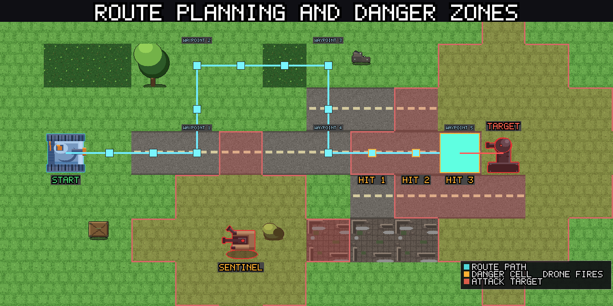

# Keyboard controls

On desktop, Panzer Island can be played almost entirely from the keyboard. This guide covers what each key does, how the arrow keys change meaning depending on what you are doing, and how to remap everything in the Options menu. Touch devices have no keyboard shortcuts, so none of this applies on Android.

Every shortcut does exactly what the matching on-screen button does. If a button is hidden or grayed out, its key does nothing. You cannot use a shortcut to do something the interface would not let you do with the mouse.

---

## Default keys

| Key | Action |
|---|---|
| **K** | Select Katyusha |
| **N** | Select Nadeshiko |
| **M** | Select Maria |
| **E** or **Enter** | Execute |
| **Q** | Add to queue |
| **C** | Cancel |
| **Z** | Undo (Easy difficulty) |
| **Backspace** | Remove the last queued action |
| **I** | Open unit details |
| **L** | Fire a limit break |
| **T** or **Tab** | Lock the next reachable drone as the attack target (**Shift** goes back) |
| **+** | Zoom in |
| **-** | Zoom out |
| **0** | Reset zoom |
| **Arrow keys** | Step a route, aim, browse, or page chapters (see below) |
| **Esc** | Pause menu |
| **F11** | Toggle fullscreen |

Esc, F11, Enter, Tab, and the numpad **+**, **-**, and **0** keys are fixed. You cannot remap them, and you cannot assign them to another action. The numpad keys work as extra zoom keys alongside the main ones.

---

## Planning a move with the keyboard

A full move can be done without touching the mouse.

1. Press **K**, **N**, or **M** to select a unit.
2. Press an arrow key to take the first step of the route. Each press moves the route one cell in that direction.
3. Keep pressing arrow keys to extend the route. The route preview updates after every step, so you can watch the predicted damage as you go.
4. Press **E** or **Enter** to execute the route.

To shorten a route, press the arrow key that points back at the previous cell. Stepping back onto the previous waypoint removes the last step. Stepping back off the first step clears the route and leaves the unit selected.

To attack, step the route into a cell that holds a drone. That drone becomes the attack target, the same way it does when you drag a path with the mouse. For drones that are further away, see the next section.

Press **C** to cancel a route in progress. If you have a unit selected but have not started a route, **C** deselects it.

Press **I** with a unit selected to open its details panel.

Press **L** to fire a limit break. With a unit selected, it fires that unit's limit break, and only when its gauge is full. With nothing selected, it fires the first ready one in the order Katyusha, Nadeshiko, Maria. It works like pressing the glowing gauge: the usual confirmation appears first, and **E** or **Enter** accepts it while **C** cancels. The key does nothing while the gauge is not ready, during enemy animations, or in modes where the gauge is hidden.

---

## Aiming at distant drones

Some drones cannot be reached by walking. Maria only moves on water, for example, so a drone on land is out of her path, even when she can hit it from the shore. The keyboard has two ways to target these drones.

### The aiming cursor

When you press an arrow key toward a cell your unit cannot walk to, the route stays where it is and a yellow aiming cursor appears on that cell. It does not move the unit or change the route.

- Keep pressing the arrow keys to move the cursor. It can cross land, mountains, and water alike, as long as the cell is within attack range of somewhere your unit can stand. Maria, with a range of 3, can aim at land tiles up to three cells from the water she can reach.
- When the cursor lands on a drone, that drone is locked in as the attack target, exactly as if you had clicked it. The route to a firing position is planned for you. You can then press **E** to execute, or keep extending the route.
- To drop the cursor, step it back onto the cell where it started, or press **C**. A second **C** then cancels the route as usual.

The locked drone also gets the same range outline and stat tooltip you see when hovering with the mouse.

### Cycling targets

Press **T** or **Tab** to lock the nearest drone your unit can reach. Press it again for the next one, and the list wraps around. Hold **Shift** to go backwards. Drones that cannot be reached are skipped.

If no unit is selected, **T** or **Tab** first selects Katyusha, then locks the nearest drone she can reach. If Katyusha is not available, it falls back to Nadeshiko, then Maria.

Each press that needs the unit to move first plans the firing position for you. The next press swaps that position for the new target instead of adding another step.

---

## Zooming

The **+** and **-** keys zoom the stage camera in and out, one mouse-wheel step per press, and they repeat while held. **0** resets the zoom to the default view. The numpad **+**, **-**, and **0** work too. On keyboards where **+** or **-** sit on different keys, the character itself is recognized, so the usual keys work either way.

Like the mouse wheel, the zoom keys pause during enemy animations and while a popup is open.

---

## The queue

The queue lets you plan actions for several units and run them in one go.

- **Q** adds the current route to the queue.
- **E** or **Enter** runs the queued actions. When a route is waiting for confirmation, **E** confirms that route first.
- **Backspace** removes the most recently queued action.
- **C** cancels the queue before it runs.
- With nothing selected, the **Left** and **Right** arrow keys browse through the queued actions, the same as the **<** and **>** buttons.

---

## Arrow keys by context

The arrow keys do different things depending on what is on screen.

| Situation | Left and Right | Up and Down |
|---|---|---|
| A unit is selected | Step the route one cell, or move the aiming cursor | Step the route one cell, or move the aiming cursor |
| Nothing selected, queue has actions | Browse queued actions | No effect |
| Undo browser is open | Step through checkpoints | No effect |
| World map | Previous and next chapter | Previous and next mode or difficulty |

On the world map, Left and Right page through chapters exactly like the chapter buttons, including the same locks. A chapter you have not unlocked stays out of reach. Up and Down move through the mode and difficulty selector one row at a time, skipping locked rows and stopping at the ends. Any confirmation dialog that clicking would show appears here too.

---

## Undo

Undo is available on Easy difficulty. See the [FAQ](../faq.md) for how checkpoints work.

1. Press **Z** to open the undo browser.
2. Press **Left** and **Right** to step through earlier checkpoints.
3. Press **Z** again, **E**, or **Enter** to rewind to the checkpoint you picked.
4. Press **C** to leave the browser without changing anything.

While the browser is open, these are the only keys that act. Unit selection and route keys wait until you leave it.

---

## Popups and dialogs

Popups take the same keys, so you can keep your hands on the keyboard.

- **E** or **Enter** presses the popup's OK, Yes, or Continue button.
- **C** closes the popup, the same as Esc. On a yes or no question, **C** answers No.

This covers tutorial popups, confirmation dialogs, level-up choices, memory fragments, and the stage and chapter result screens. Popups that offer several equal choices have no single OK button, so **E** does nothing there. When you type into a text field, such as your player name, the keys type normally and never trigger a shortcut.

---

## Remapping keys

1. Open **Options**.
2. Choose **Controls**.
3. Click the key button next to the action you want to change. It reads "Press a key...".
4. Press the new key.

A few rules apply.

- **Esc** cancels the capture without changing anything.
- **F11**, **Enter**, **Tab**, the numpad **+**, **-**, and **0**, and modifier keys on their own (Shift, Ctrl, Alt, Meta, Caps Lock) cannot be assigned. The page tells you when a key is refused.
- If the key you press is already used by another action, the two actions **swap** keys. The page names the action that moved, so nothing is ever left without a key by accident.
- **Reset Keys to Defaults** restores every shortcut at once.

Your choices are saved with your other settings.

Keys are stored by physical position, not by the letter printed on the keycap. If you play on a QWERTZ or AZERTY keyboard, the defaults stay under the same fingers as on a QWERTY keyboard, and the Controls page shows the label from your own layout.

---

## Quick reference

1. **K**, **N**, **M** select a unit. **I** opens its details. **L** fires a ready limit break.
2. Arrow keys step the route. Step backward to undo a step.
3. Arrow keys toward unwalkable cells start the aiming cursor. Land it on a drone to lock the target.
4. **T** or **Tab** locks the next reachable drone. **Shift** goes back.
5. **E** or **Enter** executes. **C** cancels. **Q** queues.
6. **Z** opens undo on Easy. Arrow keys browse. **Z** or **E** confirms.
7. **+**, **-**, and **0** zoom in, zoom out, and reset.
8. **E** and **C** also answer popups.
9. Remap everything except Esc, F11, Enter, Tab, and the numpad zoom keys under **Controls** in Options.

---

## Other guides

**[Getting Started](index.md)**
The core ideas you need for Chapter 1: reactive movement, route previews, and spreading damage.

**[Advanced Tactics](advanced.md)**
Reading multi-step routes and planning actions across several units.

**[Challenge Mode](challenge-mode.md)**
A score-based replay of any cleared stage, where fast and precise input pays off.
