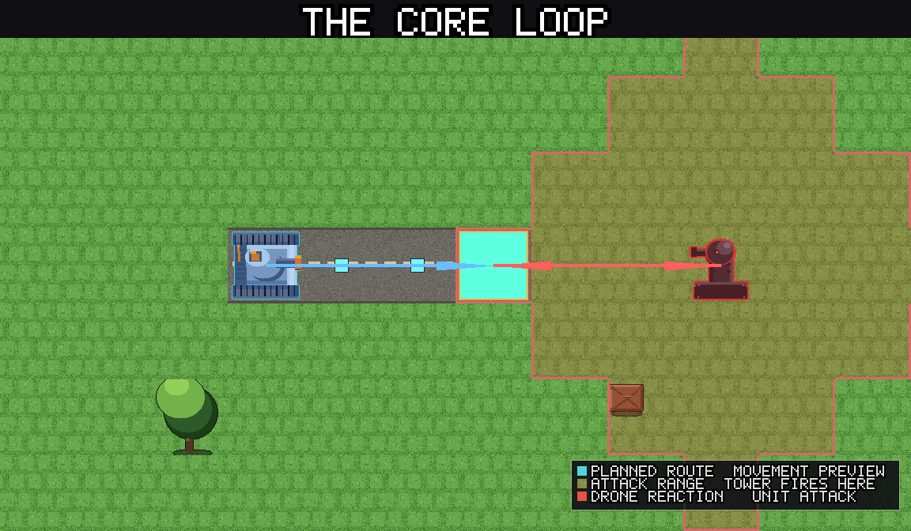
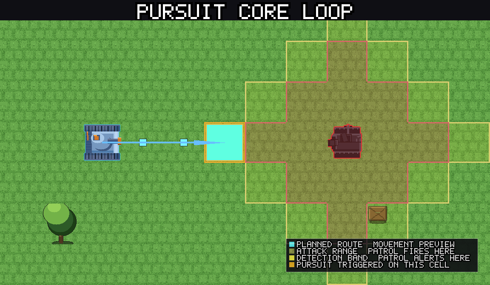
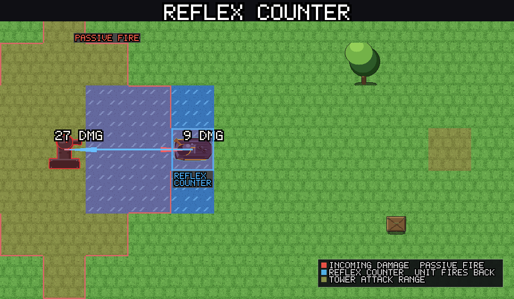
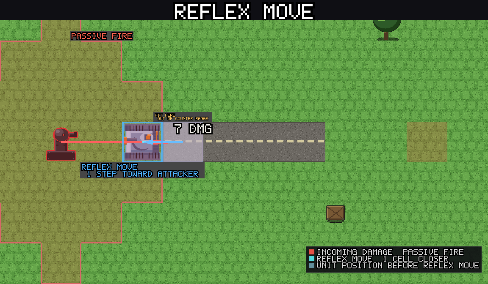
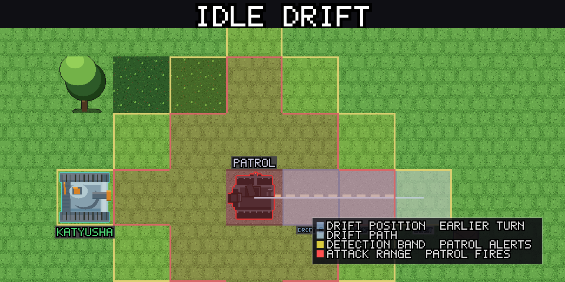
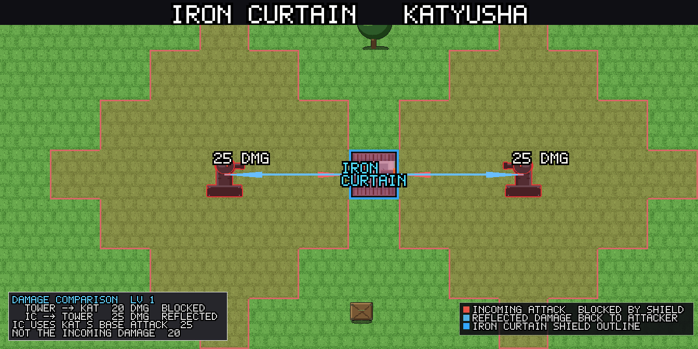
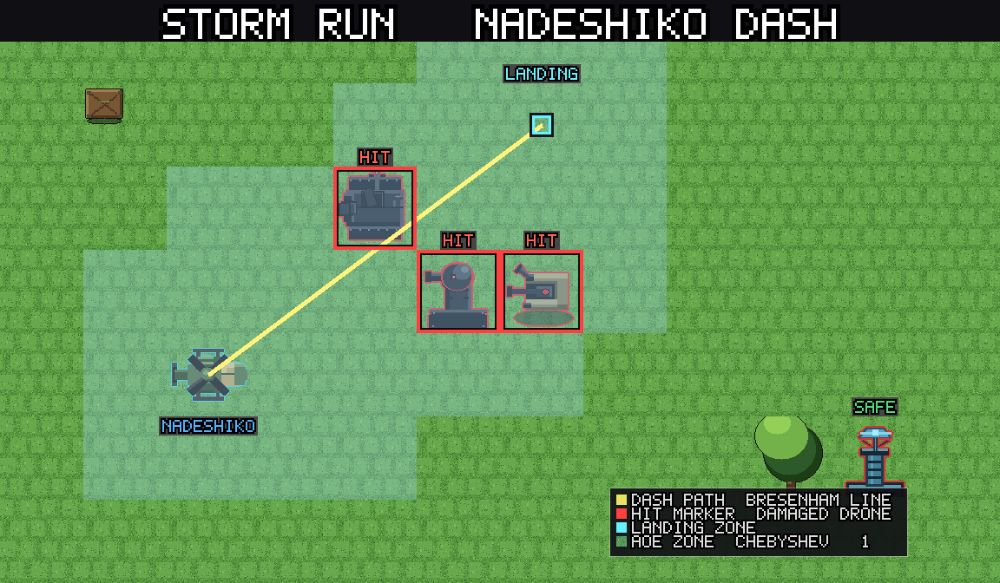
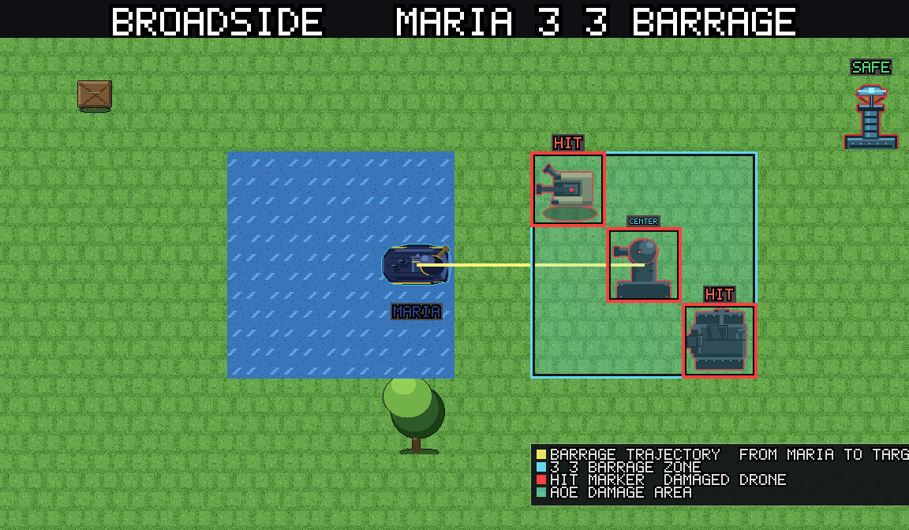

# A New Take on Round-Based Strategy: Reactive Turns

## What Makes This Different

Most turn-based strategy games give each unit a fixed movement range and an
"end turn" button. Enemies wait patiently until you finish every action, then
take their entire turn at once. This creates a predictable rhythm but also an
unrealistic one: units can sprint across open ground with impunity, and
positioning only matters when it is your opponent's turn to move.

Panzer Island replaces this with a **reactive turn system**. The core idea is
simple: every time one of your units moves or attacks, every drone in detection
range reacts immediately. There is no "end turn." You act freely, but every
action has consequences the moment you take it.

---

## The Core Loop

Every player action follows the same structure:

```
1. Select a unit
2. Plan a route (move, attack, or both)
3. The unit takes one step
4. Every drone in detection range reacts to that step
5. Repeat steps 3-4 until the route is complete
6. If an attack was planned, the unit fires
7. Every drone in detection range reacts to the attack
8. Drones that haven't fired yet may fire at other units
9. Non-acting units may counter-attack or reposition reflexively
10. Idle drones drift one step
```

There is no "enemy phase." Drones react during your own action, in real time
(or rather, step by step). You see every shot as it happens.



When a mobile drone detects your unit at the edge of its detection band, it
alerts and begins pursuit — closing distance every step:



---

## Movement: No Fixed Range

Your units do not have a movement range in the traditional sense. Any walkable
cell on the map is reachable in a single action. The cost of moving is not a
hard limit on distance — it is the cumulative drone fire you absorb along the
route.

Every cell you cross triggers a reaction from every drone that can see you at
that moment. A straight line across open ground under three guard towers is
much more expensive than a route through forest cover that breaks line of
sight. The game's route preview shows you exactly which cells are dangerous,
and the estimated damage, before you commit.


**Waypoints.** You can add intermediate waypoints to your route by tapping
intermediate cells. This lets you route around danger zones or use one unit to
draw drones into a position where another unit can attack them.

**Drag or tap.** On touch screens you can drag your finger along the desired
path; on desktop you tap each waypoint. Either way, the preview updates in
real time.

---

## Drone Detection and Reaction

Every drone has an **attack range** (how far it can hit) and a detection
band one cell wider (`attack range + 1`). When your unit enters that band,
the drone reacts.

The reaction happens in two passes:

**Pass 1 — Alert and queue attacks.** Every drone in range evaluates your
moving unit. Stationary types (guard towers, artillery) fire if you are within
attack range. Mobile types (patrols, interceptors, cruisers) become **alerted**
and queue a shot if in range, or begin pursuit if you are in the detection band
but not yet in attack range.

**Pass 2 — Fire and animate.** Each queued attack plays a projectile animation
and applies damage. Iron Curtain counters (if active) fire back after all
projectiles resolve.

**Pass 3 — Pursuit step.** Every alerted mobile drone takes one step toward
your unit. If that step brings it into attack range, it fires immediately from
its new position. This is critical: a multi-cell move cannot outrun pursuit
because the drone moves after every single step, not just at the end of your
action.

### Drone Type Behaviors

| Type | Behavior |
|------|----------|
| Guard Tower | Stationary. Fires every time a unit steps into range. |
| Patrol | Mobile. Alerts and fires when in range; pursues one step per action-step while alerted. |
| Sentinel | Stationary until alerted by another drone's reaction nearby. Then fires like a guard tower. |
| Interceptor | Mobile, aerial (ignores terrain). Same alert/pursue as patrol, but faster at closing distance due to terrain immunity. |
| Artillery | Stationary, long range. Fires when a unit enters its wide radius. Cannot move. |
| Cruiser | Water-only mobile. Same alert/pursue as patrol, restricted to water cells. |
| Nexus / Nexus Light | Stationary boss. Fires at anything in range every action; retaliates with an AoE pulse when damaged. Nexus summons an escort every 3 player actions. |
| Relay Node | Stationary, no attack. Boosts attack range of nearby drones while alive. |
| Spotter | Stationary, no direct attack. Marks units in range, increasing damage they take from other drones. |
| Repair Drone | Aerial mobile. Heals damaged allies within repair radius, or moves toward them if too far. |
| Detonator | Mobile kamikaze. Chases the nearest unit. If it reaches adjacency, it self-destructs in a blast that hits all units within one cell Manhattan. Any single attack destroys it. |
| Rocket Launcher | Stationary. Charges a counter every action step; at 5 charges fires a heavy AoE barrage at all units within range. |

---


## Pursuit and Break Off

When a mobile drone becomes alerted, it enters **pursuit mode**. It takes one
step per player action-step toward the nearest reachable unit. The drone
prioritizes the unit that triggered its alert but switches to the closest
reachable target if that unit moves out of its detection band.

A drone **breaks off pursuit** when no unit is within its detection band
(`attack range + 1`). When it breaks off, it stops moving and a flash
indicates it is no longer tracking you. Drones that break off do not
immediately re-alert if you step back into range next action — they react
freshly on your next move.

The game draws a **pursuit outline** on the map preview: orange cell borders
around every drone that would alert and pursue along your planned route. You
can see exactly what you are waking up before you commit.

---

## Passive Fire

Drone reactions only fire at the **acting unit** — the one that just moved or
attacked. But what about your other units standing in drone range while
Katyusha advances?

At the end of every action, a passive fire pass runs. Every drone that did
**not** fire during the action's reaction phase shoots at the closest
non-acting unit within its attack range. Each drone fires at most once per
action, and the shot goes to the closest eligible target (Manhattan distance
ties broken by unit order).


This means you cannot safely leave Maria parked in a cruiser's range while
Nadeshiko moves elsewhere. Standing in range is dangerous even when you are
not the one acting.

---

## Reflex Responses

When a non-acting unit takes damage from passive or pursuit fire, it may
**reflex** — react without waiting for you to select it. Two types:

**Reflex counter.** If the damaged unit has a drone in its own attack range,
it fires back immediately. This is a free attack, does not consume an action,
and happens once per unit per action. A unit that already counter-attacked
cannot counter again in the same action (no infinite chains).



**Reflex move.** If the damaged unit has no drone in attack range but
`reflex move` is enabled (on by default), it takes one step toward the nearest
threatening drone. This helps close the distance so your unit can attack on
its next action. Reflex move is suppressed for units that have a queued
action, so their planned route is not disrupted.



(Reflex is currently limited to Chapter 1 Stage 6 onward and can be toggled
in options.)

---

## Idle Drift

Non-alerted mobile drones do not stand still forever. During the end-of-action
tick, each one takes one step toward the nearest reachable unit that it can
target. The priority order is Katyusha → Nadeshiko → Maria (by proximity,
with this tiebreak).



A patrol that cannot see you yet will drift one cell closer every action.
This means you cannot safely bypass a patrol by staying out of its detection
band indefinitely — it will eventually close the gap and become a threat.

Stationary drones (guard towers, artillery, nexus) do not drift.

---

## Limit Breaks and Iron Curtain

**Limit Breaks** are special abilities that charge over the course of a stage.
Each unit has its own gauge (0-100), which fills by dealing and receiving
damage. When full, you can trigger the Limit Break instead of a normal action.

- **Katyusha — Iron Curtain:** Activates a protective counter-shield. While
  active, incoming damage is blocked and she counter-attacks up to 2 unique
  drones that fire on her (3 with the Extended Curtain skill). Hits beyond
  the cap deal damage normally.

  

- **Nadeshiko — Storm Run:** Dashes in a straight line, damaging every drone
  adjacent to any cell on the dash path. She can walk into position first if
  the target is outside placement range. Drone reactions resolve after the
  dash completes.

  

- **Maria — Broadside:** Fires a 3x3 barrage centered on a target cell,
  damaging every drone in the square. She stays in place (she can reposition
  first). Drone reactions from the barrage are suppressed — drones take damage
  but do not counterattack.

  

Limit Breaks reset to zero at the start of each stage and can charge multiple
times within a stage if the unit keeps dealing and receiving damage. There is
no per-stage cap.

---

## Sectors (Multi-Layer Stages)

Many stages are split into **sectors** (called layers internally). You clear
one sector, then advance to the next. Each sector transition:

1. Plays a "SECTOR N/M" banner
2. May play a short cutscene
3. Shows a tutorial tip if relevant
4. Respawns drones for the new sector
5. Preserves your units' HP, limit gauge, and position
6. Units that were destroyed in a prior sector do not return

On Easy difficulty, every action creates an undo checkpoint. You can browse
back through the current stage's checkpoints and restore to any prior state,
even across sectors.

---

## Queue Mode

Enabled by default, Queue Mode lets you plan multiple units' actions before
executing any of them. Instead of confirming each action immediately, tap
**Add to Queue** to stack plans, then tap **Execute** to run the entire batch
in order.

When the queue executes, each planned action runs fully (move + reactions +
attack + passive fire + reflex) before the next plan begins. This lets you
sequence a multi-unit assault: Katyusha walks in to absorb tower fire (and
her Iron Curtain counters), then Nadeshiko dashes through the alerted drones
while they are still targeting Katyusha.

You can cancel the queue mid-execution. Completed plans stay resolved;
remaining plans return to the queue bar.

---

## Key Takeaways

1. **Movement is damage.** Every cell is a potential hit. Prefer short routes
   through cover over long sprints across open ground.

2. **Pursuit compounds.** A multi-cell move against an alerted interceptor
   triggers it every step, both as a reaction and as pursuit fire. One long
   move can absorb more damage than several short moves with pauses.

3. **Spread the damage.** Drones fire at the acting unit per step but switch
   to parked units during passive fire. Rotate which unit advances so no
   single unit absorbs all the fire.

4. **Watch the pursuit band.** Drones alert one cell beyond their attack
   range. You can bait a patrol into overextending by stepping to the edge
   of its detection band, then pulling back while it pursues into your other
   unit's attack range.

5. **Priority targets.** Relay nodes and spotters multiply the threat of
   nearby drones. Eliminate them first. Detonators die in one hit — deal with
   them before they reach your line.

6. **Reflex is free damage.** Park a hard-hitter (Katyusha) in guard tower
   range during another unit's action. The tower fires at her (passive), she
   reflex-counters for free, and you did not spend an action on it.

7. **Limit Breaks charge faster under fire.** If you need a Limit Break for
   the next sector, let the unit take some hits to charge its gauge. Damage
   received fills the gauge faster than damage dealt.

8. **Sectors reset the board, not your units.** HP and limit gauge carry
   forward. Use the last actions of a sector to position your units favorably
   and charge limit gauges for the next sector.

9. **Break off resets the drone.** A drone that breaks off pursuit clears its
   alert state. If you can outrange it for one full action, it stops chasing
   and you reset the engagement.
