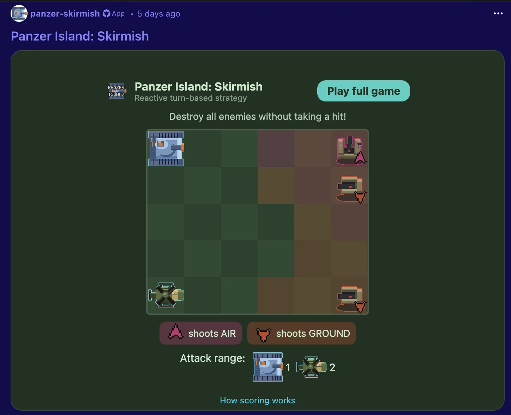

# Panzer Island: Skirmish



[Panzer Island: Skirmish](https://www.reddit.com/r/PanzerIsland/comments/1k1q0z5/panzer_island_skirmish/) is a free version of Panzer Island playable directly inside a Reddit post. This guide covers the splash screen puzzle, how scoring and leaderboards work, and how it relates to the full game.

---

## The splash screen puzzle

When you first open the post, you see a playable mini-puzzle instead of a static banner. It is a small tactics board where you control two of the three starting units against stationary drone towers. The goal is to destroy every tower without taking any damage.

A new puzzle rotates in each day (based on UTC), drawn from a pool of ten boards of varying size and layout. Each board uses a subset of Katyusha, Nadeshiko, and Maria, and features typed sentinel and guard tower drones that only target specific unit types. Figuring out which unit can safely approach which tower is the core of the puzzle.

Winning the puzzle shows a confetti celebration and a prompt to launch the full Skirmish game. Tapping **Play** or **Challenge** opens the full game from cached assets, so it boots nearly instantly. The puzzle also prefetches the game bundle in the background on your first interaction, so by the time you finish the puzzle the full game is ready to go.

A link to this guide is available from the splash screen itself for reference.

---

## What you get

Skirmish contains all 10 stages of Chapter 1, with Katyusha, Nadeshiko, and Maria all unlocked from the start. There is no story, no cutscenes, and no chapter progression. Pick any stage directly from the map and play it.

---

## Picking a stage and mode

Tapping a stage on the map opens that stage's leaderboard first, not the stage itself. From there:

- Choose **Easy** or **Challenge** with the toggle at the top. This switches which leaderboard you are looking at.
- Press **Play** to start the stage in whichever mode is selected.
- Press **Cancel** to go back without starting anything.

**Easy** plays with tutorials and the undo tool available. **Challenge** uses fixed unit stats and no undo, the same rules as the full game's [Challenge Mode](challenge-mode.md).

---

## How the score is calculated

Both modes score a stage clear the same way [Challenge Mode](challenge-mode.md#how-the-score-is-calculated) does:

```
score = 10,000 + (kills × 2,000) − (damage taken × 100) − (actions used × 10)
```

Easy mode has one addition: every use of undo subtracts an extra 500 points.

```
score = 10,000 + (kills × 2,000) − (damage taken × 100) − (actions used × 10) − (undo uses × 500)
```

The score cannot go below 0.

---

## Target scores and percentage

Each stage has a target score, and your percentage on the result screen is your score relative to it. Challenge mode's target is the same fixed value used by the full game's Challenge Mode. Easy mode's target is 10% lower, since Easy allows undo and generally forgives a rougher run.

---

## Leaderboards

Every stage has two separate leaderboards, one for Easy and one for Challenge. Clearing a stage submits your score automatically; there is no separate submit step. Open a stage's leaderboard from its tile on the map, or from the stage-clear screen right after finishing it, to see the top 10 and your own rank.

A `dev` entry appears on every leaderboard as a baseline, set at that stage and mode's target score. Beating it means you cleared the stage at or above the target.

---

## Nothing is saved between sessions

Skirmish does not save progress. Every time you open it, your units start at level 1 with nothing unlocked beyond the three starting units, and every stage is playable from the start. Your leaderboard scores are the only thing that persists: they live on Reddit's servers, tied to your Reddit account, not to your browser or device.

---

## Playing the rest of the game

Skirmish is Chapter 1 only. The full game continues past it with five more chapters, a full story, and permanent progression. See the [homepage](../index.md) for where to play it on Steam, Google Play, or itch.io.
