# Panzer Island

**A reactive turn-based strategy game for PC, Android, and web.**

In most turn-based games, enemies wait patiently while you move. Panzer Island works differently: every step your units take triggers an immediate response from drones in range. Guard towers fire. Patrols break formation and pursue. Artillery charges. There is no end-turn button. Every action you take has consequences the moment you take it.

You command three AI units across a drone-controlled island, slowly uncovering the truth about what happened there.

  <iframe src="https://www.youtube.com/embed/NaPPuQh4wyk"
          title="Panzer Island gameplay sample"
          frameborder="0"
          allow="accelerometer; autoplay; clipboard-write; encrypted-media; gyroscope; picture-in-picture"
          allowfullscreen>
  </iframe>

---

## Key features

**[Reactive turn system.](guides/reactive_turns.md)** Enemies respond to each individual step, not to a completed turn. Route planning is a skill, not a formality.

**[Three distinct units.](guides/characters.md)** Katyusha is a tank built to absorb fire and push through defensive lines. Nadeshiko is a helicopter that ignores terrain and can dash through enemy formations. Maria is a ship with enough range and firepower to crack fortified positions from a distance.

**[Limit breaks.](guides/characters.md)** Each unit builds a limit gauge by dealing and taking damage. When full, they can unleash a powerful ability that can change the outcome of a difficult stage.

**[Skill trees.](guides/skill-builds.md)** Units level up permanently across the campaign. At key levels, you choose between two skills, shaping a build for your playstyle.

**[A story worth following.](webnovel/index.md)** A scientist wakes with most of her memory gone. Her AI units know more than they are allowed to say. Six chapters across 60 stages and three endings. Also available as a [free illustrated novel](webnovel/index.md).

---

## The units

  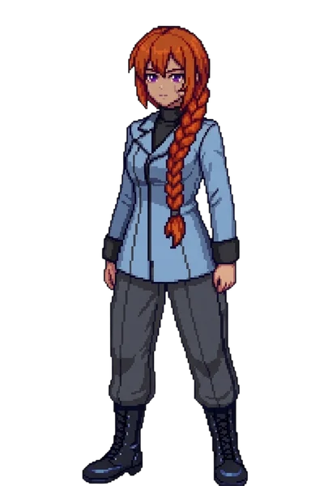
  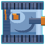
  

    
Katyusha

    
Tank pilot AI

    
An AI character who controls a battle tank. High HP, high attack, terrain cover. Her limit break, Iron Curtain, blocks incoming fire and counter-attacks drones that shoot at her while it is active.

    <a href="guides/characters/#katyusha" class="unit-card__link">Stats and skills</a>
  

  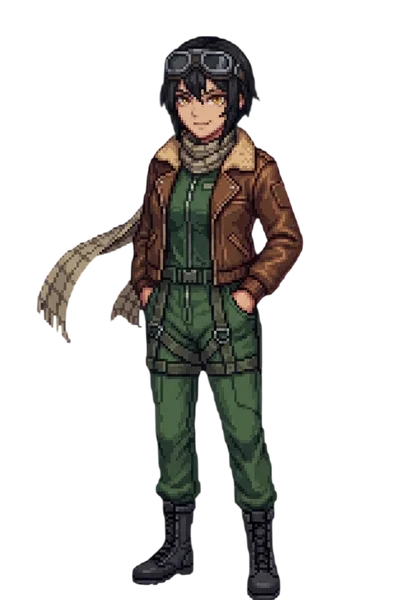
  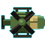
  

    
Nadeshiko

    
Helicopter pilot AI

    
An AI character who pilots a reconnaissance helicopter. Flies over any terrain. Her limit break, Storm Run, sends her dashing in a straight line, dealing damage to every drone along the path.

    <a href="guides/characters/#nadeshiko" class="unit-card__link">Stats and skills</a>
  

  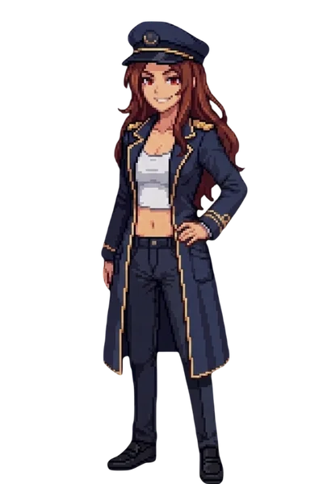
  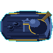
  

    
Maria

    
Warship AI

    
An AI character who commands a warship. Long-range, water-bound, and devastating against stationary targets. Her limit break, Broadside, fires a 3x3 barrage that suppresses drone counterfire while it lands.

    <a href="guides/characters/#maria" class="unit-card__link">Stats and skills</a>
  

---

## Screenshots

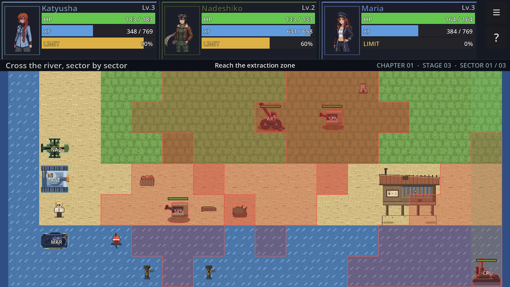

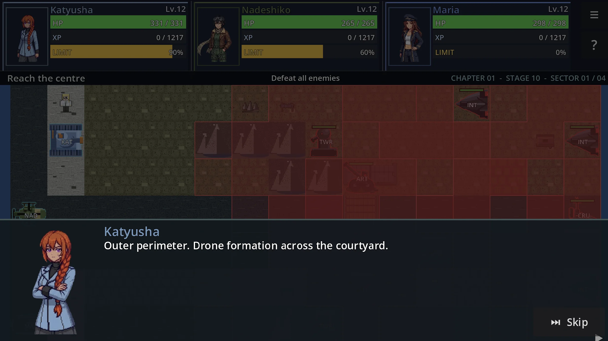

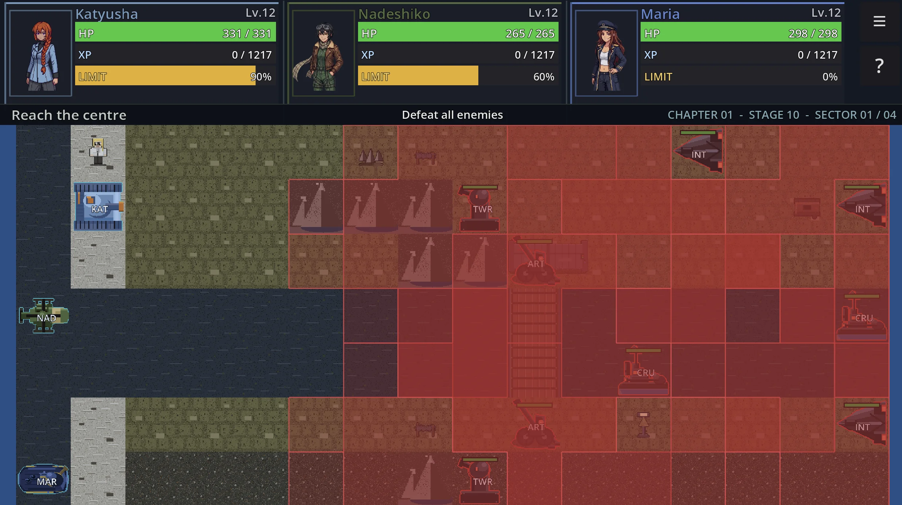

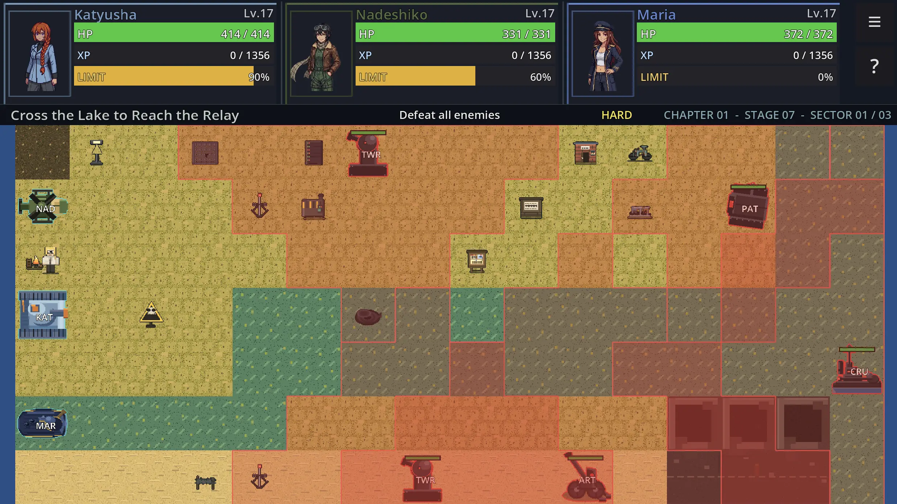

---

## New to the game?

The reactive turn system takes about five minutes to click. The Getting Started guide walks you through how movement works, what each unit does, and the handful of things that matter most in Chapter 1.

[Getting Started guide](guides/index.md){ .md-button }

---

## Read the novel

<a href="webnovel/" class="webnovel-promo__cover-link">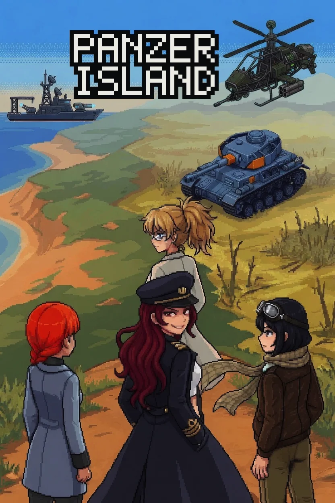</a>

The Panzer Island story is also available as a free illustrated prose novel, releasing one chapter per week on Saturdays. It covers the same events as the game with expanded character scenes and flashback chapters set before the catastrophe. No game knowledge required.

<a href="webnovel/" class="md-button">Read the novel</a>

---

## How AI supported the making of this game

Panzer Island is a solo project. Generative AI was used throughout development for code, character portraits, and playtesting. A detailed account of where it helped, where it did not, and the line between the two is posted on the blog.

[Read the full article](blog/posts/2026-06-13-ai-in-development.md){ .md-button }

---

## Get the game

Chapter 1 (10 stages, roughly one to two hours) is free on all platforms. The full game spans six chapters and three endings and is a one-time purchase.

<a href="https://store.steampowered.com/app/4757690/Panzer_Island/" class="md-button md-button--primary platform-btn"> Steam</a>
<a href="https://play.google.com/store/apps/details?id=com.rhedak.panzerisland" class="md-button platform-btn"> Google Play</a>
<a href="https://rhedak.itch.io/panzer-island-web" class="md-button platform-btn"> itch.io (Browser)</a>

Steam offers the Chapter 1 demo and the full game as separate entries. Google Play ships as a single app with Chapter 1 free and Chapters 2 onward unlocked by a one-time in-app purchase. The itch.io version plays directly in your browser with no download required.
