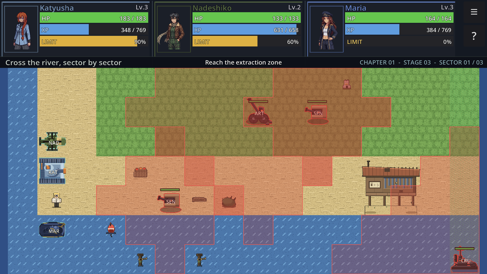
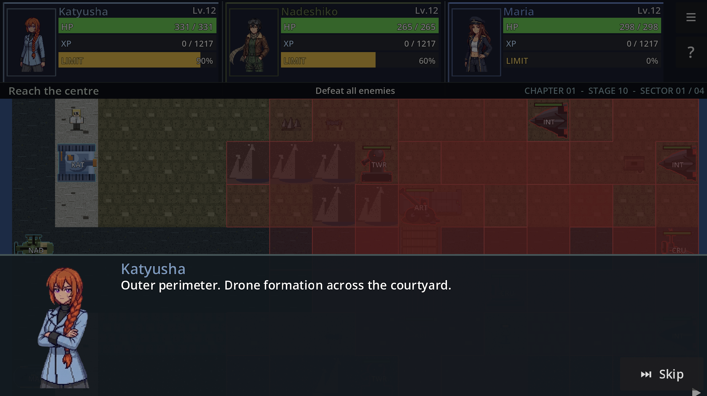
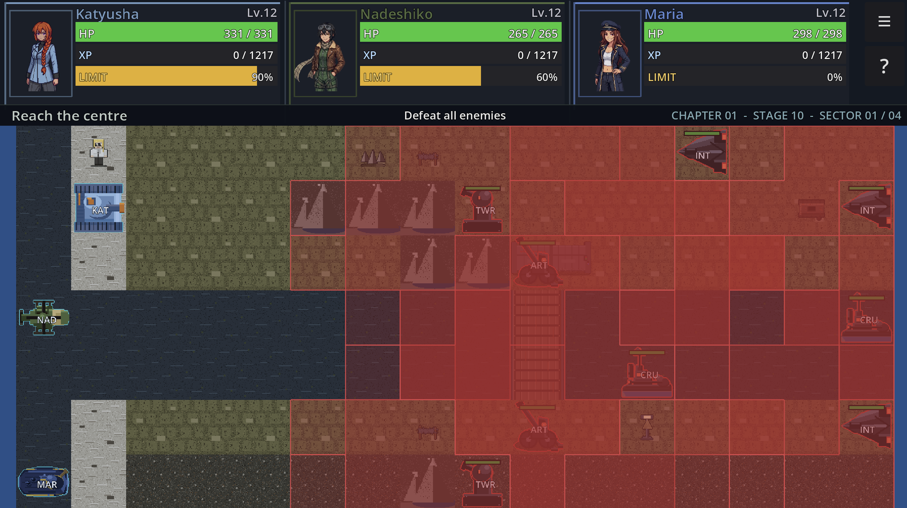
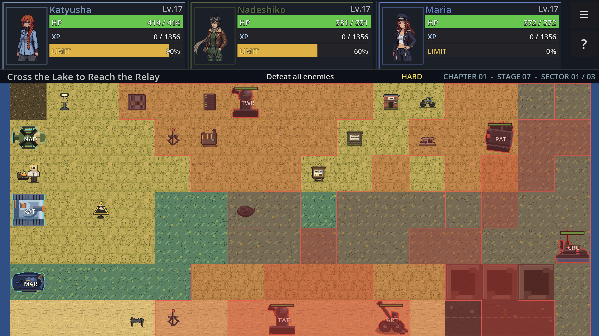
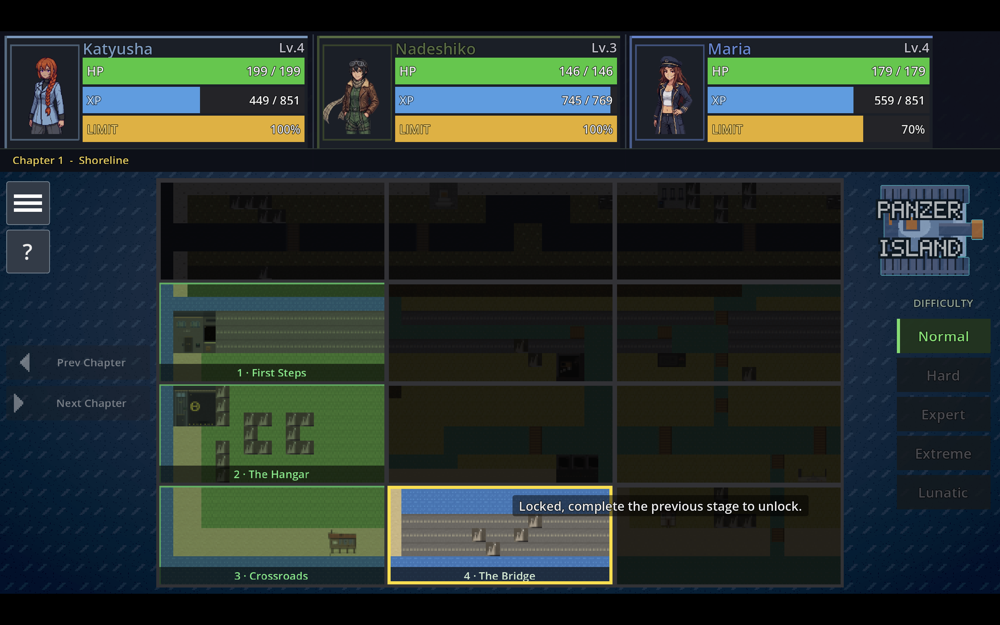

# Press kit

## At a glance

| | |
|---|---|
| **Title** | Panzer Island |
| **Genre** | 2D top-down strategy |
| **Developer** | Solo developer |
| **Engine** | Godot 4 |
| **Platforms** | [Steam](https://store.steampowered.com/app/4757690/Panzer_Island/) (Win/Mac), [Google Play](https://play.google.com/store/apps/details?id=com.rhedak.panzerisland), [itch.io](https://rhedak.itch.io/panzer-island-web) |
| **Business model** | Chapter 1 free on all platforms. Full game (Ch. 2 onward) one-time purchase. Steam ships demo and full game as separate entries. |
| **Status** | Available now. |
| **Languages** | English (other locales via browser auto-translation) |

---

## Short description

*(50-80 words. For listings, social previews, and press databases.)*

Panzer Island is a 2D top-down strategy game where enemies react to each individual step you take, not to a completed turn. Command three AI units across a drone-controlled island, manage cumulative damage as you route through enemy formations, and uncover a story about what the island used to be. Chapter 1 is free. Pay once for the full six-chapter campaign.

---

## Long description

*(Up to 200 words. For store pages and press releases.)*

Panzer Island is an anime-styled 2D strategy game built around one idea: what if turn-based movement had real-time consequences?

When you move a unit, every drone in detection range reacts immediately. A guard tower fires. A patrol breaks off its route and pursues. A dormant sentinel activates because something nearby fired. There is no "end turn" phase. Every step you take is a negotiation with the battlefield, and the route preview shows you exactly what you are paying before you commit.

You command three units: Katyusha, a tank built for absorbing punishment and pushing through defensive lines; Nadeshiko, a helicopter that ignores terrain and can dash through enemy formations; and Maria, a ship with enough range and firepower to clear fortified positions from a distance. Each has a limit break that shifts the shape of a fight when it lands.

The campaign follows a scientist who wakes on the southern coast of a contaminated island with most of her memory gone. Her AI units know more than they are allowed to say.

Chapter 1 (10 stages, one to two hours) is free on all platforms. The full game spans six chapters, 60 stages, and three endings.

---

## Screenshots

Screenshots are free to use for editorial and review purposes.

---

## Contact

For review keys, press inquiries, or interview requests, contact: rhedak00@yahoo.de
