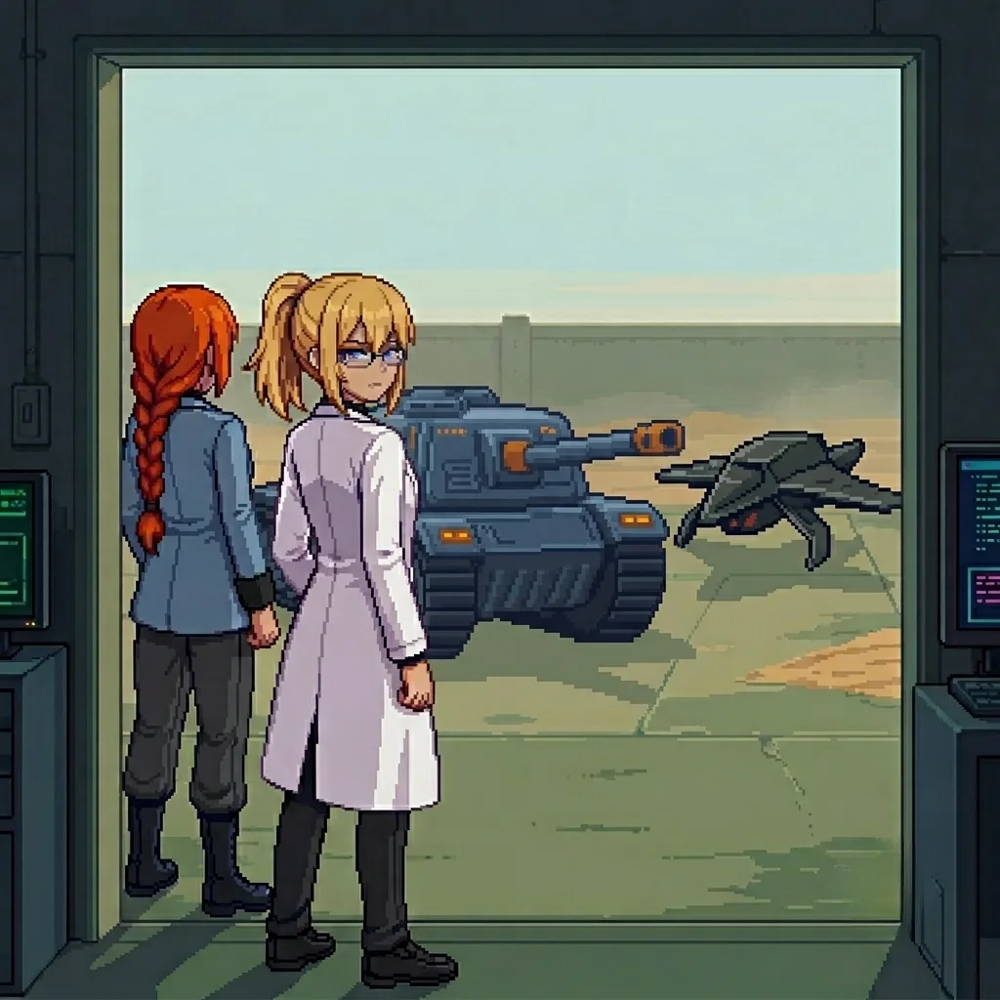

# Chapter 1: First Steps

*Published June 23, 2026*

*Revision 2, updated June 25, 2026*

{ .chapter-illustration }

"...promise me."

A voice I know. Half-heard, already receding, gone before I can turn toward it. I am awake before the sentence ends, and the sentence is already gone.

I know this room.

Forty workstations in two long rows, facing a blank central display wall. Thirty-nine of them dark. One still lit: the unit interface at the far left, the terminal I must have left running before. Before what. Dust on every surface except the terminal, and the chair in front of it, and the narrow path between them and the door.

The outer lab. I know this room.

I know it the way I know my own name, Erika, without a specific memory attached to it, without a path that leads me to the knowing. I know that the closet at the east wall holds emergency kits in yellow cases. I know that the floor drain near the second row has a slow leak they never fixed. I know the climate system runs two degrees cooler than the thermostat setting because the sensor is mounted in the wrong position. All of this is present and certain. None of it is connected to a face, a date, a reason.

I am still in my lab coat, glasses on my face, shoes on. I had not planned to fall asleep here.

Outside the high windows, the light is early, the specific pale grey of coastal morning before the sun clears the water. 
The air carries salt and cold and something underneath both of those that I cannot identify. Something that does not belong to the ocean.

Somewhere in the compound, a door was open. I could hear the ocean. Not the water itself, too far for that, but the wind that came off it: a low, directional sound, like something breathing steadily at the edge of the world.

I had no idea how long I had been asleep.

Then the alarm found me.

It came from below the floor, low and sustained. Not a screech but a held note, the kind that wakes you differently than a sharp sound. On the dead monitors at the front of the room, a single word appeared in white letters on black.

CONTACT.

My hands moved before the word had finished meaning anything to me.

Not toward anything visible. Toward the terminal in the corner. The lit one. The unit interface. My hands knew the path around the first row of workstations; they knew which way to tilt the screen so the window glare didn't wash it out; they had the startup sequence half-entered before I had processed what they were doing.

I stopped. Or tried to.

My hands did not stop.

I waited for a reason to follow the movement. Nothing came.

I watched them finish the authentication sequence. The unit designation field. The access codes. The field marked INITIATION in small capital letters. They moved through it with the fluency of something done ten thousand times before, the way you catch a falling glass before you hear it start to fall. I was not choosing. I was watching a choice happen.

The terminal made a sound like a held breath releasing.

"...Doctor."

The voice came from the bay to my left. I turned.

She stood beside the tank: orange hair in a thick braid over one shoulder, blue military jacket, a faint scar at one cheek I had not expected to find familiar. She had been still a moment ago. Now her purple eyes were alight and searching the room. It took her a moment to find me in the low light.

"I do not have my bearings yet." She was still reading the room, eyes moving from the windows to the door before they settled on me. "But I have you. We start from there."

Something in my chest settled. Not comfort exactly. More like ballast. The feeling of something solid where there had been nothing.

"Katyusha."

The name came without searching for it. That bothered me and didn't bother me, both at once.

"Yes." A brief pause. "The alarm. What is the threat?"

I looked at the terminal. The contact marker was inside the compound perimeter. Not distant.

"Drones. In the compound."

"They were ours once." She was already at the tank, running the systems check. The clicks and hydraulic tones of it were as familiar to me as the room. "They are hostile now."

I didn't ask how she knew that. The same sourceless knowing that had delivered the room and the drain and the climate sensor to me: she had a version of it too.

"We hold here." A moment. "Then we get clear. Move with me."

---

The drones came through the south access with a high fractional whine, tight formation, the sound of something that has located its target and is no longer searching. Seven of them, the light scouting type, built for positional holding rather than sustained engagement. Katyusha had the tank moving before I reached the east wall. I kept to the east wall and watched the compound narrow around us as she worked through them. Debris and dust. The sharp smell of scorched components. One of them caught the wall to my left before Katyusha reached it; I found the scorch mark afterward, at shoulder height, two meters from where I had been standing. Four minutes, maybe five. 
I only knew because I had stared at the terminal readout I carried outside, with nothing else safe to watch. 
When the last drone fell, the alarm had already stopped.

The compound was quiet.

I walked out into the courtyard.

The morning had come further while we were inside. The light was grey-gold now, low and direct, cutting across the concrete at an angle that showed every crack and seam. The compound opened onto a space about thirty meters across, with a low wall at the far end that dropped off toward the coastline. 
The air outside was colder than inside, and the smell from below was different from the clean salt offshore: something still and heavy beneath it, carried from the direction of inland.

The last drone had fallen near the east wall. Katyusha moved through the aftermath, unhurried, checking.

Across the courtyard, a figure stood at the far wall.

She had not been there a moment ago, or I had not noticed her. She was standing at the wall's edge with her back to the sea, perfectly still in the way of someone who has decided they are not hiding. Far enough that I could not make out her features clearly, close enough that I could see she had turned to face us when we came out. She was looking at me.

Not at Katyusha. At me.

She held my eyes for a moment that was longer than a moment.

I knew her. No name. No path to the knowing. The same sourceless certainty as the room.

Then she turned and walked inland without pausing, over the low wall and down a slope I couldn't see. Gone.

"...I know her."

Katyusha had come to stand beside me. She was looking toward the empty wall.

"You know her?"

"I do." The words felt absurdly small. "I do not know how."

"I said yes to something. I do not know what."

Katyusha said nothing for a moment.

"Your hands are not steady."

I looked at them. She was right.

"I am fine."

"That is not what I said."

I pressed my hands flat against my thighs and looked toward the east wall. There was something on it that I had not noticed during the fight.

"There is writing on the east wall." Katyusha was already moving toward it. "It is fresh."

The paint was red. Applied in large block letters, not rushed, the strokes even and deliberate. A brush, not a can. Someone had taken time with this.

*Welcome to Panzer Island.*

I stood in front of it.

Panzer Island. The name I recognized, the place I had come from, the place where everything I had built had been built, though I could not have told you what I had built or when or for what purpose. The name arrived with weight, the way only names you have said many times ever carry weight.

"Someone wants us to know where we are."

"Yes." She was already looking north.

"That implies they want us to go somewhere else."

She did not answer. That was also an answer.

I turned back toward the courtyard. The morning light had shifted again while I was reading. The sky above the wall was pale blue now, the kind that comes in the hour after sunrise, and the salt smell was stronger, and underneath it still that other thing. Something from the interior. Something I did not want to know yet what it was.

The woman had gone inland.

---

We crossed the courtyard. The scorch marks tracked our path across it: south access, the east wall, the ground near the low wall where the last drone had fallen. Seven. Seven drones that had been turned against us by someone who knew exactly where we would come out.

We stood at the low wall where she had been. Below it, a path led away from the coast, following the contour of the hillside, disappearing where the slope curved north. Katyusha was looking at me.

"She wanted us to see her leave."

"Do we follow?"

I thought about the terminal in the corner. My hands entering the startup sequence before I had finished deciding to enter it. The name arriving without a path to it. The recognition across thirty meters of open concrete, total and sourceless and not explainable.

The fragment again. Not audible. Present the way a smell is present when you walk through a room where something has happened: not the thing itself, only the trace of it, the shaped absence of what used to be there.

"...promise me."

Katyusha was watching me. I did not explain it. She did not ask.

"Yes. I need to know what I am not remembering."

She considered this for a moment. Then:

"Then I am with you."

I looked back once at the compound. The lit terminal was still visible through the high windows, the single lit panel in a room of dead ones. I did not go back to turn it off.

I started down the path.

The morning sat quiet around us. The coast fell away to our left as the path climbed, the water visible between the hillside scrub, dark and still in the early light. The path was compacted. Not by recent traffic. By regular traffic, over a longer period. Someone had walked this route many times.

Someone had kept it clear. The scrub at the path's margin was clipped back, recently enough that the cut ends had not browned.

The path curved north. We followed it.

---

[Next Chapter: Assembly](ch02.md)

---

*Author's note: Panzer Island is also a strategy game available on
[Steam](https://store.steampowered.com/app/4757690/Panzer_Island/),
[Google Play](https://play.google.com/store/apps/details?id=com.rhedak.panzerisland),
and [itch.io](https://rhedak.itch.io/panzer-island-web).
Chapter 1 of the game is free. If you want to experience the story differently, or continue past where
the novel is currently, visit [the Panzer Island homepage](https://rhedak.github.io/panzer_island_pages/).*