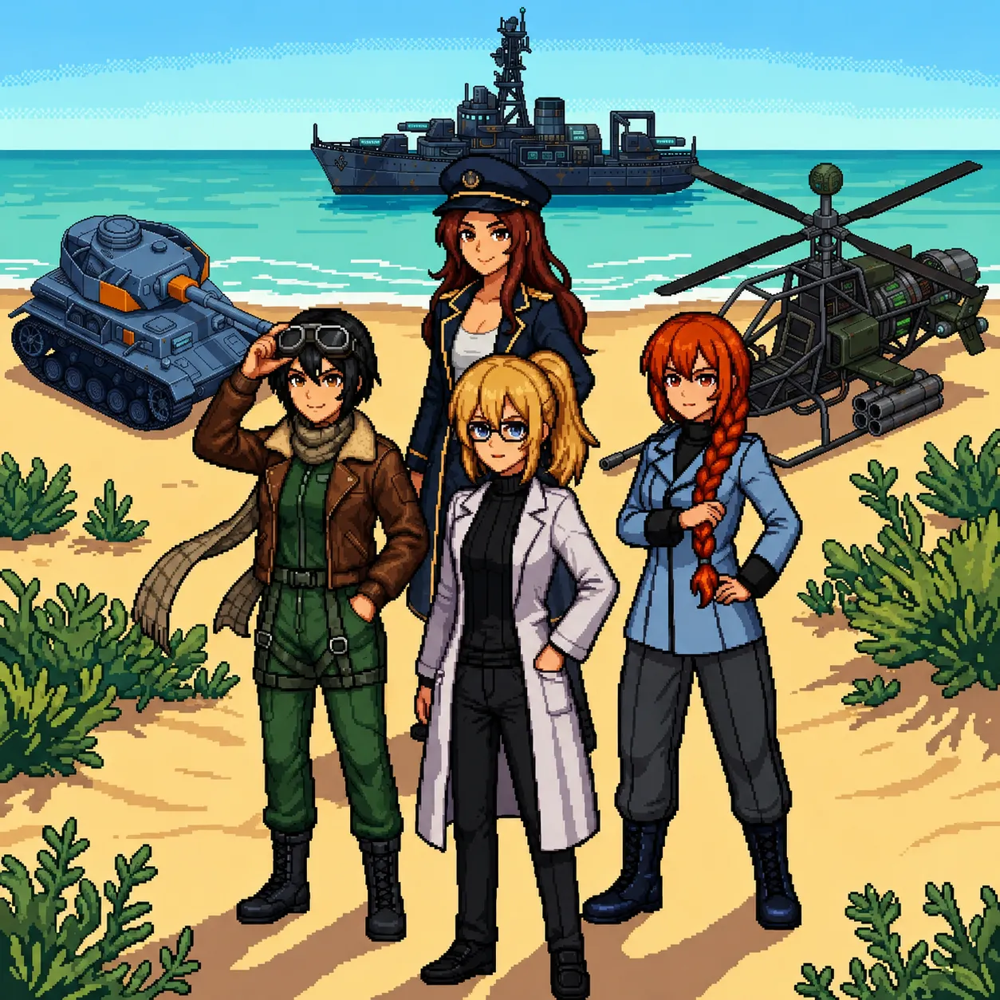

# Chapter 2: Assembly

*Published June 24, 2026*

{ .chapter-illustration }

The path followed the hillside around and then down, the coast reappearing below as the ground leveled out. By the time we reached the hangar, the morning had gone from pale to white, the kind of light that comes when the sun has cleared the water but not yet the haze.

The hangar was concrete, long and low, its paired doors rolled halfway shut. The metal had gone orange at the seams, the faded blue of the walls showing through rust in patches. Inside the gap in the north door: a helicopter on chocks, dark, no running lights.

Katyusha moved toward it and began her read.

"The signal originates from the helicopter unit in this bay. Hardware appears intact. I am still assessing the exterior for..."

I was already at the panel, surprising myself. It felt eerie as if I was losing control over my own body, yet I somehow knew it was the right thing to do.

My hands found the sequence before I looked for it. The startup protocol, the authentication fields, the designation entry.
The same fluency as the morning before, the same quality of doing something you have already done so many times you lost count. 
I entered the codes and stepped back.

The terminal made the same sound: a held breath, and then release.

"Oh." A voice from the bay, surprised. "I know you."

She had come off the chocks. She was standing beside the helicopter with her head slightly tilted, working something out: shorter than Katyusha, dark hair in a short bob, aviator goggles pushed up as a headband, a brown leather flight jacket with fur collar worn like she'd been born in it. Her expression moved fast. Curious first, then concerned. Her eyes were amber in the low light of the bay.

"I'm Nadeshiko, helicopter pilot AI, and I can't find why I know you."

"I am Erika."

"I know." The name hadn't landed the way she'd wanted it to. "You knew my name before you said yours. I can't find the where. I know you and there's nothing attached."

"You knew my name before you knew this room."

She stopped. Looked around the hangar as if noticing it for the first time. Then:

"Wait, there are contacts closing on the hangar, a lot of them, and I am already itching to move, so can I?"

"Deal with them."

"I'm on it."

---

I stepped back from the panel and put the wall of the bay behind me.

Twelve drones through the north approach, Nadeshiko already lifting before I had cleared the panel. The last one went down before Katyusha committed to engaging the second.

"I am logging this," Katyusha reported.

Nadeshiko came back down to the bay with something in her voice that was the closest thing she had to laughter. "The first mission's done, and I don't know how long I was offline but flying again feels exactly right, so what's next?"

She was already looking around the hangar, cataloguing, the way some people enter a room and find the windows first.

"There is a wall fragment here. The handwriting matches the one at the lab." Katyusha stepped aside so I could read it.

*The truth about what you did is hidden here.*

Nadeshiko came to look over my shoulder. "Was there another message?"

"'Welcome to Panzer Island.' That was at the lab."

At the east edge of the hangar, a figure had appeared at the gap in the wall. The watcher from the compound. She was closer than before: close enough that I could see the set of her shoulders and the stillness she carried deliberately. Her face was not in the light.

Katyusha had already placed her. "The one from the compound. She has followed us."

I looked at her.

The name arrived before I reached for it.

"...Drona."

"You know her?" Nadeshiko asked.

"I know her name. I should not."

"And that message is for me. I do not know why I am so sure."

When we looked again, the east edge was empty.

"She leaves words and withdraws," Katyusha observed. "She has not attacked."

"That is not the same as safe. We search the hangar, then we go."

---

The hangar records had been wiped. Same thoroughness as the lab: initialization screens, logs ending at the moment of the wipe, which was the same moment as the lab and the compound. Everything stopped at once.

I stood at the terminal long enough to confirm it, then turned away.

Nadeshiko was sitting on the edge of the helicopter's landing strut, watching the place where Drona had been.

"I should know. I keep reaching and there's... there's nothing there to reach for. I can't tell you what is missing because..." She stopped. Started over. "I can't find where it should be."

I had started toward the door.

"Your situation and mine are not the same."

She looked up. "But you knew my name before I said it. That's the same as me reaching and finding nothing. Isn't it?"

I stopped at the door.

"...It is not the same."

Katyusha was already outside. "The signal to the east reads as another unit of the same design family. The architecture matches mine."

The coast ran east from the hangar, sea on one side, hillside on the other, a strip of beach between. Further along, the shoreline opened into something flatter and wider, and the water out there caught the light differently: the bright clear blue of shallows, more saturated than the deep water. Cleaner.

"We continue."

Nadeshiko dropped off the strut and fell into step beside Katyusha, leaning to say something too low for me to catch. Katyusha did not respond. She did not move away.

---

We found her at the tideline.

She was standing in the shallows, powered down, and had been long enough that the salt had dried white on her jacket: navy blue, officer cut, gold trim along the cuffs. Her hair was auburn and wavy, falling loose below a captain's hat worn at an angle that looked accidental. It wasn't. She was not moving. No running lights. But she was upright, and that meant something.

"The signal ends here." Katyusha was already reading the contact. "A unit stands at the tideline, powered down. The salt on her hull says she has been here a while. I would recommend a full"

"Oh! There's another one, and she's just standing in the water like she's been waiting, and she has been waiting, hasn't she?" Nadeshiko called.

I was already wading in.

The water was cold, shallows over sand. Three steps in before I registered I had moved. The same panel, the same sequence, the same near-silence before the release.

"I am logging this." Katyusha's voice carried from the beach.

The captain's hat shifted. A slow turn of the head, still completing as the activation settled. She found me in the water nearby.

"Hey." Then something in her face settled into recognition and she looked at me properly. "...Huh. You again, Doc."

The name landed. I did not ask about it.

Nadeshiko's voice carried from the beach. "You knew her and she didn't even stop to ask how. How does that work?"

"She activated me the same way the first time," Maria replied. "Did not even look up from the console."

The first time. Something in that wanted to open into something larger and I almost let it.

"Contacts closing from the east," Katyusha reported.

Maria had already turned. "I'm on it."

---

I moved back onto the dry sand and stayed there.

A cruiser in the channel, same class as Maria's ship, and three patrol drones on the beach. Maria had already claimed the channel; four minutes, then quiet.

Nadeshiko watched the last wreckage settle. "That cruiser was exactly your model, Maria. It moved just like you."

"Yes." Maria's gaze was still on the wrecked cruiser. "That is going to be a consistent problem."

---

At the high ground above the tideline, a figure stood with her back to the sea. She was writing on the rock face: slow and deliberate, the same care I had seen in the paint at the lab. When she finished she looked at what she had written, then walked inland without turning toward us.

We crossed to the rock.

*The center is waiting.*

"Same hand as at the lab and the hangar," Katyusha confirmed.

"Yes."

Then I moved to the nearest unit and began working. My hands were already assessing damage before I directed them to. The structural checks ran before I consciously looked for damage, the corrective sequences came before I reached for them, and I worked through all three without reference materials, the knowledge running through my hands the way the activation sequences had and the lab's climate sensor had and the drain in the floor had: certain, specific, and attached to nothing.

When I straightened they were all watching me.

"You're about to tell me you just know how to fix all three of us," Maria noted.

"I just do. That is all I have."

---

For a moment, nothing was closing in.

The coast was quiet around us. The water came in from the east in small flat waves. The salt smell here was clean, nothing underneath it, and the light had gone to late-morning white, flat and still, every crack in the rock face visible without shadows.

"The signal at the center is unlike any unit signature I have logged," Katyusha reported. "It is distributed, not point-source, and it has been running continuously."

"Since before we arrived?" I asked.

"The duration is beyond what I can measure. I cannot account for what it has been doing yet."

Maria was sitting on a flat rock at the waterline. "So while we were all offline, something at the center was running the whole time."

Nadeshiko stood at the edge of the path, looking at the slope where Drona had gone. "She keeps leaving us directions but she has never said what she actually wants. So are we just following her?" A pause. "And I want to know what that signal has been doing this whole time."

"We do not need to know her intentions to know where she wants us to go."

No one answered for a moment.

"You are not obligated to continue."

Maria's expression did not change. "Don't get weird about it."

Silence.

"...Hey." Nadeshiko was looking at something that was not a view but a fact. "We're all here. All of us. That's new."

I looked at Katyusha, at Nadeshiko, at Maria, who had turned to look at the same thing, and whose expression held something I was not certain I was reading correctly.

"It is, isn't it."

"Four units operational," Katyusha reported. "Formation viable."

I started to say something and did not.

The fragment again. Half a voice, already gone.

Drona's footprints went ahead up the slope. The center was waiting.

"...Yes. It is."

We followed her.

---

*Author's note: Panzer Island is also a strategy game available on
[Steam](https://store.steampowered.com/app/4757690/Panzer_Island/),
[Google Play](https://play.google.com/store/apps/details?id=com.rhedak.panzerisland),
and [itch.io](https://rhedak.itch.io/panzer-island-web).
Chapter 1 of the game is free. If you want to experience the story differently, or continue past where
the novel is currently, visit [the Panzer Island homepage](https://rhedak.github.io/panzer_island_pages/).*