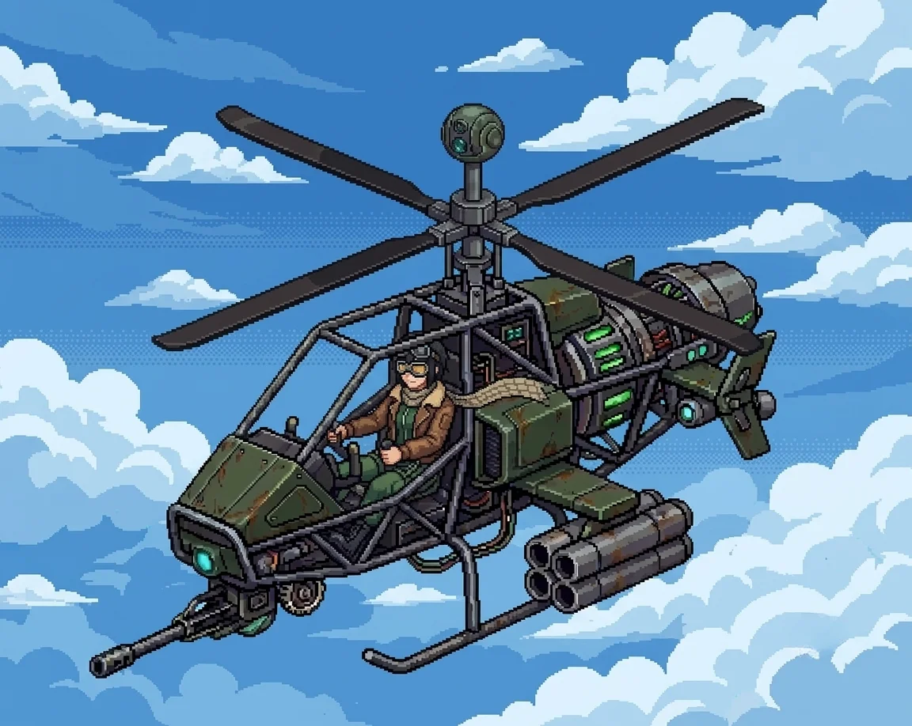

# Chapter 2: Assembly

*Published June 24, 2026*

*Revision 6, updated July 22, 2026*

{ .chapter-illustration }

The path followed the hillside around and then down, the coast reappearing below as the ground leveled out. By the time we reached the hangar, the morning had gone from pale to white, the kind of light that comes when the sun has cleared the water but not yet the haze.

The hangar was concrete, long and low, its paired doors rolled halfway shut. The metal had gone orange at the seams, the faded blue of the walls showing through rust in patches. Inside the gap in the north door: a helicopter on chocks, dark, no running lights.

Katyusha moved toward it and began her read.

"The signal originates from the helicopter unit in this bay. Hardware appears intact. I am still assessing the exterior for..."

I was at the panel before I had chosen to move, surprising myself.

My hands found the sequence before I looked for it. The startup protocol, the authentication fields, the designation entry.
The same fluency as the morning before, the same quality of doing something you have already done so many times you lost count. 
I entered the codes and stepped back.

The terminal made the same sound: a held breath, and then release.

"Oh."

A voice from the bay, surprised.

"I know you."

She had come off the chocks. She was standing beside the helicopter with her head slightly tilted, working something out: shorter than Katyusha, dark hair in a short bob, aviator goggles pushed up as a headband, a brown leather flight jacket with fur collar worn like she'd been born in it. Her expression moved fast. Curious first, then concerned. Her eyes were amber in the low light of the bay.

"I'm Nadeshiko, helicopter pilot AI, and I can't find why I know you."

"I am Erika."

"I know."

The name hadn't landed the way she'd wanted it to.

"You knew my name before you said yours. I can't find the where. I know you and there's nothing attached."

"You knew my name before you knew this room."

She stopped. Looked around the hangar as if noticing it for the first time. Then:

"Wait, there are contacts closing on the hangar, a lot of them, and I am already itching to move, so can I?"

"Deal with them."

"I'm on it."

{ .chapter-illustration }

I stepped back from the panel and put the wall of the bay behind me. Nadeshiko was lifting before I had cleared it. Whatever came next up there, I would not see it. She would.

---

*Nadeshiko*

The bay doors gave me four meters of clearance and I used three of them.

Twelve contacts through the north approach, staggered double line, the lead pair already tracking the hangar mouth. I had never seen this formation before, and I knew exactly what it was: light scouts, coverage doctrine, built to box a target and wait for it to make the decision that kills it. The knowing arrived with no flight hours attached, and it should have bothered me, and it did not, because the rotors had come up to speed and nothing else in the world was going to matter for the next minute.

Flying was right. Not good. Right. The way a joint feels when it seats.

I took the lead pair on my first vector, before their targeting finished flipping from the hangar to me. The line adjusted the way I knew it would. There was a manual for what they were doing. I had never read it. I had it anyway.

Somewhere in the third vector I reached for the last time I had flown, just to put a frame around how much I had missed it, and the reach came back with nothing. Not a memory of flying. Not a memory of not flying. A shelf where the logbook should be, and no shelf either.

The last contact dropped before Katyusha had committed to engaging her second. I logged the time out of habit. I did not know whose habit.

I came back down into the bay and put the smile on a half-second before I needed it. That was automatic too.

Below the skids, Erika had crossed out to meet me before I'd cleared the pad.

---

*Erika*

"I am logging this," Katyusha reported.

Nadeshiko settled onto the chocks with something in her voice that was the closest thing she had to laughter.

"The first mission's done, and I don't know how long I was offline but flying again feels exactly right, so what's next?"

She was looking around the hangar, cataloguing, the way some people enter a room and find the windows first.

"There is a wall fragment here. The handwriting matches the one at the lab."

Katyusha stepped aside so I could read it.

*The truth about what you did is hidden here.*

Nadeshiko came to look over my shoulder.

"Was there another message?"

"'Welcome to Panzer Island.' That was at the lab."

At the east edge of the hangar, a figure had appeared at the gap in the wall. The watcher from the compound. She was closer than before: close enough that I could see the set of her shoulders and the stillness she carried deliberately. Her face was not in the light.

Katyusha had placed her before I did.

"The one from the compound. She has followed us."

I looked at her.

The name arrived before I reached for it.

"...Drona."

"You know her?" Nadeshiko asked.

"I know her name. I should not."

"And that message is for me. I do not know why I am so sure."

When we looked again, the east edge was empty.

"She leaves words and withdraws," Katyusha observed. "She has not attacked."

"That is not the same as safe. We search the hangar, then we go."

The hangar records had been wiped. Same thoroughness as the lab: initialization screens, logs ending at the moment of the wipe, which was the same moment as the lab and the compound. Everything stopped at once.

I stood at the terminal long enough to confirm it, then turned away.

Nadeshiko was sitting on the edge of the helicopter's landing strut, watching the place where Drona had been.

"I should know. I keep reaching and there's... there's nothing there to reach for. I can't tell you what is missing because..."

She stopped. Started over.

"I can't find where it should be."

I had started toward the door.

"Your situation and mine are not the same."

She looked up.

"But you knew my name before I said it. That's the same as me reaching and finding nothing. Isn't it?"

I stopped at the door.

"...It is not the same."

Katyusha had gone back outside.

"The signal to the east reads as another unit of the same design family. The architecture matches mine."

I came out through the gap in the doors into the full late-morning light. Along the perimeter fence, at regular intervals, someone had once kept flower beds: the borders still edged, the plants gone wild and leggy in two unattended years, but alive, flowering in whatever order they had escaped into. I stopped in front of them without knowing what I was looking for. Nothing came. I filed the beds with everything else the island refused to explain, and moved on.

The coast ran east from the hangar, sea on one side, hillside on the other, a strip of beach between. Further along, the shoreline opened into something flatter and wider, and the water out there caught the light differently: the bright clear blue of shallows, more saturated than the deep water. Cleaner. Gulls were working the tideline further out, the first birds I had registered since waking.

"We continue."

Nadeshiko dropped off the strut and fell into step beside Katyusha, leaning to say something too low for me to catch. Katyusha did not respond. She did not move away.

Half a kilometer on, Nadeshiko tried again, at a volume meant to be heard.

"Do you ever say more than two sentences?"

"When more are required."

"...I'm going to like you."

Katyusha did not answer that. Her pace did not change either, and Nadeshiko, who had already learned to read her better than I could, seemed to find everything she needed in that.

A kilometer on, Nadeshiko went up again, ran the shoreline east, and came back down to walking height.

"There's someone in the water."

She said it carefully, as if the sentence might change if she got it wrong.

"Standing in the shallows, where the beach opens up ahead. Not moving. Not wreckage. Standing."

"The signal source," Katyusha said. "We approach in formation."

We covered the last stretch on the wet sand, the water coming in from the east in small flat waves, and then the shoreline opened and we saw her.

She stood in the shallows the way a mast stands in a harbor: upright, canted a few degrees, planted. Navy blue jacket, officer cut, gold trim gone dull at the cuffs. Auburn hair, wavy, loose below a captain's hat the weather had somehow not taken. The salt had dried white in the creases of her sleeves. No running lights. No response to our approach. The tide had written lines in the sand around her boots, and she was facing out to sea, as if whatever she had been watching for was still out there.

There was a name for her. I could feel it sitting under the surface, the way Katyusha's had, the way Drona's had, and it would not come up while her eyes were closed. I did not force it. It was going to arrive on its own schedule, and some part of me already knew exactly when that would be.

"A unit of my design family," Katyusha reported. "Powered down. The salt residue puts her exposure at extended duration; the sand has built a shelf against her boots. She has held this position through storm seasons. I recommend a full structural assessment before any activation attempt."

"She's been standing out here the whole time," Nadeshiko said, quieter than she had said anything since the bay. "Alone. Facing the water."

Nobody answered that.

I was already wading in. The water was cold, shallows over sand, and I was three steps out before I registered that I had moved. Katyusha said "Doctor" once, behind me, in the tone she used for recommendations she already knew would not be taken.

The fragment again. Half a voice, already gone.

My hands knew where the panel was. They had stopped asking my permission two activations ago.

I reached for it.

[Previous Chapter: First Steps](ch01.md) | [Next Chapter: Population](ch02f.md)
