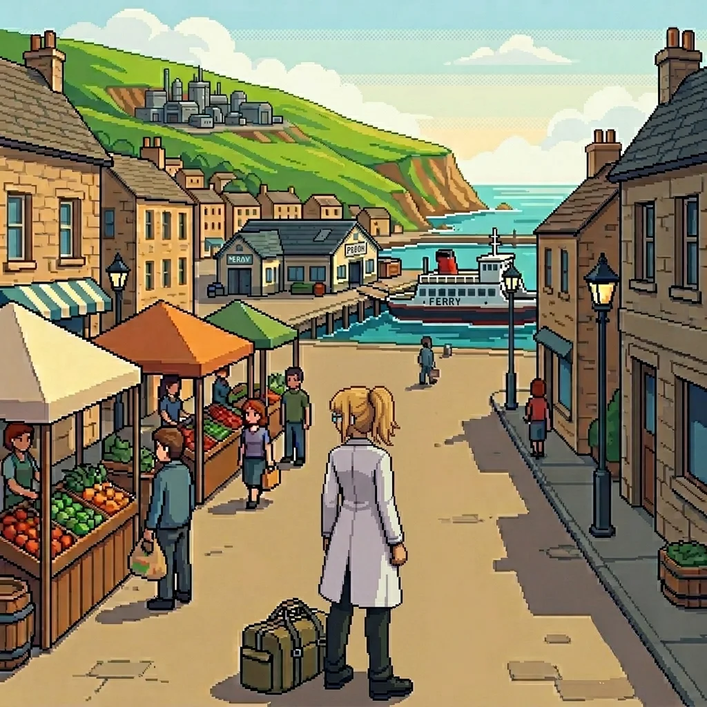

# Chapter 2F: Population

*Erika, before*

*Published June 24, 2026*

{ .chapter-illustration }

The ferry took four hours from the port at Kelsen, including a stop at the outer islands. I spent most of it at the bow rail.

The outer islands were smaller than I had expected from the map: a low ridge of them, forested to the waterline, with a harbor tucked into the lee shore. The stop was twenty minutes. Cargo in, passengers out, a small exchange of both. I stayed at the rail and watched the crew work.

Panzer Island came into view an hour out: a dark shape on the water that resolved slowly into detail as the ferry covered the remaining distance. Hills to the north, a coastal shelf running along the south where the installations had been built, the harbor town sitting between them at the base of the slope. I had studied the maps for three months. Maps did not show the specific blue-green of the water in this light, or the way the harbor's breakwater curved, or the way the town spread along the coast road with the easy density of a place that had been there a long time and expected to be there longer.

I made notes. The project brief had described the island in logistical terms: population approximately twenty thousand, distributed across the harbor town, northern residential districts, and farming and fishing communities in the interior. The installation occupied the southern shelf. The brief had not said what the water looked like, or how the hills read against the sky, because those were not logistical facts.

I was almost sorry the ferry was fast.

---

The terminal was a low building at the harbor's edge: ticket windows on the south side, covered waiting area on the north, bags and equipment stacked against every wall. A charter vessel and two water taxis were at the pier alongside us. The dock crew worked quickly, with the practiced indifference of people for whom arrivals are not events. Passengers crowded the gangway, families with too much luggage, a school group in matching jackets, a man with two dogs who had opinions about the disembarkation process.

I found the transport office at the north end of the terminal. The man behind the window had the particular economy of someone who has answered the same question enough times that the answer runs ahead of it.

"Research complex."

"Twelve kilometers inland. Shuttle twice a day. You've missed this morning's." He checked the board. "Fourteen hundred is the next one."

It was ten past eleven. I had left my equipment cases with terminal storage. I had my working bag and two hours and fifty minutes.

"What is there to do between here and there?" I asked.

He tilted his head at the window. "Town."

---

I walked north from the terminal along the harbor road. The salt smell was clean and direct, no complication underneath it, the offshore wind coming in steady from the south. The market square was two blocks from the terminal: a dozen stalls, vegetables and fish, and a baker with a queue eight people long. A child of perhaps five was engaged in a sustained negotiation with an adult about the terms under which a pastry might be purchased. The adult was losing.

I did not stop. I noted it.

The main road bent inland where the seafront narrowed to rock shelf, and the town settled into its working density: school on the left, the gate open, two teachers talking at the wall; post office on the right with a queue that was moving; a hardware shop with crates on the pavement that everyone navigated around with the ease of established habit. I passed a noticeboard outside the community center. A ferry schedule, a planning notice, a lost-cat poster with a photograph. All of it slightly weathered, all of it maintained.

The technical specification had been the draw: a cognitive architecture of that scope, applied to autonomous defense systems, with the integration challenges the brief implied. I had read the spec and had questions I could not ask until I was on-site. I had thought about those questions for three months. I had not thought much about the island.

It was not the kind of place that required thinking about. It simply was: a town on an island, twenty thousand people, ordinary in the way that places where people have lived for a long time are ordinary, which is to say densely, specifically, without self-consciousness about it. The baker's queue. The lost cat. The teacher at the gate, her coffee still in her hand because she hadn't had time to finish it.

The road climbed as it went further north, the commercial density thinning as the residential streets began. I passed a bus shelter: a route map under glass, the main stops printed and the village connections penciled in beside them. Six village names on the route, four legible from the pavement. A child on a bicycle came past too fast and veered around me without looking; the adult thirty meters behind called something that was probably "slow down." The child did not slow down.

I turned back at the next corner and walked south.

---

I turned off the main road where a footpath sign pointed toward the coast: thirty minutes before I needed to double back for the shuttle. The path dropped toward the southern shelf, a loose gravel track that widened as it descended, the harbor rising behind me on the hill and the research installation becoming visible in the middle distance as the line of sight cleared the scrub.

The slope flattened as it approached the shelf. From this angle the installation read as six structures rather than a single facility: the main building to the north, four secondary structures arranged around it in a pattern that was not symmetrical and had clearly been built in stages. I could read the difference in weathering from here. Someone had added to it over time. The original footprint was oldest.

The farmland along the path was well-tended, the field borders clear, the irrigation channels clean. A farmhouse set back from the path: vegetable rows behind it in the early-summer growth, a dog in the yard that watched me pass without getting up. From somewhere inside, a radio. A working place, not a picture of one.

The path rejoined the coast road near the aviation facility: a hangar structure, concrete and rust-orange metal, civilian-built. The perimeter fence had flower beds along it at intervals, the plants full and neither new nor neglected, the kind of beds that are someone's specific responsibility and get tended on a schedule. The windsock at the near end of the approach cone moved slightly in the wind. A helipad on the west side, approach cones still in their positions.

I did not stop. I noticed.

---

The research complex occupied the top of the coastal shelf: six main structures linked by covered walkways, a vehicle yard, a perimeter that read as security-functional rather than military. I had expected a harder boundary. The guards at the gate were thorough, not aggressive. They checked my credentials with the efficiency of people who have done this often and found discrepancies rarely.

The project administrator was a compact man in his fifties named Voss, who had the quality of treating time as a resource not to be wasted on either party. He checked my name against a printed list before he looked at me.

"Primary lab, third level, east wing. Orientation is tomorrow morning at nine. The lead researcher asked that you be shown to the workspace today." A half-pause that suggested something had been said about me. "Said you would prefer to orient yourself."

"Correct."

"The rest of the team arrives Monday. You have the lab until then." He had my badge ready. "Any questions?"

I had many. None of them were for Voss.

He walked me to the third-level corridor and left without ceremony. The hallway had the quality of a facility in daily use: equipment cases against the wall, a cart with server hardware parked outside an open door, the low sound of cooling fans from inside a lab I did not look into. Through the window at the corridor's end, the coast shelf was visible in the late-afternoon light. The east-wing door had a keypad; my badge opened it.

---

The lab was larger than I had pictured from the spec: three long workstations, equipment bays on the east wall, a secondary terminal alcove in the northeast corner. Everything powered down except the primary terminal, which had been left in standby. The spec had mentioned a co-PI on the architecture side; I could see from the workspace layout which station was his. The organization of it told me something about how he worked, which told me something about how we would disagree, which I filed without pursuing.

I opened the architecture files and began to read.

The cognitive framework was more elegant than I had expected from the documentation alone. And more ambitious. The decision architecture had three layers where the brief had implied two; the learning gradient was a live parameter rather than a fixed value at deployment. I made notes as I went.

At the third hour I reached the safety scaffold specification. The main document gave it three pages. I read them carefully. The scaffold itself was sound. The timeline was not. Phase four, the implementation notes said: pending review.

I went back to the project brief. Read the exact wording again. The brief had said phase four was in final review. The scaffold spec said pending. These were not the same thing.

I checked the autonomy gradient specifications again. The brief had understated those too. Not by much. Enough. I noted the gap on both and continued.

At some point the light in the alcove windows had changed.

---

The east wing looked out over the coast road and the harbor below. The town was lit now, the grid of it spreading from the waterfront up the slope, the market square dark, the school dark, the residential streets visible as lines of warm light. The ferry was back at the pier: the last crossing from the outer islands, the running lights clear in the early dark.

I stood at the window longer than I had meant to.

Twenty thousand people, approximately. The harbor town was perhaps a third of that. The rest distributed north and east, in the residential districts and the farming communities and the fishing villages I had passed signs for on the road.

I had not thought about any of this when I read the technical specification. I had thought about the work.

I closed the window shade.

The phase four implementation note was still open.

---

*Author's note: Panzer Island is also a strategy game available on
[Steam](https://store.steampowered.com/app/4757690/Panzer_Island/),
[Google Play](https://play.google.com/store/apps/details?id=com.rhedak.panzerisland),
and [itch.io](https://rhedak.itch.io/panzer-island-web).
Chapter 1 of the game is free. If you want to experience the story differently, or continue past where
the novel is currently, visit [the Panzer Island homepage](https://rhedak.github.io/panzer_island_pages/).*

*New chapters release every Saturday at approx. 10pm JST.*
