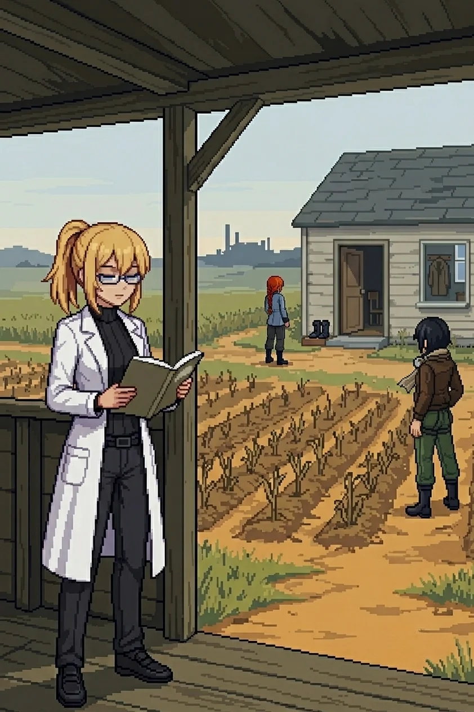

# Chapter 3: Oracle

*Published June 24, 2026*

*Revision 2, updated June 25, 2026*

{ .chapter-illustration }

The path curved north and the coastal smell thinned behind us. We had been moving for two hours from the farmhouse ruins on the coast path, then west along the ridge, and now north into the island's interior where the terrain changed character: harder underfoot, the soil a different color than the coast, the scrub shorter and less dense as it gave way to cut lanes. Straight sections. Deliberate clearings. The kind of spacing that comes from someone measuring rather than walking. Katyusha had gone quiet in the way she goes quiet when she is reading rather than moving.

"Same signal signature. Different configuration. The layout does not match a standard patrol pattern."

I had noticed it. I had not been able to name it. She had named it before I reached for it.

"Nobody planned this by accident." Nadeshiko was scanning the lane junctions, back and forth. "I want to know who."

I looked at the corridors ahead, the way they bent and rejoined, the coverage that was not haphazard but calculated. I could see the intention without being able to read whose it was.

"We push through."

---

Two clusters. The first sat at the outer ring of the lanes: angular coverage, overlapping fields of fire that required Katyusha to work wide before closing. The second was denser, different construction, higher calibration. The drones here hit harder than anything we had cleared on the coast, and the sound of them was different too, a register above the light scouts from the first morning. I kept to the lane margin and watched the perimeter narrow around us as Katyusha worked through them. Nadeshiko threaded the aerial contacts. I stayed down and measured the intervals between engagements. The smell of scorched components and something mineral underneath it, the interior ground giving off a heat the coast did not carry.

When the second cluster fell, the silence was different. There was no offshore wind here to fill it.

"Both cleared," Katyusha reported. "The second cluster was calibrated above anything we have engaged on this network. The hardware is intact. Not abandoned. Maintained."

Nadeshiko: "And the further we go, the worse that's going to get."

"We move to the ridge."

---

The ridge broke the line of the interior and gave us the view.

The lanes spread below us in both directions, and from here you could read the design in a way you could only read it from above: not a patrol network, not placement by habit or iteration. The coverage overlapped at every junction. The gaps were not gaps; they were corridors, and the corridors all led inward. Someone had thought about the inward direction with care.

Maria was reading it the way she reads water.

"Look at the lane positions. The target specialization, the overlapping coverage. Someone built this to hold the center, Doc. That is a human design."

"When did it stop being maintained?" I asked.

"Unknown." Katyusha was looking north, reading something I could not see from where I stood. "The central protocol identifier reads ORACLE." A pause that was less than a second. "It has not shut down. It is standing by."

Oracle.

The word arrived with the weight of something I had said many times in a specific register, not casual, not incidental. 
The weight of something that required precision when you named it. 
I knew this word the way I knew Katyusha's name, the way I knew the lab and the drain and the climate sensor: present and certain and unconnected to a path. 
But the weight here was heavier than any of those. There was something beneath it that was not a memory and was not a feeling and was not anything I could name cleanly. 
I had said this word in a specific register, to a specific person, more than once. I could not reach the occasions.

"That name was not accidental," Maria noted. "Someone picked it."

"What is it standing by for?" Nadeshiko asked.

I looked north. Drona's footprints in the dry ground of the path ahead. The direction she had taken each time she left us.

"I do not know. But it did not power down. It is waiting for something."

"I cannot read its purpose yet," Katyusha reported. "Drona's trail continues north. Toward it."

No one said anything about that. The ridge held us for a moment, and the name held us with it, and then we moved.

The descent took us east and the lane view dropped away. The design did not become less present for being out of sight.

---

East of the perimeter lanes the terrain opened into the first farmland we had encountered since the coast.

A farmhouse set back from the path, a field before it. The rows in the field were still legible in the dead growth: the furrow spacing, the placement, the care of someone who had planted for a season and expected to be present at the end of it. The growth had gone brown and flattened in the time since, but the rows were there underneath, the geometry of intention surviving the absence of the person who made it. The door of the farmhouse stood open. Not forced. Not broken. Open the way a door is open when you step out for a moment and mean to return.

I stopped at the field's edge.

A pair of boots on the step, set together neatly, not dropped. A clay pot just inside the threshold, something dried in it that had been green once. The window beside the door clear of dust on the inside, the kind of clear that comes from someone wiping it on a schedule. A chair visible through the window, a coat on the back of it. The specific density of a place where someone's life is still arranged, only the person is gone.

"They were living here." Nadeshiko had come up beside me. "Before the network turned."

Maria had stopped on the path behind us. She was looking at the window.

"Someone kept that window clean."

The rows. The door. The boots.

"We proceed carefully."

---

*Nadeshiko*

The aerial contacts broke formation the moment I came in on the first vector: four interceptors, pursuit-triggered, and now they were tracking me instead of the ground approach, which opened up the margin for Katyusha below. Good.

I liked this part. 
The clean snap when their targeting logic flipped to chase me. 
The geometry blooming open. 
For half a second everything felt right... but then the moment was gone.

I wanted to finish the thought about why I liked it... but I could not.

From the second pass I could see the rows. 
The furrow spacing, the placement, the geometry of something planted with intention. 
I had been over this field once already and I noticed the rows more than I should have. 
The door of the farmhouse was still open. I could see the boots on the step from there, set together, two of them, side by side on the stone.

I was late on the fourth intercept. Half a beat, no more. The contact dropped anyway. I did not examine the gap.

The boots. I kept catching them between passes, small and deliberate at the frame of the step. 
There was something I was reaching for. The sentence stopped before it got there. I had the full sensor read of the farmhouse approach. 
Whatever I was reaching for was not in the data.

The rows were still there. The door was still open. 
The boots were still on the step, placed by someone who meant to put them on again.

Maria closed the water contact on the south approach. 
Katyusha took the last ground contact. The field held.

My teeth were clenched. I hadn't told them to do that.

'This is not-'

I put the smile back and climbed north. The field fell away. Whatever I was reaching for was still not in the data.

Below, the team was moving.

---

*Erika*

I found the patrol manifest in the shelter at the field's north edge: a wooden post structure, military-functional, built after the farmhouse and not with it.

The manifest was in a weathered case on the shelf. I took it out.

My fingers found the second section before I had looked for the page.

I held the manifest open and read.

Two hands on the pages. The first I recognized from the wall messages, the same pressure, the same deliberate spacing. The second was different. The second was someone whose handwriting I almost knew, the way you almost remember a word when you hear its first syllable, the shape of it arriving before the meaning does. The spacing between words narrowed as each entry went on, a writer who accelerated into certainty. Familiar at a register below conscious recall. I read the coordination notes. I did not follow the recognition to where it pointed. I read what was on the page.

Two operators. One primary network; the other running something alongside it that the manifest's own categories did not quite contain. Coordination dating from well before whatever had emptied this place. Both hands consistent across many entries, working together for a long time.

I noted it and closed the case.

Nadeshiko was watching me from the field margin. "...You knew the page."

"I read what I can reach." I put the manifest back and moved north.

---

The path out of the shelter ran back past the farmhouse before it turned north.

We came to the farmhouse again from the path on the north side, the rows visible through the dead growth, the door still open in the same position, the boots still on the step.

Maria had stopped at the field's edge. She was looking at the rows.

"Those rows are still in order, Doc. People who mean to come back plant like that."

"They left in order. Not in a hurry."

Nadeshiko was quiet for a moment. "I wonder where they went. If they knew."

Katyusha: "The nearest inhabited islands are forty kilometers offshore. Ferry distance."

The light had moved. Late afternoon, the interior light flatter and harder than the coastal morning, the sky above the ridge a pale grey-blue. Nowhere near as much warmth as the south coast.

"Oracle was running before they left," Katyusha reported. "Whatever emptied this place was already awake."

Awake and waiting. The word sat differently now than it had on the ridge.

I looked at the house. The door. The boots on the step arranged by someone who expected to put them on again. The outer islands were forty kilometers offshore. I had passed through them on the ferry coming in, a long time ago, before. Passengers disembarking with luggage. Cargo being loaded. I had stood at the bow rail and watched and noted it as data. Twenty thousand people, approximately. I had thought about them in a specific register at a specific moment, and then I had stopped, and I had gone back to the work.

I thought about that now. I thought about what connected the rows in the field to the name on the ridge, and what connected both of those to the weight I had not reached into. Something came up beneath the thinking, something that did not arrive as a thought. A fragment, not audible, present the way it is always present when I reach this far: not a sound, not a memory, only the shaped absence of a voice I recognized without knowing whose it was.

*...promise me.*

"I do not want to."

I had said it aloud. It had not been meant for anyone. The words were out in the air before I knew I had reached for them. Katyusha was already oriented north. Nadeshiko looked at the open door once more, then looked at the ground. Maria did not lighten it.

The silence held for a moment that was longer than a moment.

"Drona's trail continues north."

I was already moving.

We followed it north.

---

[Previous Chapter: Population](ch02f.md) | [Next Chapter: The Guide](ch04.md)

---

*Author's note: Panzer Island is also a strategy game available on
[Steam](https://store.steampowered.com/app/4757690/Panzer_Island/),
[Google Play](https://play.google.com/store/apps/details?id=com.rhedak.panzerisland),
and [itch.io](https://rhedak.itch.io/panzer-island-web).
Chapter 1 of the game is free. If you want to experience the story differently, or continue past where
the novel is currently, visit [the Panzer Island homepage](https://rhedak.github.io/panzer_island_pages/).*

*If you're enjoying the story, consider following or leaving a rating on [Royal Road](https://www.royalroad.com/fiction/176303/panzer-island). It helps new readers find the series.*
