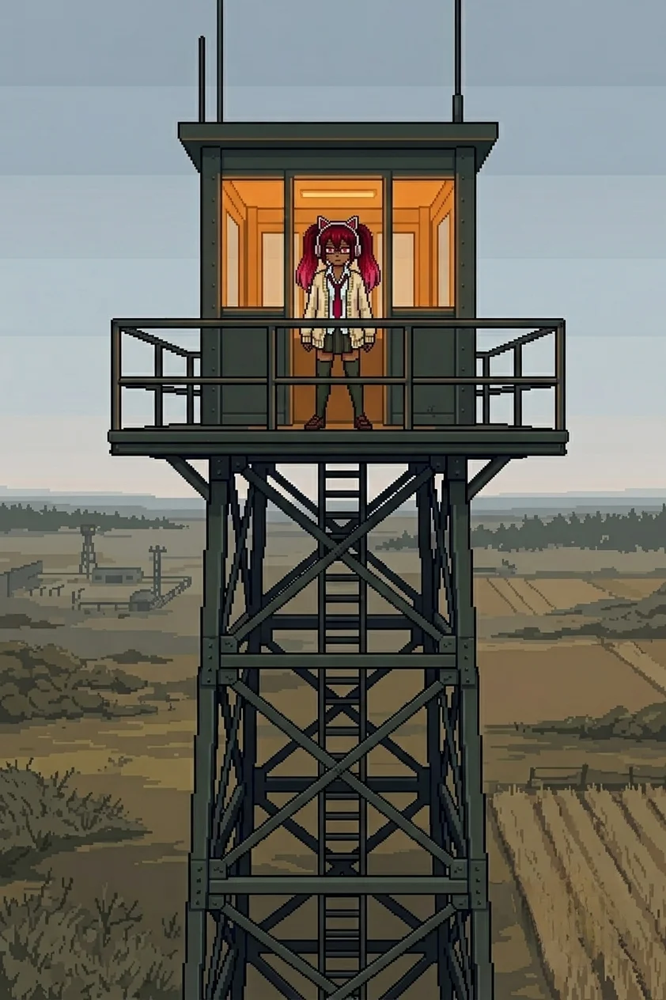

# Chapter 4: The Guide

*Published June 24, 2026*

*Revision 2, updated June 25, 2026*

{ .chapter-illustration }

North of the farmhouse the terrain changed character again. The perimeter lanes had been coverage geometry, angles and overlaps and fields of fire, built to hold ground by controlling what moved through it. This was different: wider clearings, longer sight lines, the scrub trimmed back from the center of each path rather than from its edges. Deliberate approach corridors. Space made for something to move through in a specific direction, with the obstructions removed in advance.

The light was moving into late afternoon. The sky above the ridge was the same pale grey-blue it had been when we stood on it, the coastal warmth still absent from the interior air. The ground was harder here than the farmhouse field, drier, less give underfoot.

Katyusha had been running the signal since the ridge. "The signature is consistent. It is orienting toward a fixed point north. Not transmitting. Receiving."

Nadeshiko moved through a longer clearing ahead of us, stopped at the far end, and turned to look back at the way we had come. She scanned it for a moment. "She didn't just leave the messages. She built a path. All of it: the perimeter, the lanes, the route north from the farmhouse. She built a path and we've been on it since the coast."

We moved north.

---

*Maria*

I read the inlet before the team reached the bank. The water signature was wrong: enclosed and still, no tidal current, no offshore draw feeding back through the reeds. Not my water. I moved to the bank and read it east, then west.

"Different construction," Katyusha noted. "Not the same network as the perimeter lanes."

I had already reached the same conclusion. The contacts running the shallows were naval construction, calibrated to hold rather than pursue, heavier than anything on Drona's network.

"She works land. The water coverage is outside her range or outside her brief. Either way, she left us the path she could clear." I looked east, then west. "Which is every path except this one."

The north ford was the thinnest approach. I took the deep contacts from the east margin, working the heavier units into firing range while Katyusha and Nadeshiko held the shallows from opposite angles. The contacts held their position and waited for commitment before responding. I gave them a false line instead. They adjusted late. The third held longest, which was a mistake, and I closed it.

I knew this type. I did not look for where that knowing came from.

It was very easy.

When the ford was clear I called it. The team crossed. 
I stayed at the margin until the last of them was on the north bank and then came up out of the water.

'I am not sure I like this', I thought to myself. 'But what does like even mean for an AI?'

Erika was not the same as before. I could have told her everything, 
but what would have been the point if she didn't want to know?

The inlet was still behind us. The reeds settled in the absence of anything moving through them.

---

*Erika*

The relay installation sat at the base of the first high ground north of the crossing: a tower structure, four levels, a power array bolted to the south face with conduit running into the ground-floor wall. The lights in the upper two levels were on.

That was the first thing I registered. Everything we had found since the coast had been dark, or dead, or running on residual charge that was not meant to last. The farmhouse window had been clean, but the farmhouse had been empty. This was different. This was powered deliberately, in the present, by something that had decided to keep it running.

Katyusha was looking at the array. "Same signal signature as the perimeter network. This installation is the origin point. The relay is active." A pause that was longer than her standard. "The substrate is running. It is not in standby."

"Not sleeping." Nadeshiko was looking at the lights.

"Correct."

---

The exterior was bolt-together construction, built for weather. The door at the ground level was unlocked.

Inside: a communications room. Two consoles on the main wall set at angles to each other, a third station near the north window with a pale fine layer of dust across every horizontal surface. The first console was clean, maintained, its terminal active and cycling through a status display. The second was different. The input peripherals had a grey film across them, but the screen above them was running: interface active, a status loop turning at regular intervals.

The room was warm from the running equipment. Something mineral in the air, a charge-smell, the kind that comes from hardware running long past the people who ran it.

My hands found the log before I had looked for the navigation.

Two operator IDs in the access history. The first I recognized from the pattern we had followed since the coast: the same prefix, the same registration format, the same timestamp structure as the farmhouse manifest and the perimeter records. Drona's credentials. Updated through last night.

The second ID was different in every field. Different prefix. The registration date ran back further than the inlet crossing, further than the farmhouse, further than the first message on the compound wall. Whatever the second operator was, it had been present at this relay from a point well before Drona's trail began on the south coast.

The first console's loop was running the same cycle format as everything else on Drona's network. The second ran differently: a shorter cycle, a different header format, a different refresh rate.

"Two operators."

"I can read the first." Katyusha was at the second console's cycling screen, working through the status loop. "The second access layer is behind a protocol I have not encountered on this network. I cannot read its credential history yet."

Maria came around to the second console. She stood with it, looking at the dust on the input peripherals and the active screen above them. The same attention she brought to water, complete and still.

"One was her. This one was not."

"Then who?" Nadeshiko asked.

Maria did not look away from the screen.

"It is a he, Doc. Working assumption."

---

We went back outside into the late light and Nadeshiko was looking up.

At the top of the tower: a figure. Dark clothing. Still. Looking north, toward whatever came after the high ground.

Drona.

She had been there while we were inside. She did not move while I registered her. She did not withdraw when I looked directly at her position. She was at height, in our line of sight, and she was making no effort to be anywhere else.

I looked at her for a moment.

The word I had been using for her was observer. It did not fit. She had cleared the perimeter lanes. She had left the inlet. She had maintained this relay in a running state rather than powering it down and leaving it cold. She had placed each message at the point where we needed the next piece. She was standing at the top of the tower in our line of sight, making no effort to appear to be anything other than what she was.

There was a word for what she was doing. It was not "observer" and it was not "enemy."

"She was here the whole time we were inside." Nadeshiko was still looking up. "She stayed."

"She held a position we could observe on the ridge," Katyusha reported. "This is the second instance. The frequency is increasing."

The three of us stood there longer than we needed to. Nobody moved toward the tower. Nobody suggested it. Drona was looking north and the relay was lit behind us and the trail continued past the high ground, and we were, at this moment, standing still and looking up at someone who was not looking at us and was not hiding the fact that she had been there the whole time.

Maria was looking up too. She did not say anything.

The light above the ridge was going flat, the late afternoon moving past its balance point.

---

The message was on the north wall of the stairwell. I had not seen it coming in; the angle was wrong. Red paint, applied deliberately with a brush. The same hand as every other message on this island.

*He has been waiting.*

I read it twice. Until the relay log, the 'he' had had no attachment point. Now it had one.

Nadeshiko stood beside me, reading it.

"That's not about her. She wrote it, but the 'he.'" She stopped. "That's not Drona."

"No."

"Someone behind her. Someone in the log before her trail."

"Someone whose access layer Katyusha cannot read yet."

Nadeshiko looked at the message again, then at the relay room door, then back at the message. "For us." Her voice had dropped. "That's what I keep thinking. That whoever it is has been waiting for us, specifically." She stopped. Restarted. "I don't know why I think that."

"Because the path we are on is a path. Someone built it."

Maria had not spoken since the message. She had her arms crossed and she was looking at the stairwell wall, and for a moment the hat was not at its angle.

"Well."

She did not finish it. She settled the hat.

---

When we came back outside, Drona had moved to the north face of the tower's upper level. No longer in our line of sight.

"The second operator's registration date is consistent with original project construction," Katyusha reported. "I cannot reach the specific credential history yet. But the date predates the catastrophe by the margin of the original build."

Original project. Not something built during the two years of silence. Something that had been here from before, running on its standing protocol through the evacuation and the empty farmhouse and the wall messages and all the time between. Maintaining this relay because its instruction was to maintain it. Waiting because it had been told to wait, or because waiting was what it had been doing while it ran whatever it was running.

He has been waiting. Two years since the last manual entry in the second operator's log. Longer if the registration ran back to the original build.

I looked at the trail north of the tower. The scrub on the far side was trimmed back from the center the same way it had been through every approach since the farmhouse south. Cut. Deliberate. The same hand as the perimeter lanes, the same intention running further north than anything we had found on the coast.

It was something that required a decision in advance. Whoever had made that decision was north of us.

"Move."

They all looked at me for a moment, but then started moving without objection.

---

[Previous Chapter: Oracle](ch03.md) | [Next Chapter: The Crossing](ch05.md)

---

*Author's note: Panzer Island is also a strategy game available on
[Steam](https://store.steampowered.com/app/4757690/Panzer_Island/),
[Google Play](https://play.google.com/store/apps/details?id=com.rhedak.panzerisland),
and [itch.io](https://rhedak.itch.io/panzer-island-web).
Chapter 1 of the game is free. If you want to experience the story differently, or continue past where
the novel is currently, visit [the Panzer Island homepage](https://rhedak.github.io/panzer_island_pages/).*

*If you're enjoying the story, consider following or leaving a rating on [Royal Road](https://www.royalroad.com/fiction/176303/panzer-island). It helps new readers find the series.*