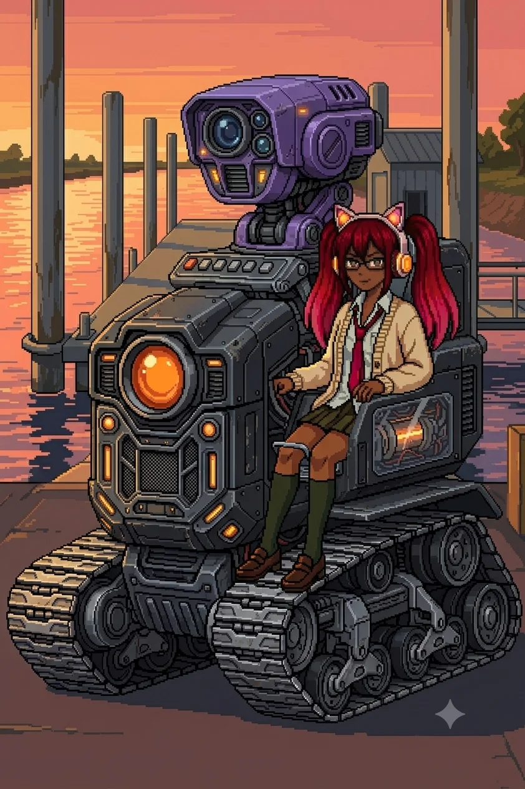
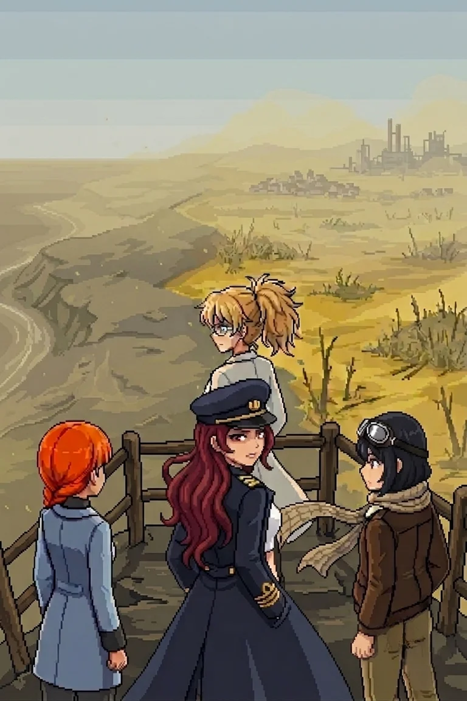

# Chapter 5: The Crossing

*Published June 24, 2026*

*Revision 8, updated July 22, 2026*

{ .chapter-illustration }

The trail north of the relay ran past a drop in the ground and opened onto longer sight lines: wider clearings, the stone closer to the surface than the interior soil behind us. Drona's cutting still ran ahead of us, into terrain we had not walked. The relay dropped behind the ridge. The light was past its balance point and moving toward dark.

Nadeshiko was running passes ahead.

"Bridge tiles to the north. A river crossing. Infrastructure beyond the far bank, ferry construction, the kind of approach that was built for regular use."

"The approach maintenance is recent," Katyusha noted.

Katyusha: "Most of the structure is older. The cleared lanes are not."

A crossing, then. That was where the lane work had been leading. Everything she had cleared for us ended at water, or it continued past it, and I could not read which from here. The message on the relay stairwell went with us: 'He has been waiting.' She had not written where.

We moved north.

---

The break-line formation was the densest we had encountered.

The drones here were calibrated above anything in the interior: heavier units, tighter spacing, overlapping fields that left no approach angle uncovered from at least two positions. Where the interior formations had channeled movement, this was built to stop it, and it held the approach from the north as well as from the south. Someone had once defended this crossing in both directions.

Katyusha stopped before the first position.

She turned from the formation and looked at me.

One beat. Something decided.

"Doctor."

I felt it land before I understood why.

"There were two. There was another Doct..."

She stopped. Complete.

"There were two." My mouth had it before I reached for it.

I did not reach into it.

"Hold that."

Maria was already repositioning east.

"I can take the opening volley from the east position, Doc."

Katyusha turned back to the formation. Whatever she had been reaching for went back on a shelf. She did not retrieve it. We went through the first position.

The clearance took twenty minutes. Katyusha worked the approach angles. Nadeshiko threaded the aerial contacts, her circuits between the ground units and the overhead clusters faster than I could follow from the path. Maria closed from the east and worked north up the water channel alongside the bridge approach. Two positions, then a third.

When the third fell, the ridge was ahead of us.

Drona was on it. She had been there since before we started.

"She watched the whole engagement," Katyusha reported.

---

We came to the bridge at the ridge's base.

The far bank was higher ground, the crossing spanning a river channel that was wider here than anything we had forded since the south coast. Beyond the far bank the approach continued north toward the ferry structure: the outline of it visible from the near side, dock infrastructure, open water past the dock.

On the far ridge, Drona stood.

She turned. Not to the group: to face me, specifically, and she held there.

Every time before this she had led us somewhere and then withdrawn: to the tower's north face, to the ridge above the relay, to the compound wall and then gone over it. She had held positions we could observe and then left them before we reached her. This was different. She was at a point where I could see her clearly, and she was waiting for me to look, and now I had looked, and she was still there.

A long moment. The distance too great to read her expression. Her stillness was readable: the quality of someone who has waited at a fixed point and has seen what they were waiting for arrive.

Maria came up beside me.

"She's not here for the ferry."

I had already reached the same conclusion. The ferry was the point she had built toward. Not the destination. Everything since the south coast, the lanes and the relay and the cleared approach, had been built to move us north to this.

"The ferry is the test."

"Do we still go?" Nadeshiko asked.

"We have to go."

The bridge held us for a moment. Then we crossed.

---

Three positions on the far bank. Katyusha named them before we reached the first: outer wall, kill corridor, ferry point. Hold capacity for the ferry point.

We went through the first two.

When it cleared, the ferry point was ahead. Water beyond it, open, the far side of the crossing, whatever came after this side of the island.

"Remaining capacity is sufficient," Katyusha reported.

"We go."

---

There was movement at the ferry approach: a single contact.

"NEXUS LIGHT," Katyusha read. "New designation. The pattern is incomplete. Not a full deployment."

Drona was walking to the dock. She moved without urgency. Her cardigan was still on.

NEXUS LIGHT was smaller than I expected: a compact unit, built for speed and reach rather than the coverage weight of the drones we had cleared through the outer wall. She mounted it from the south approach and it came alive under her hands, the running lights coming up in sequence. When it finished initializing it did not settle into a ready position. It stayed still and read the field before it moved. The headphone lights, which I had always read as teal at distance, shifted to orange.

She looked at us.

Something in her expression moved. Not warmth, not threat. A corner of the mouth. Something that looked like arriving at a destination that had been decided a long time in advance.

"You do not remember me yet,"

she said. Her voice was lower than I had expected, and more certain.

"You will."

The words held for a moment before anything else did.

She engaged.

"She wanted us here," I said, to no one. We were already moving.

---

*Katyusha*

NEXUS LIGHT opened on a vector I had not shown in this engagement. I adjusted.

It moved to where the adjustment created an opening. Not a recalibration pattern. An anticipation.

I pulled wide to a second position. The NEXUS was already there before I settled into it, which meant it was running projected behavior, not response to observed movement. The shot caught the tank's left flank mid-reposition, a solid hit, armor buckling inward rather than shearing clean. The impact came through the cockpit as a single hard jolt and a system fault light I did not have time to read. I logged it: reduced mobility on the left tread, nothing critical. I tried to read the protocol. The classification resolved to adaptive targeting and stopped there. The designation I reached for next terminated at the same location. I reached for it again. It terminated again.

It fought like something that knew how we fought.

I knew this doctrine. The specific name did not come.

I moved to an angle I had not used since before the relay approach. The NEXUS adjusted a half-beat late. I used the gap and called the east margin for Maria.

She was already there.

Nadeshiko broke her arc early and held instead of closing. The NEXUS tracked Nadeshiko rather than the flank she left open. It expected Maria on that flank. Maria had not held that flank in this engagement. The NEXUS was reading what it had been told to expect, not what it had seen.

I took the north channel approach while it adjusted for Nadeshiko's deviation. Maria closed from the south. The NEXUS held as long as it could.

It did not fall. It broke contact in sequence, screening its own withdrawal, and went north along the water channel under its own power. Damaged, not destroyed. I logged the unit designation and left the record open. Then I moved to the bank.

Erika was at the south approach, looking north after the direction Drona had taken. The sound of the engagement faded into the interior quiet.

---

*Erika*

The water in the north channel settled. The clearance echo worked its way out of the air.

Maria was looking at the rise above the dock.

"There's a lookout structure up there."

She was already moving toward it.

"Built into the slope. I want to see what she was guarding."

I looked at the path Drona had taken north. Already out of sight.

"She was guarding the view."

We climbed.

---

The lookout was old construction, fixed into the slope before any of what we had walked through, before the drones and the lanes and the relay and whatever had happened to empty this island. I took the railing at the top, the metal cold and slightly pitted under my hands.

The view from the platform was north and west.

What it showed us was color. And smell: something astringent that the interior air had not carried, arriving now from the north slope on whatever passed for wind in the flat evening.

Not the pale grey-blue of the interior sky, not the dry scrub we had crossed for two days. From the northern ridge line westward to where the terrain met the evening haze, a different color, uniform and settled: yellow-grey, the color of something that had been green once and was no longer, not on its own schedule. The color of a process applied.

"I see it," Nadeshiko said. Quietly, to no one.

Katyusha was reading it.

"Vegetation pattern inland is not natural. Discoloration extends to the horizon. Settlement clusters in the northern and western sectors are within the affected zone."

Settlement clusters.

Twenty thousand people. Ferry distance to the outer islands. I had thought about them once, at the farmhouse, in a specific register, and then stopped and gone back to the work.

There were villages under that color.

*...promise me.*

Not a sound. The shaped absence of one. The fragment surfaced and stopped, as it always stopped, in the same place. Whatever had been promised, I was standing at the edge of the result of it, looking at the full scale of what had been done, and I could not reach the occasion from this side of it.

"The south coast was the only clean corner," Maria said. "And we just left it."

She did not say anything else. The hat was level and she did not adjust it.

Nadeshiko turned from the view to look at me.

"Erika. The three of us can cross that."

She stopped. Restarted.

"You shouldn't be able to. Not on foot. Not through that."

"I will be fine," I said.

Katyusha was still reading the horizon.

"The data does not support that conclusion, Doctor."

"I know."

A pause.

"I cannot account for it yet."

I looked at the contamination on the horizon. The villages under it. The rows in a field somewhere in there, still legible in the dead growth, planted by someone who meant to come back. I had been on this island for two days and the contamination had not touched me.

I had to know what I had caused.

"Drona's trail continues north. We follow it anyway."

"That is what she wants," Nadeshiko said.

"Yes."

I found the path down from the platform. The team was already moving before I reached the bottom. The island opened north of us, contaminated and deliberate and waiting, and we went into it.

{ .chapter-illustration }

---

[Previous Chapter: The Guide](ch04.md) | [Next Chapter: Another Lab](ch06.md)
