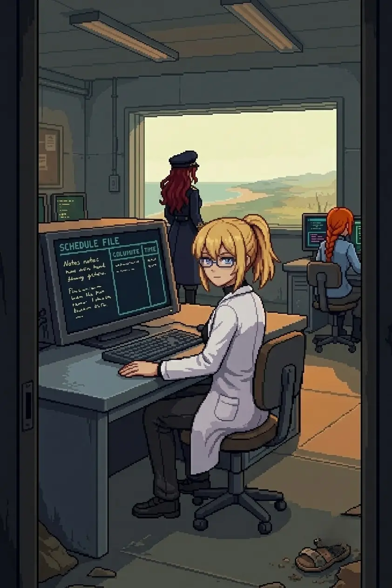

# Chapter 6: Another Lab

*Published June 25, 2026*

*Revision 4, updated July 27, 2026*

{ .chapter-illustration }

The ground was wrong before the first step.

Not the terrain. The approach ran the same rock shelf and coastal scrub as the crossing's far bank. What was wrong was the color: the vegetation at the path margins graying from the outside in, leaf-fall in a pattern that did not match any season. The soil where the path exposed it was darker than the stone, saturated without moisture.

Katyusha read it before anyone spoke.

"Soil composition anomalous from the first hundred meters. Vegetation failure uniform across the full approach gradient. The chemistry is not consistent with natural drought."

Nadeshiko came in from overhead, banking back before settling behind us on the path.

"No birds. No insects. Not even a gull. Like everything that could leave already did, and nothing moved in to fill the gap."

"That is contamination, Doc."
Maria was looking at the ground the way she reads water: taking in data I was not equipped to gather.
"Nothing does this naturally."

I did not reach toward what that meant. "Keep moving."

We moved north.

The path followed the shelf before bending inland. The contamination held along the full margin, nothing in the scrub moving except the wind. In one low section the path crossed a drainage channel, the runoff tinted at the edges; I noted the absence of insects on the standing water. The silence here had a different quality from the south coast's silence: the south coast had been empty of people. This was empty of more than that. The vegetation held still, not because the air was still but because there was nothing left in the stems to respond.

We covered the distance in flat afternoon light: nothing alive in the drainage channel, nothing circling the compound approach, no tracks in the margins. When the compound appeared in the middle distance I registered its shape before I reached for what it was: the same design language as the primary complex, unmistakably the same project. Low structures, concrete-grey, linked walkways, lights out in every window.

The main door was open.

Something arrived before the rest of it resolved into thought: not a memory, nothing that carried images or words or the texture of a specific occasion, but spatial certainty, the way a room returns to you in the dark when you have lived in it long enough, the knowledge of where the walls are before your hand goes out. I had been in this building.

The writing was on the gate, the only fresh color in the compound. Red paint, deliberate, applied carefully the way she had applied it every time since the compound on the south coast. I read it. The compound read it with me from behind its dark windows.

*The truth about what you did is hidden here.*

The same words she had written at the hangar. We had found them there without knowing what they meant. Nobody said anything about the difference.

"She was here after I was." I looked at the compound's dark entry. "We clear the perimeter."

A standard drone formation held the north approach: overlapping arcs, calibrated for coverage, the same doctrine as the interior perimeter on the south coast. Nadeshiko lifted to take the airspace above it. I kept the east wall behind me and measured the intervals.

---

*Nadeshiko*

The formation was a known type, coverage doctrine I had threaded before: I had the geometry mapped before I came into the first vector. I threaded the gap before the tracking adjustment came back. It came back late, as expected.

I reached for a sentence about having expected that, here, in front of this compound. The sentence stopped before it found anything.

The second pass cleared the east cluster. Katyusha had the ground contacts paced: she had the north approach's timing read before I finished my bank. Between us the perimeter was closing faster than it had been built to hold.

I came over the compound on my third vector. From altitude the interior court was legible: fence lines, debris accumulation at the base. A child's sandal near the inner fence, one heel worn at an angle, and an umbrella three meters from it, still at the open position, small from up here but specific, the kind of detail that has a person attached.

I was late on my contact by half a beat. I adjusted and it fell.

I reached for a sentence about the umbrella. The sentence stopped in the same place the other one had.

The last contact cleared. I came back down.

---

*Erika*

The compound went quiet.

At the base of the inner fence: the sandal, the umbrella, both in the wrong place for a military perimeter. Neither dropped in flight. The umbrella set down; the sandal on its side, a foot having stepped out of it somewhere between here and a destination that had not included coming back.

Nadeshiko came back down and looked at the gate from outside before we entered.

"It is the same message. Exactly the same words."

I looked at the writing. "She was expecting us here too."

She had been expecting us since before we arrived. At every point: the south coast, the hangar, the relay, the crossing. Each message placed before we reached it. I had understood since the lookout that she was ahead of us. I had not yet worked out what that meant about what was behind her.

"We go in."

Inside, the power was partial: emergency lighting in the main corridor, amber and flat, the primary bay dark. Somewhere below us the basement was flooded.
I turned without much conscious thought toward the east workstation.

Nadeshiko came in through the north door, checking the approach behind us as she moved.

"The entry was staged. Partial power but not no power. Door unlocked and left open. The whole compound is meant to be walked into."

"Then I follow you in, Doc."
Maria came in from the south corridor, the water from the flooded basement passage already drying on her jacket, her hat untouched and at its angle.
"Water's fine."

I sat at the east workstation and had entered the access sequence before I consciously directed it. The clearance level resolved to primary.

The file at the top of the access log was a schedule. Column headers in my handwriting: the narrow fast pressure of someone writing between tasks. Names in the rows I did not recognize. Twelve entries, each with a task log, times, results, a record of ongoing work, the kind that assumes the person who started the column will be present when it closes.

The dates at the top of the first column placed everything approximately two years ago.

"What does it say, Doc?"

Maria had taken the window position, facing north.

"A schedule. Names I do not recognize. Dates two years old."

I read the first column through. The handwriting was mine throughout. The initials at the end of each task entry were mine: E.H., twice, three times, across twelve rows. I scrolled past the first column into the second. Same hand, same pressure, the progress notes getting shorter as the project accelerated. One entry at the base of the column read simply: *all three integrated.* No closing date. Above it in different ink, the same handwriting but faster and heavier: *P4 pending.* Two letters and a number that did not resolve to anything I could reach from the front.

"I worked here. With other people."

Maria: "And now you do not."

My hand was flat on the terminal surface, cold. Something tried to reach through the names in the rows, through the dates, toward what the initials implied. It stopped.

*...promise me.*

Not a voice. The shaped absence of one. It surfaced and stopped.

I took my hand off the terminal surface. The cold stayed in the palm.

Maria had turned from the window. She looked at the screen, not at me, at the schedule. She did not say anything. After a moment she turned back to the window.

Katyusha was at the secondary console.

"Access logs confirm seventeen visits over eleven months. Last active entry is consistent with the reset date. No departure logged. No scheduled shutdown. The record ends. I cannot account for the operational content of those visits yet."

Seventeen visits. Eleven months of regular work in this specific room, at that specific keyboard, my initials at the end of twelve other people's task entries. I reached for any hour of it, any face at the neighboring workstation, and came back with nothing.

Maria had come away from the window. She was looking back at the gate from inside the corridor, where Drona's message was still visible through the doorway.

"Same words she left at the hangar, Doc. Same message, new wall."

"She is using my own words."

"Why is she showing you your own work?" Nadeshiko asked.

"I do not know yet." The schedule was still on the terminal. Twelve names in my handwriting, the last column unclosed. "We continue inland."

"She's been doing this since..."
Nadeshiko stopped. Started again:
"If she knew we would come here, then..."
The same place. She did not finish.

Katyusha, from the console: "The network north of this compound is the same signal family as the south coast perimeter. The clearance window is holding but will not hold indefinitely."

"Then we go before it closes."

I walked out through the north door. The main island opened ahead, wrong-colored to the full horizon, the discoloration from the lookout now continuous at ground level: a texture in the soil and the air and the dead growth underfoot. This was the same ground I had apparently walked seventeen times, sitting at that keyboard while the process was still running, typing those initials and walking out. None of it accessible from the front.

I looked back once at the team.
They followed, all three silent, into ground that had not finished being wrong.

[Previous Chapter: The Crossing](ch05.md) | [Next Chapter: The Boneyard](ch07.md)
