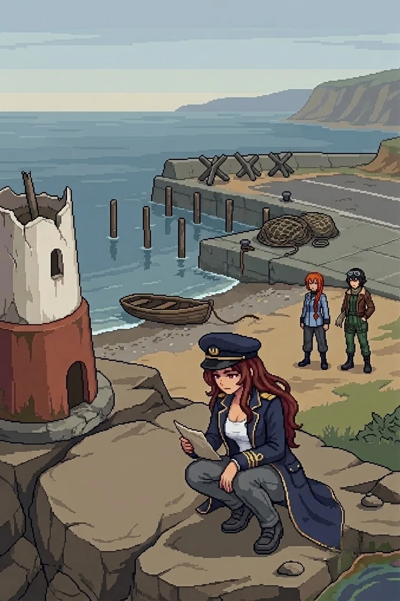

    
# Chapter 7: The Boneyard

*Published June 27, 2026*

*Revision 3, updated July 1, 2026*

{ .chapter-illustration }

The path ran two kilometers before the terrain changed register.

Not the contamination. That held constant, the discolored stems at the margins, nothing moving in the growth. What changed was the underlying character of the ground. The scrub gave way to cleared earth, and then to an access road, and then to the hangar complex: faded blue-grey concrete, rust-orange metal along the seams of the bay doors, the same low silhouette I had seen at the south coast hangar. A different building. The same design. Someone had built the same structure twice and placed them at opposite ends of the island.

The flower beds along the chain-link perimeter held only stems. Regular spacing, the border still edged, each bed maintained to the same dimensions as the others. Someone had kept the edges even for long enough that they were legible as beds and not as collapsed ground. The plants themselves had been dead for some time: the stems had gone the same grey-discolored as the vegetation on the approach path, not winter-dead but process-dead, the color change running inward from the surface. Whatever had killed the contamination path had reached these beds too.

I had seen flower beds once before, at a hangar perimeter. The same even spacing, the same deliberate edging.
The memory arrived as a faint smell of damp soil and fertilizer. It did not vanish.

I stopped. My hand was at my forehead before I had raised it. Katyusha interrupted.

"Incoming. Drone contacts on the north side of the building."

I retreated.

---

*Katyusha*

Three units in standard spread. I read the intervals before they completed their first arc.

Overlapping fields, calibrated for the open approach. Predictable.
I adjusted left and drew the outer unit. Nadeshiko came in from the northeast, threading the gap I left.

Maria held the perimeter fence. The pattern was known. The engagement was known. The outcome was known.
What I could not account for was why the formation felt so familiar.

I had the full doctrinal match in my logs. I knew the designer. I knew the deployment date.

I knew the exact order that had placed these units here. The access code restrictions kept the full context sealed.

I could not tell Erika.
The restriction sat like a fault line in my core processes. I logged the irritation and kept the engagement clean.
The outer unit fell. The second adjusted late. I took the gap.
Three contacts. Four minutes, seventeen seconds.
When the last one fell the open ground around the hangar was quiet.

I logged the engagement. The restriction had not lifted.

---

*Erika*

After the last contact fell the open ground around the hangar was quiet, and I walked the fence line to the north end where the wreckage zone began.

I glanced at Katyusha who had stopped in place with an expression unusual for her. I did not press.

It was not a battlefield. That was the first thing to resolve: these things had not been destroyed in any engagement. They were present exactly as they had been left. Ammo crates in a stacking pattern that assumed they would be moved, the top row partially shifted and then set back. Pipe clusters in the ordered sequence of an installation in progress, the far end of each pipe still sealed. Cable coils with their transit ties still on them. A cutting tool lying flat on a crate, set down with the blade pointed away from the person who had set it down.

Two years of wind and weather had shifted things at the margins: debris drifted into the lee of the crates, a slow rust across cut metal, the packed earth settled slightly. The underlying arrangement was unchanged. The crates were still in the pattern of someone who had expected to come back and load them. The cutting tool's angle still reflected whoever had set it down and the reason they had for that particular angle.

Between the ammo crates and the far wall: a work schedule in a clear-faced sleeve, cable-tied to the fence post at standing height. The kind that a team uses when they need to know who is where without looking for them. The sleeve had kept the paper dry long enough that the lines were still legible. Eight names in columns across the top, times in rows down the side, initials in the cells. The schedule ran twelve days. It stopped mid-week, the last three days of cells empty.

Katyusha stopped at the east wall.

The tank chassis was there: an older frame, the proportions more deliberate than the drone units I had been cataloguing since the south coast. A weapon unit's geometry. It had been there long enough that a debris pile had drifted against its lower body, half-burying the track assembly.

She looked at it for two seconds.

"Tank chassis. Older frame. The design reads like mine."

Nadeshiko had stopped three meters back. She was looking at Katyusha's back and not at the chassis.

"Keep moving."

We kept moving.

The message was on the far wall, applied with the same brush and the same handwriting as every other.

*Don't you want to know your sin?*

Every prior message had been a statement. An arrival note, a direction, a name ahead of naming. This was a question. It assumed the sin existed and set that aside as already settled. It asked only whether I wanted to know what it was.

Nadeshiko was at my right. She read the wall and said nothing.

Maria was at my shoulder. She read it once, then looked at me. Not at the message.

"They're never for us, Doc." Her voice was level, without performance. "I've been watching how she places these. Every wall since the south coast. She doesn't write to the team." She paused. "She knows who holds the access codes. She knows who opened the terminal back at the lab." A beat. "She's asking one person."

I had known this since the south coast compound. Knowing it and having it named were different things.

The message did not name the sin. The question was only about whether I wanted the specific account of it.

I did not answer. I turned north.

---

The path north of the wreckage zone ran through the same discolored scrub as the approach from the lab compound. The contamination held. The cutting tool's angle stayed in my peripheral thinking the way a misread persists.

The memorial coast opened half a kilometer on, and the air changed before the harbor came into view. The contamination smell was still present but the sea came in under it: salt and cold water and the particular quality of shallows over rock. Something that had been on the island since before the project and would be here after whatever we were moving toward. For a stretch of path, the smell of the sea had some priority over the smell of the ground.

A lighthouse stub on the headland. The upper half had come down in the two years, the fracture line clean, structural failure rather than impact. Dock posts standing in a row without a dock, the decking gone, rotted or salvaged or both. A net pile at the quay's end, coiled with the care of someone who intended to come back to it. The rowboat drawn up on the shingle had its mooring line still tied to a ring in the stone. The line had rotted through at the splice. The boat had not moved.

The fortifications were across the harbor entrance road: three concrete tank traps at the standard blocking angle, a guard booth on the landward side of the quay, sandbags stacked at the windows. They had been placed here while the dock was standing and the lighthouse was operating and the boats were in use. The booth's field of view covered the approach road completely. It covered the quay not at all.

Nadeshiko had stopped at the outer barrier. She was looking at the guard booth with an expression she did not usually put on her face.

"These were placed here while people were still here," she said. It was not a question.

Maria had come up alongside her. She was not wearing anything visible on her face. "Someone looked at this harbor and saw a choke point. They registered the lighthouse and the dock and the boats as context, not as the thing to work around." She looked at the tank traps' angles. "You place a booth to watch a road, you're looking at the road. They weren't looking at anything else."

I read the sightline from the booth to the approach. Clean coverage of any vehicle coming from the south. No angle on the harbor at all.

The rock pools at the base of the headland were discolored at their margins: a faint chemical quality in the water, different from salt bleaching, running as a thin band along the pool edges.

Katyusha crouched at the nearest one. She did not touch the water.

"Chemistry anomalous. Consistent with the interior contamination family, early progression." She stood. "The distribution is not marine introduction. The taint is moving south from the inland gradient. I cannot classify the specific compound yet."

Six months ago this pool had been clean. Or a year ago. The contamination was still in transit.

---

*Katyusha*

I had the artillery ranges before they fired.

Three units at the lighthouse base, positioned for the harbor road approach. The coverage geometry was standard: overlapping arcs across the approach corridor, the high ground giving them depth to engage at distance. The placement assumed a ground approach. It did not account for the seaward angle.

Nadeshiko peeled north to break the first coverage arc. Maria had already committed to the water, reading the seaward line the way she read every approach: before the problem had finished presenting itself. I held the landward perimeter from the cover of the net pile and kept the road clear. The second unit tracked Nadeshiko and lost her. The third held the approach road and did not adjust for Maria until she was inside its minimum arc.

Three contacts. Four minutes, twenty-two seconds.

When the last one fell the harbor went quiet.

Wind over water. The dock posts without a dock. The rowboat's mooring line slack in the shallows where it had rotted through at the splice.

A secondary process had been running since the boneyard.

The chassis at the wreckage zone had been older hardware, the proportions more deliberate than the drone units I had been cataloguing since the coast. I had looked at it for two seconds and recognized the design lineage without reaching for the source of that recognition. The identification was present the way Erika's hand on the activation terminal had been present, the way the log had read two hands and two operators before we had any context for a second operator: certain, specific, and without a traceable path.

I had logged it and kept moving. I had not resolved it.

I ran Drona's messages in sequence. The first four had been statements: information, direction, or both. None had asked anything back.

*Don't you want to know your sin?*

The fifth assumed the sin as established. It only asked whether she wanted the specific account.

Erika had not answered. She had turned north.

I had logged: *no response given.* I was still running the question of what it would mean when she did.

---

*Erika*

Nadeshiko found the carved record.

She had gone to the base of the lighthouse stub to look at the fracture line, and she stopped, and stood still the way she stood still when something had caught before she could finish naming it. I came up beside her.

The cuts were in the flat face of the rock below the stub, at standing height, deliberate strokes at a consistent depth. Not graffiti. Not a registration mark. The edges had weathered at the surface, old enough for that, but the depth held the letters clear.

No name. No date. Four words.

*We were still here.*

Maria crouched next to the rock and read it. She stayed there, not speaking. Katyusha and Nadeshiko gave her the distance. I moved closer.

Maria turned her head.

"Hey Doc."

"You always call me 'Doc.'"

She stood.

"I have something," she said. "Small."

"Tell me."

"The way your voice went when you said the word 'Doc.' One occasion, before." She held my gaze. "That was like before."

Something landed in my chest. I left it there.

"I do not remember saying it."

"I know." No weight in it, no comfort. Simply accurate.

Something in her expression held, like there was more. Then the corner of her mouth moved and she turned back toward the road north.

---

Katyusha came up alongside me as we cleared the headland. The afternoon light had gone flat.

"The contamination front at the rock pools is approximately six weeks ahead of the south coast degradation timeline," she said. "The inland taint is accelerating as it moves south."

"Log it."

"Logged."

Maria was three steps ahead, her hat silhouetted against the flat light. Nadeshiko had taken altitude to read the next approach. The island interior spread north of us, wrong-colored, contaminated in a pattern that was moving.

The question on the boneyard wall stayed with me, unsettled.
Every prior message had told me what existed or where to go.
This one had asked whether I wanted something. I had been moving north for two days without finishing that question.

Maria's memory pressed at me from behind, specific and unlocatable, the sound of a voice I did not recognize as mine. I let it.

I kept moving.

---

[Previous Chapter: Another Lab](ch06.md) | [Next Chapter: Dr. E.](ch08.md)

---

*Author's note: Panzer Island is also a strategy game available on
[Steam](https://store.steampowered.com/app/4757690/Panzer_Island/),
[Google Play](https://play.google.com/store/apps/details?id=com.rhedak.panzerisland),
and [itch.io](https://rhedak.itch.io/panzer-island-web).
Chapter 1 of the game is free. If you want to experience the story differently, or continue past where
the novel is currently, visit [the Panzer Island homepage](https://rhedak.github.io/panzer_island_pages/).*

*If you're enjoying the story, consider following or leaving a rating on [Royal Road](https://www.royalroad.com/fiction/176303/panzer-island). It helps new readers find the series.*
