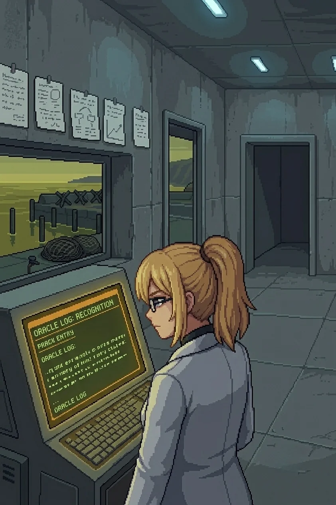
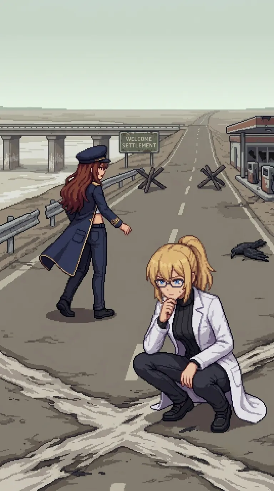

# Chapter 8: Dr. E.

*Published June 29, 2026*

*Revision 2, updated July 13, 2026*

{ .chapter-illustration }

The road to the bridge ran long and open, and for a while there was nothing to do but walk it.

Nadeshiko came up alongside me at the first straight stretch. The road had been empty long enough that the weeds were coming through the center seam, the asphalt sun-cracked and sallow at the edges, and there was nothing in any direction but the road and the yellowed scrub and the sky above the ridge holding its flat grey-blue.

"What did we used to talk about? Before. When it wasn't all this."

"You are asking the wrong table." Maria's voice, from a step behind. "None of us kept the receipts."

"I would have logged it," Katyusha said.

A beat.

"That is almost a joke."

Maria's voice carried the particular flatness of genuine amusement, the kind she did not perform.

"I'll allow it."

I thought about it for the length of one straight stretch. "Work. I think. I talked about work."

The road bent south at the ridge and the island chain came into view at the end of the sightline: five of them across the water, and what might have been a sixth in low cloud, all of them holding the same quiet they had held since we arrived on the south coast. The outer islands. That was where they had gone, if the empty rooms behind us meant what they appeared to mean. I did not let the thought travel further than the water.

"Did you question it?" Maria asked. "Before you forgot."

I looked at the islands. The sixth, or what might have been the sixth, dissolving in the cloud base.

I did not answer.

"Structure ahead," Katyusha reported. "Bridge crossing. Drones in the approach emplacements."

"Move."

The emplacements at the bridge approach were old: sandbags and barbed wire that predated the drones by the condition of them, set here before the project existed. Maria read the placement in one pass.

"This was a front line. A long time ago."

A different kind of conflict, before Oracle, before any of it.

The campsite was to the right of the approach: a fire pit, bedding for one person, the ash not yet weathered through. Katyusha crouched at it and did not touch the remains.

"One person. She left the campsite intact."

She had slept here. She had crossed the bridge ahead of us and slept on the near side, and she had known the terrain was the obstacle so she had not waited to watch us clear it. I looked at the bedding arrangement long enough to confirm it was hers and then moved to the engagement.

The clearing took twelve minutes. When it was done we were on the bridge.

Three hundred meters, Katyusha had said. The tidal flat below was dry now, old sea floor, the bridge pillars trailing salt residue at height where the waterline had been before it shifted. The whole island's underlying structure had moved since this bridge was built. I could read it in the stain on the stone without being told to look.

The far bank resolved ahead of us.

The contamination was denser here than anywhere since the ferry crossing onto the island. Not the slow grey discoloration of the approach paths, not the thin chemical banding at the rock pools. Vegetation absent entirely, the ground between the road and the tree line bare and scorched in bands, sallow yellow giving way to grey-brown in a pattern that ran from the inland side toward the bank. A dead crow at the road's edge, wings spread, the feathers carrying the same discolored grey as the scrub along the interior path.

Nothing had held on at this bank. Nothing had tried.

I stopped walking.

The bands read like something I knew how to read. The geometry of them, the way they ran from the inland gradient rather than diffusing outward from any single point. A source pattern. I stood at the edge of the bridge with the tidal flat below and looked at the scorched bands and did not follow the thing I knew about them toward where it led.

"Doc." Maria's voice, level.

"Keep moving." I waited one beat. "Please."

Maria looked at me. She said nothing. She moved.

We moved.

On the far bank the road continued east toward a settlement, a welcome sign at the edge with the name mostly weathered off the surface. Katyusha gave us three kilometers by the signage. The vegetation either side ran sallow and wrong, the color of something still technically alive and losing the argument.

Nadeshiko came alongside me again, quieter than before.

"We still haven't talked about the contamination."

"Not yet."

Maria: "Then we don't."

Katyusha: "Logging the request to defer. I will surface it on request."

"Thank you."

Nadeshiko looked at the road ahead. Something in her face settled.

"East, then. To wherever this road goes."

"East."

{ .chapter-illustration }

Drona's footprints were on the road shoulder a kilometer out: single set, civilian boot tread, the same read as the campsite. She had walked this road this morning, or last night. The salt was back in the air from the eastern side, a different quality than the south coast, calmer and smaller, the smell of a sheltered bay rather than an open coast.

The farmhouse was south of the road: a vegetable plot at the back with dead rows, the furrow spacing still legible under the dead growth. An open chicken coop at the side. Door standing wide, the latch not forced. No chickens. Not fled, evacuated, same as everything else on this island, in the same orderly manner, the coop left open because there was nothing left to keep closed.

I went past it without stopping.

The fishing village appeared at the next ridge: small harbor, weathered wood greys, faded paint on the net racks and the smokehouse at the fenceline. No lights. No power signature. The yellow-green sea at the harbor mouth was not the clean salt-blue of the south coast but the wrong color that everything east of the bridge was carrying.

"Then we go in."

The fenceline was partial, barbed wire along the perimeter with the boundary marker half down on the east side. Past it: a market square with a general store on the right, the door standing open. Goods still on the shelves. The cash drawer pulled and empty.

Maria stopped at the store entrance.

"Took the money. Left the rest."

"They expected to come back," Nadeshiko said. "To a point."

Katyusha: "The withdrawal was orderly. This is consistent with the harbor records and the farmhouse rows."

I did not stop. Past the market square, the road ran to the wharf: dock posts and net frames, a smokehouse greyed by two years of weather, the concrete outpost at the south end low and functional and sealed.

Maria came up beside me and slowed.

"Stop walking."

I stopped.

She was reading the approach geometry. The angles, the cover placement, the single entrance point. She did not look at me when she named it.

"This is a trap. The geometry gives it away. Engagement geometry favors the defender by a factor of three. The approach is a funnel."

Katyusha: "Confirmed."

Nadeshiko said nothing. She had stopped two steps back.

I looked at the outpost. The door. The concrete shell, low profile, the harbor behind it carrying its yellow-green water.

"We go in."

"Doc." Maria's voice, present without pressure.

"I know." I looked at the approach and it was what she had described and I had heard her. "I am asking anyway."

A silence that lasted one second.

Maria: "Your call."

"Logged," Katyusha said. "Doctor has the call."

"Move."

I took position behind the concrete barrier at the harbor road and stayed low.

---

*Maria*

The land approach was a funnel and I had named it. The harbor side was not.

I took the water while Katyusha drew the drone contacts north.
The harbor basin was still, the yellow-green of everything east of the bridge.
Three contacts at the south wall of the outpost: positioned for the road approach and nothing beyond it.
I came in from the water margin instead.

The first two adjusted late.
The third held its position, which told me its targeting had been set for the road and only the road.
I closed it from the margin.

I followed because I wanted to see it. Her, arriving at this. I had been waiting since the south coast.

I knew I was not supposed to want things.

I came up the harbor steps and through the outpost door.

---

*Erika*

Concrete shell. Power out. The cold smell of a sealed space that had been running on its own until it stopped: engine-dry, faintly chemical, the mineral undertone of machines left running with nobody to switch them off. Cold grey walls, cold grey floor. A console at the back wall with a battery showing residual charge, the terminal screen dark.

I crossed to it, and the startup sequence was already running through my fingers at a panel I had not consciously located. Not searched for. Known.

"You went straight to the right panel," Nadeshiko said.

"Yes."

Power restored. The display came up cold grey and then warm as the terminal's backlight cycled through its startup arc, the only color in the room. Most of the display was corrupted: status loops cycling on partial data, logs cutting out mid-entry, timestamps inconsistent. One partial record held complete.

*Project ORACLE, Phase 3 field integration commenced.*

*Primary architect sign-off: Dr. E.*

I read it.

Then I read it again.

"You read it twice," Katyusha said.

"Yes."

"What is Oracle?" Nadeshiko asked.

"I do not know."

Katyusha: "Movement. Doorway."

Drona was standing in the frame: not filling it, not advancing, simply present. Her gaze moved across the room the way she read everything: the console, the terminal display, the notes on the wall above it, and she gave nothing in return. No urgency. No signal of whether what she had led us to was the thing she intended or only the first of it.

She walked to the back wall.

I watched her take the brush from the inside of her jacket and apply it to the concrete. One word, red on grey:

*Good.*

Then she was at the door and through it, and her footsteps went north along the wharf and did not stop.

I turned to the wall.

Notes pinned above the console in a row: field logs, hand-written, the same careful spacing as every document we had found since the south coast. I recognized the hand the way I had recognized the activation panels: immediately, and without a path.

Most of them were mine.

Two were not.

I read the first of the others. Different pressure on the strokes, different spacing between words, a writer who accelerated into certainty the longer each entry went on. The spacing between words narrowed as the note continued. I had seen this before. Not in this room, from before. The specific quality of the handwriting was already in some register below the accessible one, sitting there the way the island chain had sat across the water when Maria asked whether I had questioned it.

I did not follow that toward where it pointed.

"Most of the handwriting on these notes is mine," I said.

Katyusha: "Insufficient evidence that 'Dr. E.' refers specifically to you."

"'Dr. E.' Sign-off as primary architect. Most of the handwriting is mine." I looked at the terminal, then the notes, then the terminal again. "I am Dr. E. I built Oracle."

No one disputed it.

"Two of these notes are not in my hand. Someone worked here with me."

Nadeshiko: "Someone else was here. With you."

"Katyusha."

"Logging the second hand. We do not have a name yet."

"We do not."

A moment passed that did not ask to be filled. Then Maria, quietly:

"Doc."

"I heard you."

Maria: "You are not."

I looked at the outpost window. The harbor beyond it, net frames without nets, dock posts without a dock, the wrong-colored sea sitting still in the early dark. "No. I am not." The terminal screen behind me was the only warm thing in the room. "I will be functional. That is not the same thing."

A pause.

"Logged," Katyusha said.

Nadeshiko, still looking at the notes: "What is Oracle?"

I looked at what I had made and did not remember making. The five notes in my hand, the two that were not. The partial record that was complete.

"Something I made and do not remember making."

Maria had already moved to the door.

"After her, then."

I clenched my fists.

"After her," I said, and did not look back at the notes that were mine.

[Previous Chapter: The Boneyard](ch07.md) | [Next Chapter: Twenty-Three Names](ch09.md)
