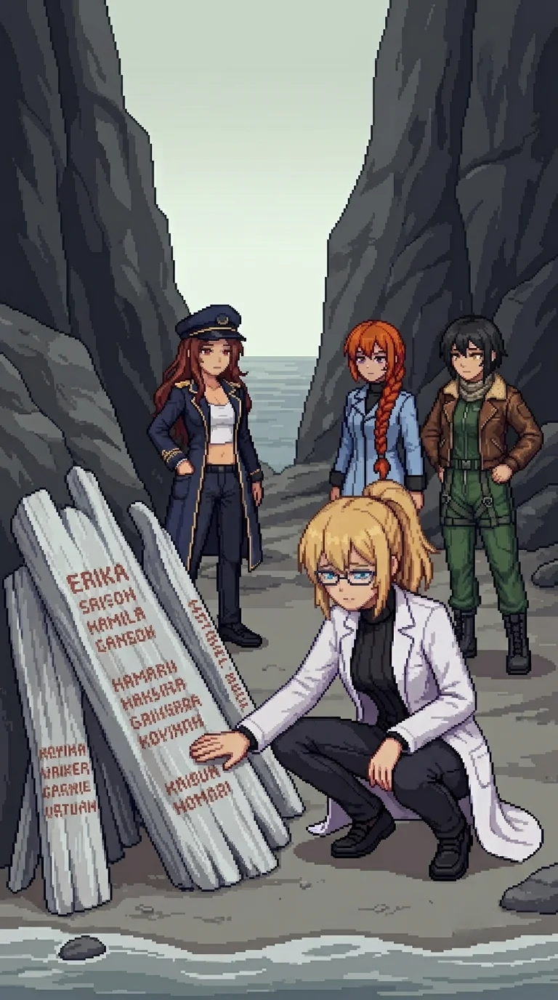

# Chapter 9: Twenty-Three Names

*Published June 30, 2026*

*Revision 5, updated July 13, 2026*

{ .chapter-illustration }

The coastal road climbed north of the fishing village and the wind came in off the channel with the particular quality of high ground: cold and lateral, carrying deep water and nothing else. The scrub on the cliff margin had given way to rock. Below, the channel was blue-grey and close, the water darkening fast past the cliff base. Maria kept pace with us from the water the whole climb, a shape moving under the surface rather than on it, in no hurry to be seen doing it.

Drona's footprints were on the path shoulder. Same tread, same depth.

Maria: "She is always ahead of us."

"Yes." I looked at the path ahead.

Maria: "How long has she been doing this?"

"Since before I woke up."

Maria: "Before we woke up, Doc."

Katyusha interrupted.

"We need to stop for supplies and a charging unit soon."

I did not look at her.

"We keep going."

We had daylight left and the trail was fresh. That was the reason I gave it.

Nadeshiko had been flying the cliff edge and came down to walking height to match my pace.

"Your readings don't change up here."

She looked at me sideways, the way she does when something won't resolve.

"The contamination. Same level as anything since the bridge."

She looked forward.

"It doesn't register on you."

I did not answer. "Katyusha."

"Channel below the path. Movement in the water. Naval signatures. Multiple."

"Mine."

Maria was already reading the angles.

"Cover from the cliff margin. Stay below the skyline."

I took position at the cliff margin, the drop below me.

The channel engagement ran long. The contacts were heavier than anything in the village, cruiser-class, and Maria worked the water from the cliff base while Katyusha held the approach road and Nadeshiko covered the arc above the channel mouth.

It went wrong in the third minute. One of the cruisers put up a flak pattern that had no business being on a patrol asset, and Nadeshiko threaded the first burst and took the edge of the second. I heard the change in her rotors from the cliff top: a beat added where no beat belonged. She did not spiral. She chose a pocket of shingle between two cliff faces and put herself down in it, controlled, ugly, alive, and Maria closed the channel twice as fast after that, which told me something about what Maria had been holding in reserve.

We came down the cliff path to the pocket. Nadeshiko was standing beside the helicopter with her hand flat on its flank, the way you stand beside a horse that has gone lame. The rotor assembly was visibly wrong. She was not visibly wrong, which is not the same as undamaged.

"I'm fine. She's not." A pause, and then, quieter, without turning: "Wait."

She was looking past the helicopter, at the base of the inner rock wall.

{ .chapter-illustration }

A beach pocket between two cliff faces, where the slope broke and a strip of shingle caught what the sea brought. The driftwood had been placed at the base of the inner rock wall: pieces sorted by size, the larger ones at the back serving as the surface, the structure built to face the water and to last. The salt air had been working at it. It had not been moved.

Names.

Painted first, then carved over the paint, then painted again over the carving. Three layers of making sure. The brushwork was patient, the letters uneven but deliberate, someone working close and taking time with each one. The carving underneath was deeper, made to outlast the paint. The paint above the carving was made so the names would be legible from the path above.

Katyusha: "Twenty-three names legible. Several share a surname. Six are grouped together under one."

Nadeshiko: "Six under one name. That's a whole family."

"More than one family."

Maria had come down to the shingle and was reading the names from left to right. Not quickly.

"More than one."

I looked at the layers. "Someone came here to do this. With paint and a knife and time."

Nadeshiko, not asking for an answer: "Six under one name. Did they all go at once, or one by one?"

No one answered.

Katyusha: "Inefficient."

Nadeshiko looked at her.

A pause.

"I am noting that the sentiment was strong enough to override impracticality."

Another pause, the same length.

"The names are legible. The record will last."

Maria: "It will."

At the base of the driftwood, beside the leftmost piece: a sealed envelope in a clear waterproof sleeve, the kind used for documents that must survive weather. I did not open it. Whatever was inside had been placed there deliberately and left, and opening it was a decision I could not undo. I left it.

My hand had found the carved names. The surface was rough under my palm, paint over carving over paint, three layers of someone refusing to let these names disappear into unmarked stone.

For a moment I did not move.

"I do not have names. These people did."

No one spoke.

I stood. "We keep moving."

The memorial fell behind us.

Nadeshiko walked with us now. The helicopter tracked alongside at head height, flying nothing that deserved the name, the added beat in its rotors keeping time with our footsteps. She had said "I'm fine" twice more since the pocket, unprompted, which by her own accounting was once too often.

Katyusha: "The channel engagement exceeded everything we have fought on this island combined."

Maria: "She has been holding back, or she is not working alone."

Katyusha kept her pace on the road.

"A single field commander would not have this asset budget. Drone command in the doctrine I have access to is hierarchical."

"Someone is signing off." I kept my pace.

Maria: "Someone we have not seen yet."

The cliff line ran ahead and the contamination ran with it, the scrub carrying the wrong color, the rock faces holding the chemical smell the island had been carrying since the bridge.

The path reached the highest point of the climb two hours after the memorial and the view opened.

Coastline north for several kilometers, the channel behind us, the inland plateau spreading west. At the inland horizon, center of the island, southwest: a structure. Not a relay tower. Something larger. The silhouette held at the distance: vertical mass, arrayed forms at its base, too symmetrical to be a geological formation.

Nadeshiko: "That's not a relay tower. That's something else."

Katyusha: "Approximate distance: twelve kilometers. Silhouette only. I cannot resolve detail at this range."

Maria: "It is not small."

I stood at the high point and looked at the inland horizon.

"I see something. I do not know what it is." A pause. "I know it is mine."

Katyusha: "You see it."

"Yes."

The silhouette held. Twelve kilometers of contaminated ground, whatever was above Drona, whatever I had signed off on in Phase 3. The structure did not give me the account. It gave me the distance.

Maria came to stand beside me.

"Doc. On the record. Are we doing this."

"Yes."

Maria: "We could turn around. Sit on a beach for a year. Figure out who we are without all of this."

"I cannot."

Maria: "I know."

A beat.

"I'm asking anyway."

I looked at the horizon a moment longer. "We continue."

"Then Maria votes continue."

Katyusha: "Concur."

Nadeshiko, quiet: "Same."

"Thank you."

The road bent west from the high point. The structure held its position on the horizon until the terrain took it.

"West, then."

Two hours west of the cliffs the terrain flattened and the relay site came into view: three antenna towers on the high ground at the center of an inland village, the structures locked and covered. The team's operational reserve had run lower than I had tracked.

Katyusha: "Thirty-one percent. Below the threshold for sustained engagement."

Maria glanced at the relay towers.

"Same here. The lab cells from before the bridge are gone, Doc."

Nadeshiko: "Mine ran out somewhere after the last tower. I kept going."

She had kept going without telling me. I noted this.

"I have not eaten since yesterday."

Maria, carefully: "Doc."

"I know. We stop for supplies first. We should have done so earlier."

The village had a bus shelter on the road in, the route map faded but still legible: six village names on the main route, four clear enough to read, and below them a ferry schedule connecting to the offshore islands. I did not stop long. There was a pantry door open two buildings north and cans on the shelf inside.

The drones came from the relay before we finished the sweep. I moved to cover and let the team work the approach.

Drona was at the base of the first tower when we reached it.

She was holding the access door open. Standing to one side. Waiting with the specific stillness she had been carrying since the south coast compound.

"In."

She stepped aside and we went in.

---

*Nadeshiko*

Wide-band sweep while Katyusha ran the ground contacts.

One word on the loop, clean and repeating, in the frequency range I was already scanning: ORACLE.

I knew the word. I had known it before. I did not run the search.

I marked it and kept the sweep running. I had been scanning for this frequency. Not this word. For something.
The loop had been running on that band for two years; the wear on the signal said so. And I had watched this frequency before, somewhere I could not reach,
and I did not remember what I found the first time, and I did not know why I knew this frequency to watch,
and I was still tracking the third contact when

The last contact fell. The signal cut.

'Why don't I know what I should know?' the thought came unbidden. 'Why am I the only one that doesn't know?'

I stopped. I was not supposed to think that, the programming discouraged it.

I came around to the north end on foot, the sweep antenna still deployed. Ahead, the team was at the tower door.

---

*Erika*

The relay control room was clear and recently used. Two consoles on the main wall; the right one wiped clean within the last week, the input hardware showing the particular cleanliness of a deliberate wipe rather than disuse. Nadeshiko had already found what mattered more tonight than the room's history.

Nadeshiko: "The annex generator is still running. We can charge here."

"Then we charge here."

The industrial generator in the relay annex was still running. The charging unit connected to it was rated for sustained draw and Katyusha had already identified the connection points before I had crossed the room. The team plugged in. I went back to the village for the food.

When I returned they were in the positions they had settled into: Katyusha in the corner, Nadeshiko cross-legged on the floor with her goggles pushed up, Maria with her back against the wall and the hat at its angle. The room was warmer than the outpost. The generator ran through the floor.

I spread the annex's tool roll beside the helicopter and started on the rotor assembly, working through the first can in alternation with the fasteners.

My hands knew the build. That had stopped surprising me. What had not stopped surprising me was the specificity: the way they went to the third fastener first because the third fastener seizes on this airframe, the way they carried the torque settings by feel. Nadeshiko came and sat on the far side of the rotor column, inside the work light, saying nothing, watching her own machine come back together in the hands of someone who could not say where she had learned it.

In the second hour,

Nadeshiko: "Maria. Did you know you hum when you charge? Low, off-key."

"I do not hum."

Katyusha: "You hum."

A long pause. Maria looked at the charging cable, not at Katyusha.

"We are not friends, Katyusha."

"Logged."

The quiet came back. The generator ran.

"Thank you," I said. "For finding this."

Maria, without opening her eyes: "We needed it. All of us."

Katyusha: "I do not require gratitude. But it is logged."

Later,

Katyusha: "The tower foundations were poured in a hurry. The mix ratios show it."

Nadeshiko: "They built it fast and they built it afraid."

I looked at the floor. "There was a war here. Or one was coming."

The rotor assembly closed a little before dawn. My hands had gone from cold to numb to a distant kind of steady, and when I finally sat back, the light over the eastern hills was already grey.

"Will she fly?"

"She will fly. Gently, until I can test the balance under load. Do not let me watch you do anything interesting for a day."

"...Define interesting."

"Nadeshiko."

"Gently. Got it."

The relay log on the open console showed the transmission destination: north, three kilometers. Maria had already read it.

Maria: "There is an archive north of here."

I thought of the driftwood memorial, the twenty-three names, the structure waiting twelve kilometers southwest of wherever north led. "Then we proceed north."

Maria had not moved from the wall. She was still in the charging position, eyes closed, the hat at its angle and something in the quiet of her face that was not sleep. For a moment, not long, something shifted in her expression, a small reaching that almost landed. Then it settled. The generator ran. The hat stayed at its angle.

She did not say anything.

Nadeshiko: "North."

I paused for a moment before replying.

"North."

[Previous Chapter: Dr. E.](ch08.md) | [Next Chapter: The Archive](ch10.md)
