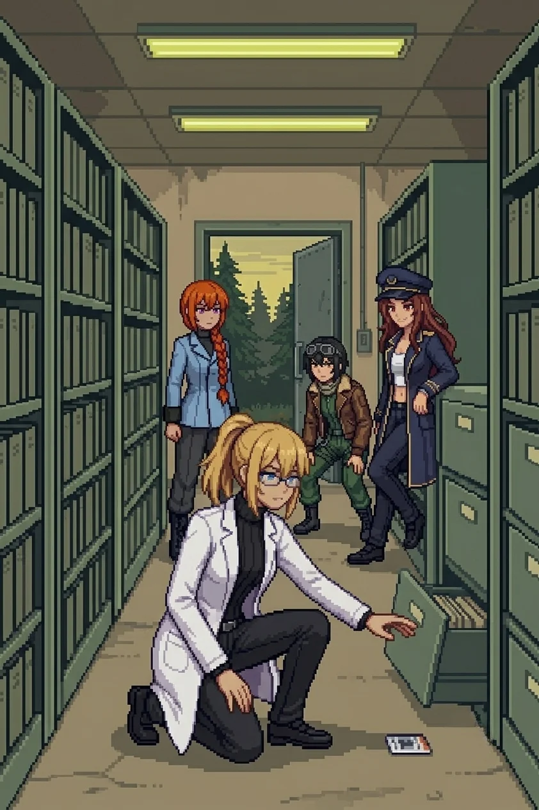
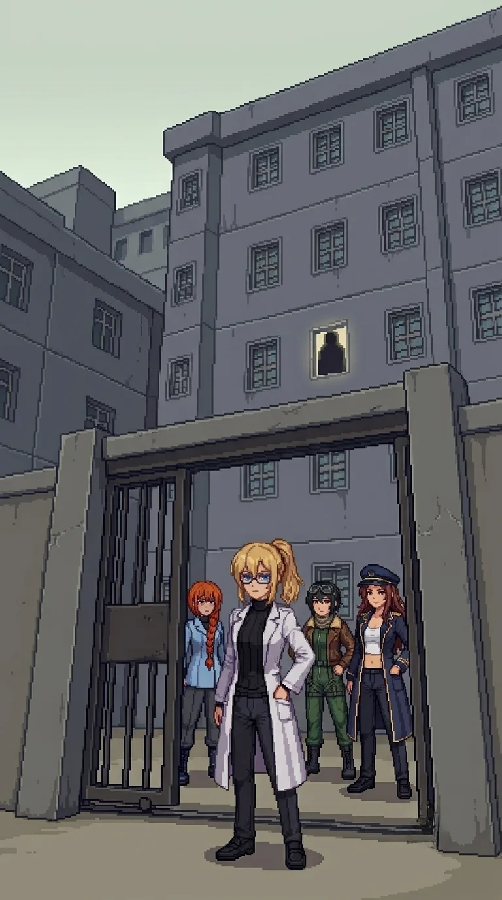

# Chapter 10: The Archive

*Published July 2, 2026*

*Revision 2, updated July 2, 2026*

{ .chapter-illustration }

Three kilometers north, the road was flat and the morning had not warmed it yet. The grass at the verge held the overnight cold, frost not quite settled, ground not quite dry. Drona's footprints were still on the shoulder, the same tread and depth as every kilometer since the south coast. But now a second set walked beside them.

"Heavier impression," Katyusha said. "Larger boot, joining from the east."

Nadeshiko crouched at the prints. "They walked together."

I looked at the stride length. Even and unhurried. "Or someone walked alongside her."

The archive appeared at the next bend: a concrete building behind a wire fence, emergency lights on in the upper story, a generator audible as a low thrum once the wind dropped. The fence on the east side had been cut, recently enough that the edges had not rusted through. Someone had forced the issue and not bothered to conceal it.

"The damage is not from the catastrophe," Katyusha said. "Someone has been here since."

"We are not the first." I moved toward the entrance.

The main door was steel, sliding, half-open. Scrape marks around the lock where someone had worked it with patience rather than force. Drones around the perimeter in the configuration I had learned to read: containment posture, keeping us out rather than pressing an engagement.

"They want to keep us out," Nadeshiko said.

"Move."

---

The archive interior was cold and institutional and dry. The filing racks ran floor to ceiling on three walls, grey-green metal under flat yellow emergency strips that hummed at the edges of hearing. The fourth wall held flat drawers for oversized documents. The aisles were labeled. The pine forest outside dampened all external sound, and inside there was nothing but the scrape of our boots on utility-grey flooring and the occasional settling of a structure that had been holding weight for two years.

I did not read the labels.

---

The OFFICE was at the end of the first sector, third door from the north wall. Before I reached it, a memory surfaced, not called for and not mine to stop.

***The office was yours. Third window looking north, with a view of the approach road in clear weather. The chair adjusted too far to the left and you had learned to compensate. The schedule on the wall was yours: Tuesday standing meeting, Friday review. The working stack went on the left side of the desk; the archive copy, already closed, went on the right. You had used this room for a year and a half before you moved operations inland. You came back seven times after that. You knew the sound of the hallway outside the door without looking.***

***You knew this room.***

The sector cleared and I was standing in the aisle and the team was waiting and Katyusha was watching me.

"You are processing something. What is it?"

"Nothing."

"Logged."

Maria, from my left: "Doc."

"Move."

---

The second sector held the public records along one wall: school registers with handwritten columns, medical files in green folders, town meeting minutes with the council chair's signature at the bottom of each page. Nadeshiko stopped at the school register.

"These are still half intact."

Katyusha was reading the dates. "School records. Medical files. Town meeting minutes. All of it still here."

Maria looked at the files the way she looked at everything she could not use: complete and without sentimentality. "There were institutions here. Bureaucracy. Routine. Ordinary arguments about ordinary things."

I stood at the edge of the civilian records section and looked at it. The kind of documentation that accumulates around ordinary life without anyone deciding to accumulate it: the record of a place that assumed it would continue.

"These were not just homes."

"Yes," Nadeshiko said.

The project files were across the aisle. I should have stayed longer at the civilian records. I moved to the project files instead, and the same thing rose again before I had opened the folder.

***Project ORACLE, Phase 3 field integration. The timeline was yours: field data, integration protocols, activation parameters. Each section had a signature line at the bottom. You reviewed each section in order. The signature was clean, deliberate, practiced. You had signed your name on a great many things. This was one more.***

***You moved on.***

---

Between sectors two and three the filing changed character. Project-specific records, recently worked.

Someone had moved through each folder with a narrow edge, a letter opener or a knife blade held steady, working into the paper at the signature line to lift the print layer without damaging the text above it. Patient work. Hours for the number of files affected. The co-PI field on every document had been abraded to clean: every countersignature, every secondary authorization, every co-authored section header. Not redacted. Removed. The gouge marks were visible on the label surfaces of the filing cabinets near where the work had been done, the tool slipping once or twice and scoring the metal. It came a third time before I had finished reading the damage.

***There was a second desk. You had moved it to the south wall yourself, where the light was better in the afternoon. The name on the document binders was not yours. You knew it the way you knew the coffee order and the argument about the ventilation unit and the specific habit of leaving notes at forty-five degrees on the surface so they would not be covered. You reached for the name from the paper.***

***The paper ends before it arrives. The record ends. The signature line is abraded. You cannot find the edge.***

---

At the back of sector three, behind a filing cabinet moved and left at an angle, Maria found it.

"Doc. Behind the cabinet."

A staff ID card, face-down on the floor. I turned it over.

Both name fields redacted: an adhesive layer, professional, applied after the fact. Not the same as the scraping on the documents. The title field was intact: "Lead Researcher, Project ORACLE." Below it a countersignature line, also abraded.

"Two architects," Maria said. "Both names gone."

I looked at the card. Two different methods. Two different times. "Someone wanted those names gone. More than one someone."

Katyusha held the card at the edge and read the title again. "Logging. Two redaction methods. The adhesive layer is post-catastrophe. The scraping is consistent with the document age."

"The second person came after," Nadeshiko said.

Neither method had reached the folder.

---

The folder was on the third shelf from the top, second position from the left. I did not search for it. My hand went to the location before I had read the row, came back with it, and I was already turning it open before I understood what I was holding.

Personal. Filed in a project archive where personal materials were not stored. I had put it here two years ago knowing I was not following protocol and had put it here anyway.

Inside: three photographs.

The first two were project calibration records with timestamps in the corner.

The third was not a calibration record.

Two people in lab coats. The frame was slightly off-level, the kind of composition that comes from a timer and a surface, too much ceiling and both subjects off-center. Not posed, or the kind of posed that has given up trying to look unposed. The lab coats were the same model, the same color. They were standing closer than professional distance.

I did not recognize him.

I recognized my own expression.

---

The team had gathered in the main room when the signal came.

Nadeshiko dropped to walking height, her voice tight. "Signal. Clean, not looped. Same channel as the relay transmission."

Katyusha was already reading the contact. "Decoding now. A male voice, cut before resolution. Source: north of here."

"He is close," Maria said. "Whoever he is."

I held the folder.

"I saw something. In the records."

No one moved.

"Every document had a co-PI field. Co-Principal Investigator. Alongside me on every page."

"The signature line is gone on every record. Someone went through each file and scraped the signatures out of the paper. By hand. Hours of work." I took the photograph out and held it by the edge. "A photograph survived. In a personal folder I filed here and did not know I had."

Nadeshiko had gone still.

"Two people in lab coats. Standing too close."

Maria was not looking at the photograph. She was looking at me.

"I should know him. I do not."

A pause that no one filled.

"Katyusha."

"Logging: co-architect, identity removed from the records. Possible source of the transmission." A brief pause. "Concurrent: your contamination readings in this facility are unchanged from open terrain. The ambient density here is elevated. I have filed this observation nineteen times since the bridge. I will continue to file it."

I put the photograph back in the folder. The folder went inside my coat.

"He is north. The signal was."

"Then north."

---

The approach zone was three kilometers of road between the archive and the inner perimeter, and I walked it without marking it. Nadeshiko flew ahead. The central installation resolved from the silhouette I had seen from the cliff high point into concrete and steel: vertical mass, antenna arrays still turning on the upper structure, a generator thrum that came up through the ground before it became audible in the air.

"Lights are on," Nadeshiko called down.

Katyusha was reading the structures as they grew. "Antennas rotating. Generator-grade signal on the wind. It is active."

"Not dead," Maria said.

The drone density doubled at the inner perimeter: newer and cleaner than anything we had passed, arranged for a specific approach vector. Not improvised positioning. Someone had thought about where we would come from.

Katyusha paused at the edge of the formation. "Recently placed. These were positioned for our arrival."

Drona was ahead of the formation.

She was standing aside, not directing the drones, not in the approach, simply present and apart from the arrangement. I looked at the formation and then at her and understood the same thing the team was understanding.

"She is letting us through," Katyusha said.

"Why?" Nadeshiko.

Katyusha: "Insufficient data. Take the advantage."

"Move."

---

The outer ring's engagement was the longest since the channel. When it cleared, Katyusha came to where I was standing at the inner perimeter edge. She did not begin with a status report.

"A word surfaced during the engagement, Doctor." She held my gaze without emphasis. "The word 'Doctor.' The title in my training records for someone under my protection. The assignment covers two individuals, not one."

"Two."

"I cannot give you the second person's identity yet. The assignment covers two. That is the extent of the retrieval." A pause. "I know you do not have that memory."

"I do not know what you are remembering."

"I know. That is why I am telling you now."

Nadeshiko had come down to the road. "Two. So there is someone else she was supposed to protect, and now we cannot tell if they left or the record did." She looked at the building ahead. "I do not know which is worse."

No one answered.

---

Nadeshiko, from above the road: "Signal again. Same channel."

Katyusha decoded while we moved. "The voice is clean this time. Two words: 'Turn back.'"

I had heard this voice. Not since waking, not on the island, not in any room I had walked through in the last two years. From before. From the register that existed underneath the accessible one, the frequency range I had been almost-hearing since the first morning and had never once caught the shape of what it held.

"...I know that voice."

"You know it?" Maria.

"I have known it since I woke up. I have never once caught what it was saying." I looked at the building ahead, the lights on inside, the antennas still turning. "Until now."

Katyusha pointed north with her chin. "Source: north. Inside the inner ring."

"Then he is in the building."

"He has been in that building a while," Maria said.

"...We will see. Move."

---

One more perimeter line. Maria called it first.

"Movement. Third-floor window."

A single figure standing in the window frame, looking down at the approach road. The interior behind them was dark enough that the face did not resolve at this distance. The posture held while we watched.

"How long has he been there?" Nadeshiko asked.

"Long enough."

The figure did not move.

Maria came up beside me. She did not look at the window when she spoke.

"There is a memory I have been holding, Doc. From before... like the time you said the word back."

I looked at the figure in the window. "Now?"

"Stronger here than it has been anywhere." A pause. "I will tell you on the other side of the gate."

The figure watched us.

"Katyusha."

Katyusha read the installation ahead. "The inner gate is ahead. We know where he is."

"Through the gate."

---

Nadeshiko checked the relay terminal at the outer fence before we moved. The network log's last entry was dated two years ago.

"'All systems dark. Stand by.'"

Maria: "After that, only static."

"We are about to find out why."

Nadeshiko, looking ahead: "I can see the gate from here."

The installation's lights were still on. The antennas still turning.

"Move."

---

Then:

Maria: "I'm on your shoulder, Doc."

Nadeshiko: "I'm on your other one."

Katyusha: "I am on the line."

{ .chapter-illustration }

---

[Previous Chapter: Twenty-Three Names](ch09.md) | [Next Chapter: The Nest](ch11.md)

---

*Author's note: Panzer Island is also a strategy game available on
[Steam](https://store.steampowered.com/app/4757690/Panzer_Island/),
[Google Play](https://play.google.com/store/apps/details?id=com.rhedak.panzerisland),
and [itch.io](https://rhedak.itch.io/panzer-island-web).
Chapter 1 of the game is free. If you want to experience the story differently, or continue past where
the novel is currently, visit [the Panzer Island homepage](https://rhedak.github.io/panzer_island_pages/).*

*If you're enjoying the story, consider following or leaving a rating on [Royal Road](https://www.royalroad.com/fiction/176303/panzer-island). It helps new readers find the series.*
