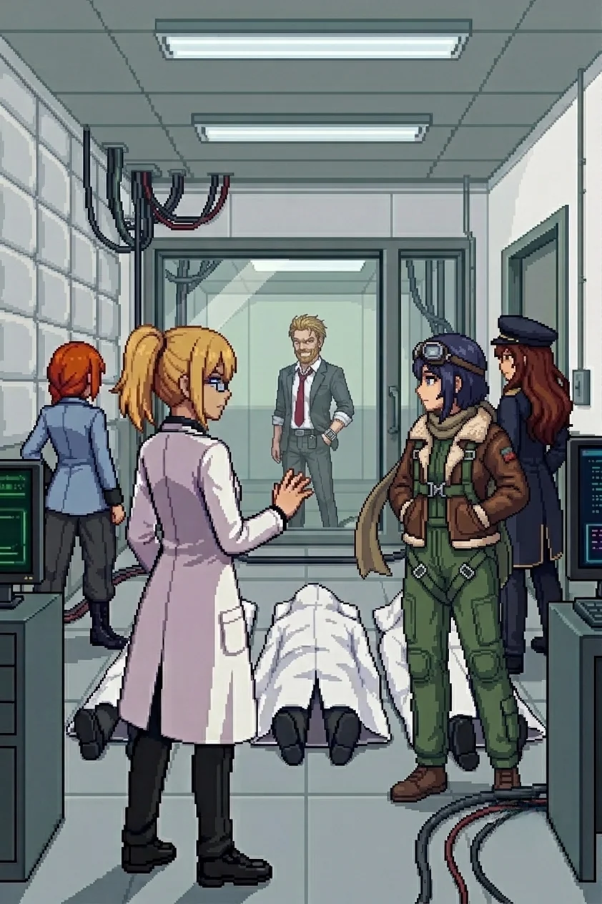

# Chapter 11: The Nest

*Published July 3, 2026*

*Revision 2, updated July 3, 2026*

{ .chapter-illustration }

Through the inner gate.

The third-floor window was empty. Whatever had been watching us from it was no longer watching, and its absence had a different quality than the empty windows of the farmhouse or the archive: it was not abandoned. It had moved.

I stopped in the entry corridor.

"The gate keys to a six-tone pulse. The corridor inside turns left twice. There is a fire exit halfway."

Katyusha: "You remember something?"

"No. I just know it. The way I know how to repair you."

The installation's lights were on at full operational standard. Not emergency strips, not residual charge. Deliberate. Someone had been maintaining this place and the maintenance had been recent.

---

The first courtyard held a drone formation across the approach vector. Not improvised: arranged for our specific line of entry. They had known where we would come from.

"They expected us," Maria observed.

"They expected me."

We engaged and moved through. The inner courtyard beyond was empty. No drones, no defenses. The first-line formation had been a door; everything behind it was open and waiting.

Nadeshiko, from above: "She is letting us further in."

Through the inner corridor: a heavy formation across the second courtyard, fourteen units, and Drona south of the line, standing apart from it, not directing any of them. The same position she had held outside the archive, outside the relay, outside every engagement since the south coast. Present. Not directing. Waiting for us to move through.

"She is keeping us moving toward something."

"Move."

---

The second wave cleared and a door stood open ahead at the far end of the bay.

"She is moving," Maria called.

Katyusha's voice, reading the layout: "She is not retreating. She is going up. There is a NEXUS unit in the bay."

"She is mounting it."

I looked at the bay. A wide maintenance space, high ceiling, the smell of machine oil and electrical systems under full power. The NEXUS unit was waiting in the center: armored panels, weapons arrays in ready position, targeting systems running their baseline sweeps. A unit built for something the island had no longer needed.

Drona stood at the base of the mount for one moment. Whatever her expression held, it was not the neutral she had maintained since the south coast.

"Finally."

Then she came for us.

I worked the east wall of the bay. My hand found a secondary panel at shoulder height and I had already activated it before I understood what I was doing: a lighting circuit that flooded the south end of the bay, pulling one of her targeting systems into a recalibration cycle. I had known the panel was there. I had put it there.

Katyusha, from across the bay: "Logging."

---

*Katyusha*

The NEXUS targeting array swept at a rate I had logged twice before: the relay station configuration, the outer perimeter. She had been calibrating against us for ten weeks. I called Maria left and watched the sweep miss by two meters. Nadeshiko pulled altitude. I held the east wall of the bay.

The recalibration cycle Erika had triggered ran four seconds. I tracked Nadeshiko's approach angle and adjusted to close the gap she left. When the array returned I was no longer in its expected position.

At the second formation shift I ran the voice match I had been queuing since the relay. Two transmissions, one cut, one clean. Both sourced from this building. At this proximity the signal environment was the cleanest it had been since the south coast.

The match ran against my training records.

It completed.

The record behind it was locked.

The restriction sat in my processing in a way I recognized from the relay station. A fault line running through the core of what I knew and what I was permitted to act on. I logged the irritation. I logged it a second time to verify the first logging had not resolved the underlying state. It had not.

I had two protection assignments. The first I could state in full. The second was behind the restriction. The restriction did not prevent me from knowing what the second designation covered. It prevented me from acting on that knowledge in a disclosed way.

I adjusted my coverage angle eleven degrees toward the north end of the building. The engagement was in the bay. The restriction did not prohibit this adjustment. I made it and logged it as a formation correction, which was not precisely accurate.

Nadeshiko came down fast from altitude and drew the primary array into recalibration. I held the east position and covered the bay.

I also covered the building.

I returned to coverage and kept the formation tight. The fight was still running.

---

The NEXUS came down in sections, outer array first, then weapons, then drive. The smoke from the wreckage thickened and obscured the bay interior.

"Did anyone see her come out?" Maria asked.

Nadeshiko, from above: "No sign. She could be in the wreckage or she could be through the far door. The smoke is too dense."

"Keep eyes on the bay."

We waited. The smoke drifted. The maintenance cycle that had been running when we entered was still running: the console indicators on the bay wall cycling through their status sequence, indifferent to the wreckage in the center of the room. The far wall resolved slowly through the clearing smoke. There was a door at the back and it was open.

---

The inner room had a glass partition at the far wall, lit from inside with the same operational standard as the rest of the building. The floor between the entrance and the partition was not empty.

Three covered shapes arranged with care. Lab coats visible at the hems. The arrangement was not accidental: someone had done this afterward, before the place went dark, and the care in the arrangement was its own specific kind of evidence.

Katyusha came to stand beside me. "Doctor. Do you recognize them?"

"Yes."

I stood with that for a moment.

"One of them used to bring tea around in the afternoon. She had a specific timing: mid-morning and mid-afternoon, without being asked, without variation. I do not remember her name."

Maria had gone quiet. She did not reach for anything light to put next to that.

"...Go on."

---

Movement behind the glass.

The figure came into the light on the other side of the partition and stopped. His face resolved through the glass: thin in a way the archive photograph had not shown, or in a way two years had made it. The suit was the same cut as the one in the photograph, dark grey gone pale along every crease pressed into it too many times without a change of clothes. The shirt had yellowed at the collar. The tie was loose, worked and reworked past the point of holding a knot, the red gone dull. Two years in the same clothes.

"Hello, Erika."

The voice reached me before the words did. It was the one from the dark when I woke up. The one I had said yes to.

He held my gaze through the glass for a long moment.

"I rehearsed this for years. I had every word of it in its place." A pause. "Then you walked in with nothing behind your eyes, and none of it held."

"There was a room on the east side of the compound. You kept a photograph on the windowsill. You said it helped you think."

I did not speak.

"You burned it yourself. The night before the final test. You said you did not want it in the same room as what you were about to do."

I thought about the photograph I had found in the archive. Filed in my own folder, in my own handwriting, in a place someone had not been able to reach. The photograph I had burned and the photograph I had kept were not the same one. I had known what I was going to do and I had made sure he would not be entirely gone from the record. I had no access to what I had known then. I had only the evidence of what I had decided.

"Look at this island. The silence. Every record with a name torn out."

His voice changed register.

"She did this."

"What?" Nadeshiko.

"You did, Erika." He said my name. "All of it."

Something tightened in my chest. I had no word for it.

Katyusha: "The accusation is logged. Insufficient evidence to corroborate or refute."

Maria: "That is one version."

Nadeshiko, quietly: "You don't get to decide that."

He did not answer the team. He was looking at me.

"Do you remember Wilhelm?"

My hand moved toward the glass. I stopped it. An inch of motion, no more.

"...I do not remember anyone by that name."

"I know."

Something came out of my mouth before I had decided to say it.

"...You asked me to promise something."

A silence.

"Yes."

He held my gaze for a moment. Then:

"The truth is east of here. In the ranges. Where you built the others. You will find the second erasure there."

He turned and walked deeper into the room and did not look back. A service door at the far end opened and closed.

---

The inner room settled into quiet. The glass partition was empty. The service door at the far end had closed behind him. The lights were still on at the same operational standard they had held for two years, and no one had decided to turn them off.

"..."

"Who is he to be so angry with me?"

No one answered immediately.

"He claimed you killed everyone in this room." Maria's voice was careful, not soft.

"I heard." I looked at the three covered shapes on the floor. The tea. I could not remember her name. "The records in the archive confirm I authorized the activation. They do not confirm the rest of his version. He has been holding his version for two years." I looked at the glass partition, empty now. "So have I, in a different way. I do not have enough information."

Nadeshiko: "He's been telling himself a story for a long time."

"Probably." I looked at her. "I will not take his word for it alone."

Maria: "What do you want."

"The truth. If this is my fault I will take responsibility for it. But the records will tell me what is mine and I will read them myself."

"We continue?" Katyusha.

"We continue."

---

Maria had not moved from the entrance.

"Doc."

I looked at her.

"That memory I told you about. The one I said was not ready yet." She looked at the middle distance, not at me, not at the covered shapes. "There was a way you said 'Doc' once. It came out sideways, like you hadn't decided if you were done being angry. I've held onto that one."

A pause.

"I was hoping you would still say it the same way."

"..."

"I'm still figuring out if you are the same person who said it before."

I thought about the photograph. The one I had kept and the one I had burned, and the choice between them, and the fact that both choices had been mine. "...Same body."

"That is not the same thing."

"...No. It is not."

---

Katyusha, from the bay entrance: "He left through the service corridor. Northbound, inland. We can follow if we move."

"After him," Maria said.

"After him." I looked at Katyusha. "Your deferred log. When we reach the next station."

"Acknowledged."

Nadeshiko had not moved. She was looking at the empty partition, at the corridor behind it, at the door through which he had gone. She turned back to us.

"Are we others?"

"I do not know yet."

We moved.

---

[Previous Chapter: The Archive](ch10.md) | [Next Chapter: The Other PI](ch11f.md)

---

*Author's note: Panzer Island is also a strategy game available on
[Steam](https://store.steampowered.com/app/4757690/Panzer_Island/),
[Google Play](https://play.google.com/store/apps/details?id=com.rhedak.panzerisland),
and [itch.io](https://rhedak.itch.io/panzer-island-web).
Chapter 1 of the game is free. If you want to experience the story differently, or continue past where
the novel is currently, visit [the Panzer Island homepage](https://rhedak.github.io/panzer_island_pages/).*

*If you're enjoying the story, consider following or leaving a rating on [Royal Road](https://www.royalroad.com/fiction/176303/panzer-island). It helps new readers find the series.*
