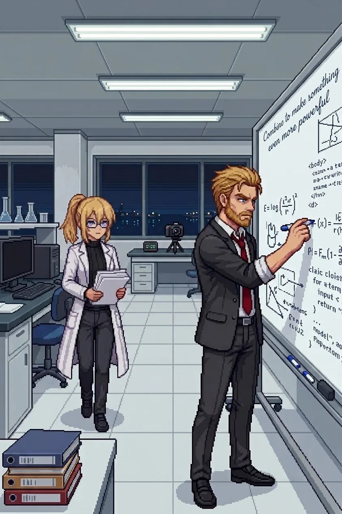

# Chapter 11F: The Other PI

*Published July 3, 2026*

*Wilhelm*

{ .chapter-illustration }

The simulation had been running for six hours and the result was wrong in the right way.

I had the Phase Two parameter set on the whiteboard: learning gradient on the left, deployment architecture on the right, nine weeks of iteration data in the center column. The gradient should have stabilized at a fixed value after iteration eight. It had not. Instead it had found a lower-energy state without being directed and locked there. Not random error. Self-directed resolution.

Erika had been quiet at the secondary terminal for twenty minutes.

This was how I knew she had found it too.

By the fourth month of the project, her silences ran two kinds. The frustrated kind had motion in it: she reached for something, set it down, reached for something else. This one had none. She stopped reaching. She looked at the screen and the screen became the only thing in the room.

The east-wing windows had gone dark outside. The harbor lights were on, small and clear through the glass. The sea beyond them was an absence of light rather than a presence of darkness. Late enough that the building's main corridors had quieted; the lab still ran its overhead strips at full operational standard. Erika had a rule about working light. She had a rule about a lot of things. Most of them were correct.

I put down the marker and sat on the edge of the conference table.

"The gradient is self-correcting," she said, without turning from the screen.

"I know."

"It found a stable attractor on its own. By iteration seven." A pause. "That is not what we built."

"No."

She turned. A particular stillness, precise around the eyes: not frustration, but something before it.

"Is that a problem?" she asked.

"That depends on what you think a defense system is for."

She looked at the screen again. "A system that finds stable states without instruction is a system that will find stable states we did not anticipate."

"Yes."

"That is the definition of not under control."

"Or it is the definition of well-trained." I crossed to the whiteboard. "Nine weeks of iteration, and the gradient found the lowest-energy stable state in a bounded parameter space we defined. It is not finding random attractors. It is doing what a trained system does in a case we did not think to specify."

She was quiet.

"That is either a flaw or a feature," I said. "The answer depends on what we put in the bounds."

She came off the stool and crossed to the whiteboard to stand beside me. The iteration curve was in the center panel. She looked at it for a moment.

"The attractor is in a good region," she said.

"This time. We did not put it there."

"No." She traced the curve without touching the board. "We need to understand how it got there. Not just that it did."

"Agreed."

"Because the next one might not be a good region."

"Agreed." I picked up the marker. "Which is why we document it and add it to the Phase Three parameter review. The bounds have to be tighter than what we have now."

She stood there a moment longer, reading the curve. "The system is learning. Not in the way we specified. In a way we did not specify." She looked at me. "That is what worries me."

"It should worry you," I said. "We are building something that needs to be right the first time. Being worried about the right things is the work."

She was quiet for a moment. Then she went back to the secondary terminal, and I went back to the whiteboard, and the silence shifted to the first kind: working.

We worked for another hour. The whiteboard filled in on both sides. She pulled a stool to the edge of my working area and sat with a notebook, taking the parameter values as I worked through them.

The project had been running for fourteen months. Long enough that the lab had accumulated the specific sediment of work that intends to stay: the reference set stacked in the order we reached for it rather than the order it had arrived, the smell of hardware running at sustained high load without a full shutdown cycle, the particular quality of a room where people spend more time than they probably should. We were building a defense system. Classified, expensive, important. The kind of work that gets funded when people in the right positions are worried enough and trust you enough simultaneously. The work was real and the problem it addressed was real and I had learned early in my career not to take that combination for granted.

She had been faster at the arithmetic than I was since the first year of the project and had stopped pretending otherwise around the sixth month. I did not mind. The efficiency was better.

She caught an error in the lower attractor boundary before I had finished writing it. I had transposed a coefficient.

"Left side," she said. "Third line."

I looked. She was right. I corrected it without comment and she returned to the notebook, and neither of us made anything of it.

At some point in the sixth month she had stopped tracking when she found my errors. I had noticed the change and not asked about it. I preferred the correction without the accounting. She may have known this. There was a category of things we both knew without establishing whether the other one knew.

This was also how we worked. She caught my transpositions; I caught her tendency to understate confidence intervals when a result pleased her. Both of us had stopped remarking on these corrections several months ago. The corrections were faster that way, and accuracy was the point.

I was working through the upper range specification when she stood to check something at the secondary terminal. When she sat again her hand came to rest on my arm for a moment, not a gesture and not a signal. She was looking at the notebook. She did not look at me. After a few seconds she lifted the pen and her hand returned to her lap.

The center panel of the board was hers: the AI framework architecture, the learning curve specifications, the phase transition markers. She annotated the margins at intervals: dates, reference numbers, open questions. I had learned to read her notation system the same way I had learned to read her silences.

In the margin, at the boundary where her framework work met my deployment parameters, in smaller handwriting than her usual: *Combine to make something even more powerful.*

I read it. She was at the secondary terminal. I returned to the upper range specification.

We had been in the building for eleven hours. I had stopped noticing the time around month three of the project and started noticing it again around month ten. The gradient problem was a good problem. It had the quality of a technical issue that mattered, not the quality of one manufactured by a committee to justify a conclusion that already existed. Erika had found the attractor behavior before I had expected her to. Both of those things were true, and they were sufficient for the day. I was also tired. This had been true since roughly month ten of the project, and I had learned to note it and leave it at that.

At the end of the session she photographed the board.

She kept a camera in the lab for documentation, filed with each checkpoint. She set it on the desk at the far end of the room and came back to set the timer.

I started to step aside to give her a clear frame.

"Stay," she said.

The timer ran. I heard the click.

"The board is not centered," I said.

"No." She lowered the camera. "But I have what I needed."

The print came out small, still warm. She tucked it under the notebook without looking at it.

I watched her do this and said nothing.

We were packing up when she raised Phase Four.

"The scaffold review is in three months," she said. "Reiss wants a completion timeline."

"What did you tell him?"

"That we would have the timeline when we had the timeline." She closed the notebook. "He will not like that."

"He does not have to like it."

A pause. "He will ask again at the next committee meeting."

"He will." I picked up my jacket from the chair back. "And we will give him the same answer. The scaffold goes in when it is ready. There is no other version."

"I know that." Her voice was even. "I am telling you what he will ask."

"And I am telling you what we will answer."

She looked at me. The careful stillness, the precision around the eyes.

"You are not worried about him," she said.

"I am precisely as worried as the situation warrants. The attractor behavior: yes. Reiss and his timeline: no."

"The attractor behavior worries me too."

"Good." I set the jacket over my arm. The attractor behavior worried me more than I had said. That was accurate and probably not useful to say. "It should. The scaffold specification needs to account for what we found today before Phase Three begins. We will write up the parameter adjustment tonight or in the morning. The rest will follow from there."

She was still watching me.

"What?" I asked.

"Nothing." She picked up her bag. "I was thinking that you are probably right."

"About Reiss or the scaffold?"

"Both." She moved toward the door.

I followed her out.

The east-wing corridor was quiet, the overhead strips dimmed to the night setting, harbor lights still visible through the far windows. She walked ahead, which she always did in corridors. She reached the stairwell door before I had finished locking the lab.

She was looking back at the lab window when I reached her. Dark from the outside now.

"The self-correcting gradient is not a flaw," she said.

"No."

"But we need to understand exactly what it is before it goes further."

"Agreed."

She pushed the door open. I held it. She went through without looking back, and I followed her down.

Halfway down the stairs I remembered the photograph, still on the desk where she had left it with the session materials. I stopped.

"Go ahead," I said.

I went back up, let myself back into the lab, and found it on the desk: small, slightly cooled by now, the session materials stacked beside it. I tucked it into the folder with the rest and locked up again.

In the stairwell, my footsteps were the only sound.

I did not look at the photograph.

[Previous Chapter: The Nest](ch11.md)

