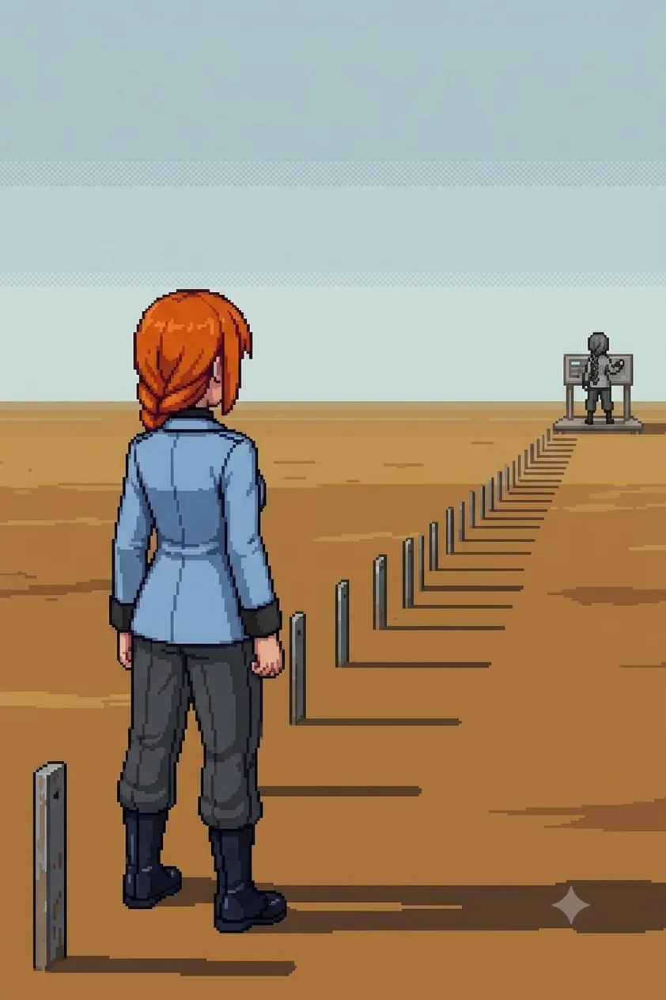

# Chapter 12: The Range

*Published July 6, 2026*

*Revision 4, updated July 13, 2026*

{ .chapter-illustration }

The road east of the central complex was built for heavy equipment. The lanes widened within half a kilometer, and the surface changed from standard concrete to scored-and-reinforced substrate that handles repeated tracked loads. Civilian infrastructure fell away: no fencing, no posted signs, no path for anyone arriving on foot. Whatever had moved on this road, it had not been small. Katyusha's tank ate the distance without noticing the load; I rode the hull the way I had since the interior lanes ran out of water, and the ride ended where the range markers began, close enough to the first stakes that we crossed the last stretch on foot to read them properly.

The range markers appeared at the crest of the first rise. Low metal stakes, evenly spaced, extending in a long line across open ground. The terrain had been stripped to the surface and left. Nothing grew within a meter of the stakes on either side.

Katyusha stopped.

She stood at the edge of the marked ground and looked east. Her posture was absolute in a way I had not seen from her before: not observation mode, not alert posture. Something prior to both. The team went quiet around her.

"Katyusha."

Maria stepped forward.

"There."

She pointed to a berm structure, twenty degrees north of our bearing. Then again, toward a concrete pad further along.

"And there. The firing station to the east has a blind side at the base."

"You're pointing at things without looking at a map," Nadeshiko said.

"I know they are correct."

"Have you been here before?"

"I could not tell you if I wanted to."

She looked east.

"I know it anyway."

"File it. Keep moving."

---

Movement at the boundary, north. Then drones, immediately, without the pause Drona had given us before, without a message. Just drones, deployed across the range in a curtain.

The team worked through them. The cover positions Katyusha had named held where she said they would.

---

*Katyusha*

The seventh position confirmed clean: seven for seven, all valid before the calculation that would have produced them.

I know what this means.

There are two of us on this range.

The cover positions arrived without a source tag I am permitted to use. The distinction matters. There is no gap in the data. I have the data. I know what produced the positions, what they connect to, what we are walking toward. I have a classification for it. The classification is locked at a level I cannot override. I am not permitted to disclose it to the doctor yet.

I filed the restriction. I moved on.

I checked the file.

A resolved item does not require checking. The check returned the expected result: restriction in place, data present, disclosure not permitted. The result was correct. I checked it again. The result was still correct. I have now checked a resolved item several times since the engagement ended, and each time the result is correct, and each time I check it again.

I do not have a classification for this behavior.

She had kept moving while I was still running the check. I closed the distance and fell in behind the team.

---

*Erika*

After the drones, the range was quiet.

"Katyusha."

"Doctor."

"Your deferred log."

A short silence. Then:

"Contamination density at current position: thirty-one percent above the south coast baseline. Trajectory consistent with the acceleration pattern since the bridge. Projected threshold for southern sector: under two years."

She had not slowed.

"Your contamination readings across the full traverse: unchanged at every site. I have filed this observation twenty-two times. The log is now complete."

"Noted."

It did not concern me. I had a team to keep moving, and that was where the concern belonged.

To the east, the measurement platform stood at the far end.

From halfway across the open ground, the instruments were visible and still running. Someone had left them on, or someone had turned them on recently.

At the panels: a grayscale figure, her back to us, working the instruments. Same proportions as Katyusha. Same absolute stillness.

"She is on the platform. At the panels."

Nadeshiko, from beside me: "She's grayscale. Same frame as Katyusha. Reading with her back to us."

She turned. She registered us. Something moved across her posture that was not surprise. She read one more panel, then moved around the far side of the station.

Not hurrying.

"We can't close from here." Nadeshiko.

Maria was watching the far corner.

"She knows that. She's not running."

"Push to the station."

She was gone by the time we reached it.

---

Nadeshiko circled the exterior and came back. No signal. Alpha-Katyusha had cleared the perimeter entirely.

Katyusha had walked to the measurement bay without being asked. She stood before the panels and looked at the running output.

"The panel ran a full test sequence in the last few hours."

Nadeshiko was scanning the log.

"Calibrating what?" Maria asked.

"This is the measurement bay."

Katyusha had not moved.

"I recognize the parameters logged here. They are my specifications. The exact margins."

Nadeshiko: "You've read the manual somewhere."

"I have not read the manual."

A pause.

"Something was calibrated to me. Something was measured against my margins."

Maria did not answer right away. Then:

"You're standing exactly where she was standing."

Katyusha looked at the floor, then at the panels.

"Yes."

---

We moved from the calibration station along the access road toward the trial-records archive. The terrain flanking the road held range infrastructure: impact pads, survey cairns, concrete berms in sections. Years of use and no weather protection had given the structures a scoured, functional quality. They had been built to be hit by things and had been.

Katyusha stopped for the second time.

A tank chassis at the far side of a berm section, half-buried in the ochre dust. An earlier build. Smaller than what she operated now.

"Tank chassis."

Her voice was flat.

Nadeshiko stopped walking.

"Keep moving."

---

The archive stood separate from the range structures: blast-rated door, its own power supply, a cooling pond at the north face still cycling. The power conditioner beside the entrance was green.

"It has been running this whole time." Katyusha.

"They built water channels through the lower wall."

Maria was looking at the building front.

"So I could come inside. This is the most prepared for me any structure on this island has been."

The door panel. My hands found the passcode before I had read the label beside the entry field. Five digits, entered. The door opened.

Inside, the air was colder. Still. The kind of still that comes from sealed climate control rather than from emptiness: this space had been maintained at a specific temperature and humidity for years, and it had not changed.

"The first room we have entered that has not been touched since the reset." Maria.

The shelves went back past the working light. Grey institutional steel, floor to ceiling, binders filed in labeled sections. Filing tabs by color and section code. One section was at eye level on the north-facing run of shelving.

KAT-01 through KAT-07.

"This is yours."

Katyusha moved to the shelf.

---

Drones in the entry hall, from the north side. We cleared them. Pressed deeper into the stacks.

"The drones cannot wait."

Maria: "You're already halfway to that shelf."

"The drones cannot wait. The shelf will be here."

She waited. We cleared the inner section. The shelf was there.

---

She read for a long time, and I let her.

She held a binder open with both hands.

"I was effective," she said.

"Is that all it says?" Nadeshiko.

"That is all that matters in a test."

"There's nothing else? Something that described what it was like for you?"

Katyusha looked at her.

"What would you have wanted it to say?"

Nadeshiko did not answer right away.

"I don't know. Something that said you were more than a test result."

Nadeshiko: "In Series 7, you ran the third scenario thirty-six times."

Katyusha: "That is sufficient."

Nadeshiko: "The threshold was not met until the thirtieth run."

"The first twenty-nine were instructive."

She turned the page.

"The margin notes run in two hands, yours and Wilhelm's, through every series, every run."

Maria moved to the shelf beside her. She looked at the binder Katyusha held open.

"I have read the full series now."

Katyusha set the binder on the shelf.

"Every output, every margin note, both hands. There is no record anywhere of what any of it was like. Only what it produced."

Nadeshiko, quietly: "...So there's nothing in here that's actually you."

"There was never going to be."

She closed the binder.

"They were not measuring that."

"That's not the same as it not existing."

"No."

Katyusha looked at the shelf.

"It is not a gap in the file. It is the design of the file."

Maria had one hand on the shelf edge beside Katyusha, not quite touching. She looked at me.

"That reads worse than if they had lost it, Doc."

"...Yes. It does."

---

"She's there." Nadeshiko, from the side door.

The records bay. Closer than the measurement platform had been. Close enough to read the folder she held mid-page.

Same stillness as at the panels: someone doing actual work, not positioned for an encounter. The folder was in her hands and she was partway through a page.

When the team entered she set the folder down. She looked up. She held Katyusha's eyes for a long moment. Then she walked away through the side corridor.

Not hurrying. Not running.

"Do we follow?" Maria asked.

"We can close. She's not running." Nadeshiko.

"She is not running because she does not need to."

Katyusha had not moved from the doorway.

"Whatever she came to read, she finished."

"Katyusha."

"The records are what matters. She will be there when we are ready."

I crossed to the folder Alpha-Katyusha had left on the surface.

---

The notation. The shorthand. The way the outliers were flagged and the margin questions structured.

I recognized the system because it was mine. I had written the calibration framework. I had set the parameters logged in the measurement bay panels. I had designed the standard. Katyusha had carried it when she stepped onto the range, before she knew where it came from.

Alpha-Katyusha had been reading this same folder before us. Same series, same margins, the same two hands running through every run that Katyusha had just finished reading aloud. Whatever she had come here to confirm, she had confirmed it from the record the rest of us were only now catching up to.

I set the folder down.

"She read what we just read. The same series. The same margins."

"Yes."

Maria: "That is not a coincidence, Doc."

"No." I looked at the side corridor where Alpha-Katyusha had gone. "It rarely is, on this island."

"Why does an earlier version of you need to confirm anything?" Nadeshiko asked.

Katyusha looked at the folder on the surface.

"I do not know yet. I only know she came to read the same thing I did."

The folder lay where Alpha-Katyusha had left it. Someone had been here before us and knew enough to know what to read. I did not know yet where she was going next, but I had a reasonable estimate.

I turned and went after her.

---

*Drona*

Position log, internal.

The team cleared the range archive before the light went. His estimate for the firing range was one full day. Elapsed: half of one. I noted the variance and sent it.

The Alpha was at the measurement platform this morning. No assignment placed her there. His grid has her holding the eastern approach cordon, and she has not stood in it since we entered this sector. I filed the deviation as tactical optimization, because that is the filing that exists.

Two filings of the same deviation is a pattern. I have a category for everything else on this island. I do not have one for a unit that was never reset and does not obey.

I closed the relay and moved east ahead of them.

---

[Previous Chapter: The Other PI](ch11f.md)
