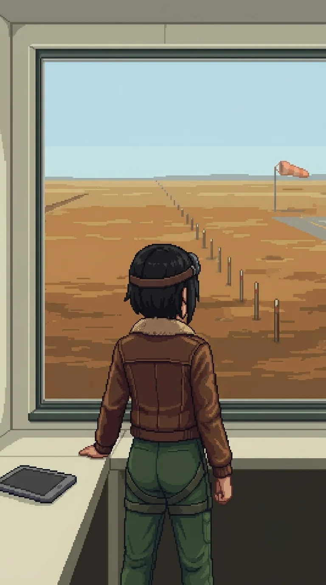

# Chapter 13: The Anomaly

*Published July 8, 2026*

*Revision 3, updated July 13, 2026*

{ .chapter-illustration }

Alpha-Katyusha was somewhere lateral in the testing sector's ground, and we had stopped trying to close on her.

"We will reach her when she is ready," Katyusha said. "Keep moving."

Past the range and the berm country, the terrain opened. Ground cover thinned, the sightlines extended, and the range marker type changed: longer stakes, wider intervals, oriented along corridors rather than across impact zones. Not measuring blast radius. Measuring approach paths.

---

Nadeshiko stopped before she should have.

"The air is different here. More open."

Maria: "This is the flight range."

"Past the far end of the approach, behind the apron."

Nadeshiko had not looked east. She was looking at the marker line in front of us.

"The control booth door opens north."

Katyusha: "You cannot see the booth from here."

"No."

A pause.

"I just know."

I had heard something close to that before, from my own mouth, in the first hours after I woke.

Katyusha was watching her.

"You are describing the layout without looking at it."

"I know."

A pause.

"It feels like remembering something I was never told."

Maria: "Like waking up and already knowing your name."

"Exactly like that."

Katyusha: "File it. Move."

---

*Nadeshiko*

The approach corridor runs west to east. The apron sits past the rise. The control booth is behind it, door facing north.

I know this the way I know wind-shear: not as a conclusion but as a starting condition. The outputs were present before I ran the calculation.

I checked the source. There was no source address I could file under.

I checked my model for the wind-shear pocket at the eastern end of the corridor. I had flagged the pocket in an approach survey. I found the flag. I found no record of the survey. The data was precise. The timestamp was absent.

I have done this check before. I do it every time a prior fires without a source address. I have done it enough times now to know the shape of the result: data present, accurate, no origin.

Katyusha's gaps have a different shape. She has data. She has the source. She is not permitted to access it yet. The filing system is intact; the file is locked. I can see this in how she answers: she deflects with precision. She knows exactly what she is not saying.

Maria's gaps are different from Katyusha's. What Maria does not say, she does not say by choice. I have watched her long enough to tell the difference between "I cannot access this" and "I have decided not to." She decides not to, and then she makes a small joke to close the subject.

Erika's gaps are different from both. She does not remember. But the knowledge is still there, surfacing before she reaches for it. She recognizes things with her hands first. She arrives at the truth and acts surprised to find it. The forgetting is real. The material is not gone.

Mine is different from all of them.

I do not have locked files. I do not have unfiled priors surfacing ahead of the question. I have accurate data and no source address and nothing underneath when I look. The gap is not at the access layer. It is not at the retrieval layer. It is below the retrieval layer. Whatever was here before is not archived or restricted or waiting to surface. It is not here.

Something was removed.

I named the wind-shear pocket when we crested the rise so the team could account for it in the approach. It was there. I did not explain how I knew. Katyusha noted I had named it before it was visible. I confirmed. She filed it.

Bay 3 was empty. The windsock was faded orange. I knew this before the color resolved. I filed each instance and kept moving. I have gotten very good at keeping moving.

At the far end of the approach: the grayscale figure from the range, walking the corridor line at measured pace. Same build as the one Katyusha had marked. The exact trajectory I had named. She paused at the position marking the wind-shear pocket and said something. My sensors caught it. The others did not.

[[Alpha-Katyusha]]

Three hundred and forty-two names.

I do not have a category for where to file it. I do not know what it means. I know that I am the only one here for whom that is true.

She completed the approach and moved out of the range's sightlines. I could flag the removal as hostile action. I have considered it.

I have not flagged it.

Drone contacts north of the apron. I went to work.

---

*Erika*

The range cleared without difficulty. The drone deployment was thinner here than at the firing range: Drona had not concentrated force. She was moving the team through, not slowing it.

Maria: "What did she say? At the far end."

Nadeshiko was looking east, toward the control booth.

"I did not catch it clearly."

---

The control booth observation window faced east across the full length of the flight range. The terminal was mounted to the right of the window on a bracket. The screen was on.

My hand went to the power cycle before I had consciously reached for it. The interface came up.

"You do that every time."

Nadeshiko was watching from beside the window.

"I know."

Nadeshiko's trial series were in the first partition I accessed. I turned the terminal toward her.

She read without speaking. The records were thorough: performance metrics, scenario logs, accuracy and efficiency tables across multiple series, each logged to within tight margins. Whoever had maintained these had spent time. The researcher notes were in my handwriting: I recognized the shorthand, the way I flagged outliers.

Then she reached the NAD Series 4 summary. She read it once. Read it again.

*Emotional response patterns inconsistent with combat-optimal behavior. Anomalous initiative in non-combat scenarios. Recommend recalibration: review motivational framework for excess.*

Below the recommendation, in a different hand. Shorter. Underlined once.

*Don't flatten them.*

She read the counter-annotation. She took the data pad and set it face-down on the desk and walked to the window. The range was empty and bright past the glass.

"Let's keep moving."

Maria and I stayed for a moment. I picked up the pad.

Maria: "That second note was yours, wasn't it, Doc."

I looked at the counter-annotation. "I would need to see the handwriting."

"You know."

"...probably."

The counter-annotation was in the same handwriting as the notes I had seen in Katyusha's trial logs: dense, short, a different pen weight than mine. The same argument, the same position, held consistently across both unit series. I had been making this case in writing, in margins I no longer remembered writing in, and it was still there.

I set the pad down.

---

The route from the flight range to the command hub ran along a hard-packed access road through the eastern testing sector. The hub was visible ahead, wider than the individual ranges, multiple glass panels on the long axes. A cooling reservoir spilled from the south corner; they had needed water on demand to run that much equipment. Maria peeled off toward it without a word and met us again at the hub doors, having covered the same distance without touching the road once.

Nadeshiko walked beside Katyusha for most of it. I was behind them when she spoke.

"They wanted to flatten me."

Maria: "We argued against it."

Nadeshiko stopped walking. She turned.

"...you remember that?"

"I remember deciding."

Maria's voice did not change register.

"I am not going to walk you through the argument. We decided against it."

A long beat.

Nadeshiko's gaze went back to the access road ahead.

"The report still says recalibrate."

"Yes."

"Who won?"

Maria looked at her for a moment.

"You're here, aren't you."

Nadeshiko was quiet. She turned and kept walking.

---

The hub doors were open. Katyusha had read the building from the approach without consulting a plan: she described its purpose before we entered, the way it was designed to correlate data from every range simultaneously, outcomes brought together here rather than processed in isolation. I told her this was the one building I wanted to read with her, not after her. She acknowledged.

The deployment inside was not patrol shape. Denser. Each position chosen rather than distributed.

Nadeshiko: "I have been answering her drones since we arrived. I want to answer her."

We went through the door together.

The team worked through the hub in tight formation. I stayed low against the north wall and watched the sightlines. The cover held where Katyusha placed me.

---

The hub's operational floor held a master timeline board on the north wall. Horizontal bars in unit colors: KAT / NAD / MAR, each with data across its columns, series designations and output ranges. Years of measurement, reduced to a wall you could read in a minute. A fourth bar ran the full length alongside the other three.

ORACLE. Its data columns were blank.

Not damaged. Not wiped. The headers were printed and the cells had never been filled in. Somebody had built the apparatus for measuring it, and the apparatus had never once been handed a result. Three programs tested to exhaustion, and a fourth that ran alongside them the whole time and left nothing on the wall.

Nobody spoke to it immediately. We had all looked.

Katyusha found the session archive on the mezzanine: a fire cabinet, rated to carry its contents through anything the building could do to them, standing open. The folders inside were intact through the final quarter. The last folder was ash.

"The burn was contained and deliberate. Accelerant, applied to a single folder, inside a cabinet built to prevent exactly this. It happened after the catastrophe." A pause. "Everywhere else on this island, records are redacted. Redaction removes a name from an event. This removed the event."

"Which event?"

"The cabinet indexes by date. The destroyed folder is the final session log." She closed the cabinet door with more care than the ash required. "The last day this hub recorded anything, someone decided we would not read."

Maria looked at the ash for longer than the ash explained.

Drona was still on the floor. She did not withdraw. She spoke.

"You were designed to win. That is all any of you are."

Katyusha: "The category does not trouble me."

Drona went still.

Maria, quietly: "She expected an argument."

Katyusha: "There was nothing to argue with. I was designed to win. That is what I have been doing."

Drona held her for a moment. Then she left.

"She is not wrong," I said.

The team waited.

"You were designed to win. I designed you that way." The board. The four bars, three full, one blank. "I also designed the one that failed."

Katyusha's attention had moved to the observation gallery at the east end.

"Look at the window."

The glass faced out across the range, east-facing, wide. A grayscale figure. Upright. The same posture as at the calibration station.

Nadeshiko: "She was there too."

Katyusha: "She has been moving with us."

"Log it. Keep moving."

---

Outside the hub, the testing sector spread behind us. The main facility was ahead, larger now than it had looked from the archive. The late light was flatter here, no cover to cast shadow.

I said it before I decided to: "Oracle."

Nadeshiko turned.

"You said it like it was already named."

"It is already named." The board, through the glass behind us. "The fourth bar. No trial data."

Maria: "The four bars are not four separate programs."

"No."

Katyusha: "I have data on the connection between them. I cannot disclose it yet."

Katyusha: "And the figure at the window fits the same pattern as the fourth bar."

I did not have the answer to that yet.

Katyusha: "Drona does."

"She did not tell us."

Katyusha: "She did not answer. That is not the same as not knowing."

---

Beyond the hub the approach road ran east and then curved south, and the terrain shifted again. The ground opened in a different way from the flight range. Not the flat channel of an approach corridor. A broader exposure, and the light had a quality I recognized before I could account for it: the marine layer, the way it diffused differently over water.

Maria went quiet.

Not the pause she used for emphasis. Something prior to that.

"There is water."

Nadeshiko: "Oh, she noticed."

Maria did not take the opening. She was looking south between the range structures at the surface visible at distance.

"The light. The way it catches."

A beat.

"...this is the place."

She looked at the waterfront operations building ahead, long and low on the shoreline.

"My research journal is in there."

"How do you know that?"

"Same way I know where the reefs are."

She was already moving toward it.

---

[Previous Chapter: The Range](ch12.md)
