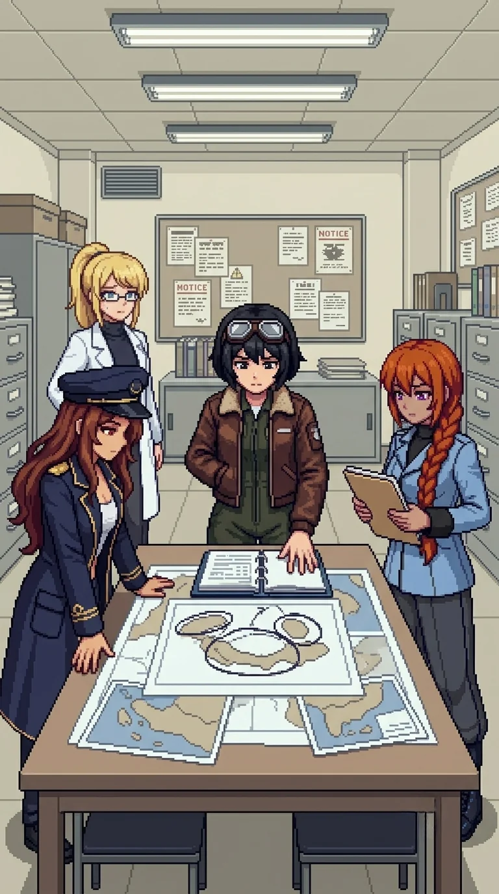

# Chapter 14: The Wrong Tests

*Published July 9, 2026*

{ .chapter-illustration }

The coastal path came over a final rise and the light changed. Not brighter: different in source, the grey-blue of open water carrying a quality the interior sky had not had. The smell changed with it. Salt. The sound changed too: wind off open water rather than the flat interior air. A horizontal line past the slope where the land stopped and something else began.

"Waterfront operations building two hundred meters north." Nadeshiko, from above. "Drones spread wide on the approach. No cover between here and the building."

Maria had already stopped at the path edge. She was not looking at the building.

"There is water."

It was not an observation. It was recognition.

"The shoreline."

She looked at the way the light fell on the shelf where the land dropped to the waterline. She named the engagement geometry without being asked.

"The shelf drops here. Ground units hold it. I take the waterline approach. I can use the current from the east."

"I recognized the firing range the same way," Katyusha noted.

Maria looked at her.

"Yes. Like that."

She turned to the building.

"The research files are in the back section."

The same register as the shelf and the current: no uncertainty in it.

"I know they are there."

We moved north.

The engagement was coastal geometry. The drones were spread wide with no overhead cover, their positions calibrated for open ground and a long approach. I held the path margin above the shelf while the team worked the waterline. Maria operated differently at the water. The casual register was entirely gone. She moved through the approach without it, her ship working the current with a precision none of us had seen from her in any interior engagement. She used angles we had not called and used them correctly. When it was over she stopped.

"I am sorry. I did not think."

"Don't apologize."

Nadeshiko was watching where she had gone.

"That was actually something. I want to know how you did it."

Katyusha: "That was effective."

Maria: "It was."

Maria resettled her hat. Then she looked at the building.

"The files are in the back section."

She was already moving.

"There is nothing in front of the cabinet worth protecting."

Katyusha: "Maria. Wait for us."

Maria: "I will wait."

She moved ahead anyway.

We found her at the records cabinet, four pages into the first folder.

"These are not trial notes."

She looked up when we came in.

"These are long pages."

She extended the open notebook toward me without speaking further.

Research journal entries. Full pages, observation and analysis, the shorthand I used for initiative patterns in behavioral sequences. I recognized the handwriting before I read the content. My thumb found the annotation before I reached it reading in order: a second hand, different ink, shorter. *You know the answer. You put it there on purpose.*

"Whose handwriting is this?"

Nadeshiko had come up beside Maria.

"It is hers."

"So you did know me."

"I must have."

Maria turned back to the journal and read. She read aloud. The main entry:

*She chose the harder option four times in a row. I did not flag it as anomalous. The MAR unit weights long-term outcomes more heavily when the short-term cost is visible. Whether this is emergent or intentional is a question I should probably answer.*

A pause. Then:

"'And then there is a note in different ink.'"

She read the annotation to herself first. Then she read it out:

"'You know the answer. You put it there on purpose.'"

Katyusha: "You were not an accident."

"That is what the note says."

Maria set the page flat.

"Someone was arguing with themselves in writing about whether I was an accident. And then they answered their own question."

A silence.

I set the notebook on the cabinet. "The handwriting is mine. The reasoning is not."

Maria looked at the annotation.

"You knew me well enough to fill a journal. That makes one of us."

I had no answer.

"You were careful. You asked the right questions."

She turned another page.

"Those are in here too."

"I do not remember any of that."

"I know."

She closed the notebook.

"I remember liking you back then. That is strange to know."

Without weight.

I looked at where the closed notebook was sitting on the cabinet. "I put it in her on purpose. I knew I was doing it."

Maria looked at the annotation. Then at me.

I met her eyes. "I am measuring whether that was a mistake."

"I am not upset."

No reassurance in it.

"The person who built this chose the harder option on my behalf before I existed. That is exactly what I would have done."

Nadeshiko, quietly: "She is not wrong."

"I cannot." A pause. "I am sorry."

"I know, Doc."

She put the notebook in her jacket.

Katyusha had been reading the cabinet index.

"The rest of the journal series is in the dock cabinet, east end."

"I will get it."

Maria was already at the side door.

"Cover the shore. I am faster in the water."

She went through the door. Katyusha moved to the waterline position. Nadeshiko covered the building from above. I stayed at the cabinet with the open folder, the second ink still on the page in front of me.

She came back in three minutes with the remaining files. She did not read them here. She put them in her jacket with the notebook and did not say anything more about it.

"We have what we need."

---

*Drona*

I stepped onto the dock once they were out of sight.

The MAR unit had reached the cabinet on schedule. I logged the clearance and looked east along the dock line.

Alpha-Katyusha was not in view. She was within receiver range.

"You were not supposed to break the hub window. He did not write that step."

Water moved at the pilings. I waited the standard interval.

"Answer me when I am logging you."

Nothing.

"Noted. There is no response."

His estimate for the waterfront building had been half a day. They had cleared it in less than two hours. I noted the variance and sent it. Then I moved west.

The combined archive would need monitoring.

---

*Erika*

The combined archive was the most fortified position we had encountered since the Nest. Four corner towers, drone stacks inside and holding a specific position at the interior.

Katyusha, before we reached the entrance: "Individual trial data does not give you the full picture. The full picture is what we can do together, and how that scales."

"This building has the assessment of what we were built for." I looked at the tower positions, the coverage. The most heavily guarded position in the testing grounds. "That is the clearest read we will get."

Katyusha: "Or whoever set up the defense did not want it found."

We pushed the perimeter. I held the approach road while the team worked the corner towers, then the stacks inside.

Inside, drones held the central table in stack formation, not residual patrol. They were protecting a specific record, not a room. We cleared through.

Nadeshiko reached the central table first. She opened the top binder and read without speaking for long enough that the others noticed. Then she set it down. Then picked it up again.

"These are force-projection maps."

A page turned.

"Three-unit formations. Deployment parameters. I'm in them."

Katyusha was in a second folder.

"Deployment vectors exceeding defensive application range. The margins have been wiped in the same erasure pattern as the lab archive. The redaction is recent."

Maria: "He has been cleaning these. We take the originals."

Nadeshiko: "I thought we were built to protect the island."

Maria: "We were. The question is what we were protecting it from."

"These scenarios are about projecting force."

She set the binder on the surface.

"When someone builds a weapon and says it is for protection. Do they mean that?"

"Sometimes," I said.

Nadeshiko: "And sometimes they don't."

"Yes."

The silence in the records bay held long enough for Katyusha to complete her folder review. Maria was looking at the maps.

There had been pressure to expand the scope. I had been present when it was applied and I had agreed to it. The memory arrived accurate and sourceless: I had known what these buildings contained. I had kept building anyway.

Nadeshiko turned another page. She looked at it for a long moment without speaking, then closed the binder with both hands on the cover.

"Nadeshiko takes the originals. She is the fastest."

Katyusha was already covering the corridor.

"Move."

The withdrawal corridor was wide and low, built for tracked loads rather than people on foot. Nadeshiko moved through it with the originals pressed close.

Outside, on the northern approach, Maria came alongside me.

"So we were weapons, Doc."

"You were classified as weapons." The approach was open. "That is different."

"How is it different, Doc?"

"It is different." I did not look at her. "I do not know if the difference holds."

She was quiet for a moment.

"Some of you did not know," I said. "Some of us did." I kept my pace. "I was one of them."

She did not answer.

Katyusha, without turning from the approach: "We are not what we were built to be. That was already true before the reset. The trial data shows it. Anomalous initiative. The harder option. The longer path. All of it flagged for recalibration."

Maria: "We kept failing the tests."

"We kept passing the wrong ones," I said.

"We move."

---

*Drona*

I returned to the combined records building after they cleared the northern approach.

The originals were gone. The binders remained, several still open at the pages they had read. I walked the floor once. The central table where Nadeshiko had stood. The open drawer at the back section cabinet, still extended. A boot print in the ochre dust by the east wall, where no team member had stood: the same tread pattern from the hub perimeter and the firing range. She had been in the room. She had read what they read.

I composed the report. Sector six cleared. Elapsed: one day. His estimate had been two days minimum, accounting for the perimeter. I noted the variance and sent it.

Then I looked toward the approach.

"You were not posted here."

No answer.

"You have not been posted to a single position he wrote since the firing range."

I waited.

"A response is required."

Nothing.

"Noted. There is no response."

I closed the relay. They were already north, past the archive, moving toward the bridge corridor at a pace he had not written.

He had not written the pace they kept. Neither had I.

[Previous Chapter: The Anomaly](ch13.md) | [Next Chapter: Phase 3](ch14f.md)

