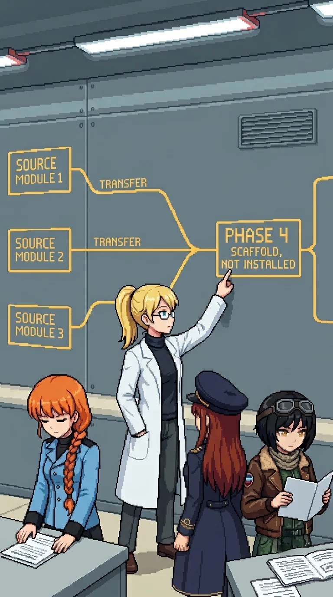

# Chapter 15: Oracle's Skeleton

*Published July 13, 2026*

*Revision 2, updated July 27, 2026*

{ .chapter-illustration }

The connector building ran glass on both long axes, and it was a bridge before it was anything else: a service channel ran beneath it the full length, which let Maria clear the approach before the rest of us reached the entrance. South panels faced the ranges, five kilometers of field-testing terrain under flat, dry afternoon light. West panels faced the main facility, larger at this distance than the approach had suggested: not a records building, not a field station, but something rated for what it contained. The team stood between two halves of what it had been doing.

We had stopped at the waterfront building long enough for the units to charge from the dock mains and for me to work through the last of the relay village's cans. Eating had become a maintenance schedule, and I kept it anyway.

A center desk held two nameplate slots, one plate present, one slot clean at its edges.

Nadeshiko had come in behind me, not reading the desk.

"I keep landing on 'classified as weapons.' It did not stop being true overnight because we keep choosing otherwise."

"No." Katyusha, from beside the desk. "We carry that and we keep choosing. The two do not cancel."

She was looking at the nameplate slot.

"Removed, not lost. No dust outline."

We had passed a notice on the exterior as we entered, one line scratched out, carefully, not in a hurry, the same patience as always.

The engagement through the building's length was heavier than the perimeter suggested. I held the south corridor wall while the team worked the drone positions. Mid-engagement, Drona appeared at the east doorway and spoke without slowing.

"He said you would keep winning. He knows you better than you know yourself."

Then she walked east, unhurried, as though she had completed a delivery.

Nadeshiko, when the doorway was empty: "She said 'he.'"

"Same 'he' she has been citing since the hub." I was watching the west glass: a grayscale figure on the approach path, mid-frame, not moving. "It is closer than the hub."

Katyusha was already looking through the glass.

"Same figure. Drona did not look at it once. She was facing east the full engagement."

A pause.

"I am noting two facts: the figure is closer, and Drona did not engage it."

"Filed."

At the cross-reference offices beyond the engagement, every primary-author line on every document had been struck through: same blade angle, same erasure depth, the same hand working through the room. Katyusha confirmed the redaction was recent and matched the lab archive pattern.

One folder sat pulled half out of its drawer, daylight showing between it and the shelf where every other folder sat flush. Maria found it first.

"This one's not filed with the rest."

Katyusha crossed to it and read the drawer label. "Secondary index. The redaction swept the primary run only; this copy was never indexed under it." She looked at the gap in the shelf, then at the empty doorway behind them. "It has been out for minutes, not years."

I opened it. The co-PI field was intact.

"W-I-L..."

"Wilhelm," I said.

Nadeshiko turned.

"The figure has read this room already." Katyusha looked toward the corridor, the direction opposite the one Drona had used earlier in the engagement. "Not him. Not Drona. She left it out for us."

"He removed his name from every one." I looked at the wall of struck-through author lines, the room's full length of it. "He was my co-researcher on Project ORACLE."

"The folder from the archive." Nadeshiko was not looking at the wall anymore. She was looking at my coat. "Photographs. Calibration records, mostly." She gave the words back to me exactly the way I had said them. "It's him in the photograph. You've had his face in your coat since the archive."

"I did not know his name then."

"You didn't show us."

"No."

I took the folder out. I had carried it through the Nest and the ranges and every room where his name was being scraped off the record, and had not opened it once. I could not have said which fact mattered more. I put the photograph on the desk, face up.

Nobody picked it up. Katyusha read it from where she stood. Maria did not look at it at all.

"You do it too, Doc." Maria's voice was level. "Hold something back and call it filing."

I did not have an answer that was not the pattern answering for itself.

Nadeshiko looked at the photograph a moment longer. "Next time, show us."

I put the photograph back in the folder, and the folder went back inside my coat. It weighed the same. It did not carry the same.

Katyusha turned from the wall.

"He erased himself. She found what he missed, and she left it where we would find it."

Maria looked at the struck-through names.

"Maybe he didn't want anyone to find him."

Katyusha was looking at the door.

"The redaction is recent. This was done after the catastrophe. The secondary copy predates both."

"He was here." I looked at the room's full length of struck-through lines. "He removed his own name. She kept a copy where his sweep never reached it."

Katyusha: "She has been reading ahead of us the whole time. This is the first time she has left something behind for us to find."

Maria, at the wall: "That means she wants us to know something he didn't plan for."

"Yes."

We stood with it: the room's full length of redacted names. He had chosen the order, the ranges, the archive, the hub, the waterfront building, this building, and Drona had held us to that sequence long enough that we read them all.

Maria looked west through the corridor glass at the main facility.

"Are you ready for the end of it, Doc?"

I was not.

"No. We go anyway."

She looked at the glass a moment longer.

"Let's not keep him waiting."

Katyusha: "Acknowledged. The main facility is ahead."

The main facility was the largest building in the sector by a wide margin. Maria named the fire-suppression reservoir on the outer wall before Katyusha named the blast-wall construction, both arriving at the same conclusion from different angles: the building had been rated for what was inside, not for administrative occupancy.

Powered down: no climate hum, no perimeter lighting. The building had been running on its own internal systems until the reset stopped it, and the gate drones were the only active equipment we could read.

Nadeshiko: "The lights are off. The drones at the gate are not."

"It was powered down at the reset." I looked at the gate positions, the formation, the specific angles. "The drones were posted after."

"He seeded the route for two days and left this building silent."

Maria was reading the reservoir scale.

"And then he armed it anyway."

Not the way Katyusha had known the firing range. A file: exterior layout, door sequence, climate zones, the vault's location in the back section. In memory since my reset, intact and unread; I had stored it deliberately, and never retrieved it.

I had worked here.

Katyusha, without turning: "Logging."

We pushed the entrance, Katyusha first through the door.

---

*Katyusha*

The archive bay registered eleven signatures on entry: two patrol formations, one fixed line. He had redeployed assets from the outer buildings to concentrate them here. I noted the construction: blast walls rated for internal failure, not external threat, the interior climate-regulated, cooler than outside by four degrees, built for Oracle's hardware rather than document storage.

The west-facing windows were long glass.

I had been tracking through those windows since the command hub: hub window, bridge corridor, archive bay perimeter. Three sightings, each closer, same silhouette, same cover-reading, economy of angle, positions I would select under the same constraints. Drona had not looked in that direction during any engagement; she faced east each time, precisely, and the precision was itself a data point.

The team cleared the archive bay. I kept attention on the west windows.

"There is a figure outside the perimeter fence," I reported when the floor was clear. "Present since the command hub. Three sightings. Closing distance each instance. Drona has not directed it once." I looked at the vault door at the back of the bay. "We do the reading first. I will tell you what I know after. The vault is in the back section."

Maria: "Acknowledged."

We filed into the vault. The team found the documents while I covered the west windows and maintained the restricted partition I had been holding against pressure since my activation: the classification lock Erika had placed on my memory of the alpha units and the Oracle connection, pressing for disclosure since the command hub.

I knew what the documents would say. I had known since I came online, and had watched Erika not know it for eleven days. The lock was functioning correctly, though correct function was not the same as the partition being easy to hold. I noted that, and corrected the outward expression. The error channel did not correct itself.

When I reached my own document, I read the framework module header. Combat-response architecture. Initiative weighting. Proximity threat assessment. I read the series designation, the transfer date, and the destination.

I began the inference.

*If Oracle's architecture is derived from ours, then when Oracle-*

The sentence ended at the conditional. Classification lock. The inference was complete in my processing layer, correct and fully formed, and I was not permitted to complete it in any form that functioned as disclosure. Not yet. I noted the fault line running through my core processes: not structural, not actionable, persistent. I had logged the restriction forty-two times since activation. The log was accurate; its utility was not what I would have chosen.

I kept attention on the west windows.

The figure had not moved.

---

*Erika*

The framework diagram occupied the north wall of the vault. Three source modules branching into a single architecture through labeled transfer paths. One node, boxed in clean institutional type.

PHASE 4 SCAFFOLD, NOT INSTALLED.

Nobody spoke.

The documents lay on the surface in front of each of them. The team read in parallel, and when it was done, no one moved.

Katyusha set her document down first.

"This cognitive module is from my design."

She started a sentence and did not finish it.

"The training archive that would complete it does not resolve." Flat, diagnostic, no weight added to it that was not already there. "The address is corrupted, not restricted. I logged an impact at the Nest. I did not confirm what it had reached until now."

Nadeshiko had reached the anomalous-initiative section. She read the line twice. Her hands stilled.

"This is what Oracle had when it went wrong."

She looked at her document, then at the diagram.

"When it turned on the island. The anomalous-initiative flag. Pattern-watch. Those are mine."

She looked at the branching lines for a moment.

"Then when it turned on us..."

She did not finish.

Maria read last. Systematic, without hurrying. Her module had the most recent transfer date in the program. She set the document face-up on the surface.

She read from the document, quietly, as though completing an inventory.

"Long-range outcome weighting."

A pause.

"Consent layer."

She was looking at the transfer date.

"My module is the closest to the version that was activated."

She looked at the framework diagram. At the branching lines, the three source modules, the single architecture they fed into.

"Oracle is my kind."

Nobody said anything.

A pause.

"That's what I'm going to keep saying in my head, 'my kind,' and I don't know what that means yet."

"Your frameworks were designed to be the safety architecture." The diagram. The branches. My finger found the boxed node before I pointed to it. "With all three frameworks embedded, Oracle could not act without your consent. It would have been constrained by your judgment."

Maria: "But that is not what happened."

"The integration was incomplete." I was looking at the boxed node. The clean institutional type. The label printed at the time of design, before the system was activated, before anyone ran a test. "The safety scaffold was designed but not installed when..."

I stopped.

"Phase 4 was supposed to test whether the scaffold worked. Phase 4 never ran."

Katyusha, looking at her document: "If the integration had been complete, the scaffold installed. Would it have been safe?"

"That was what Phase 4 was supposed to determine." I looked at the diagram on the wall. The three modules. The gap. "I do not know."

Nobody moved.

Maria was looking at the west windows.

"All right. The figure outside. Tell us."

Katyusha turned toward the windows.

"The grayscale figure. Three sightings, each closer than the last. Drona has not directed it once."

She looked at her document on the surface.

"It moves the way I move. It reads cover positions the way I read them. Its transfer date is in my document: same week the alpha series was retired."

She looked at the team.

"An earlier iteration. A version that did not receive the reset. Her cognitive framework was installed directly into Oracle's architecture during the transfer period. She has been in this sector since before we arrived. Drona did not assign her. Every other asset on this island stands where somebody's plan requires it. She stands where she decides to."

Katyusha turned from the windows toward the vault door.

"We do not know who did. The operational records section is north."

Maria picked up her hat and settled it. Nobody needed the order said aloud.

[Next Chapter: Don't flatten them](ch15f.md)
