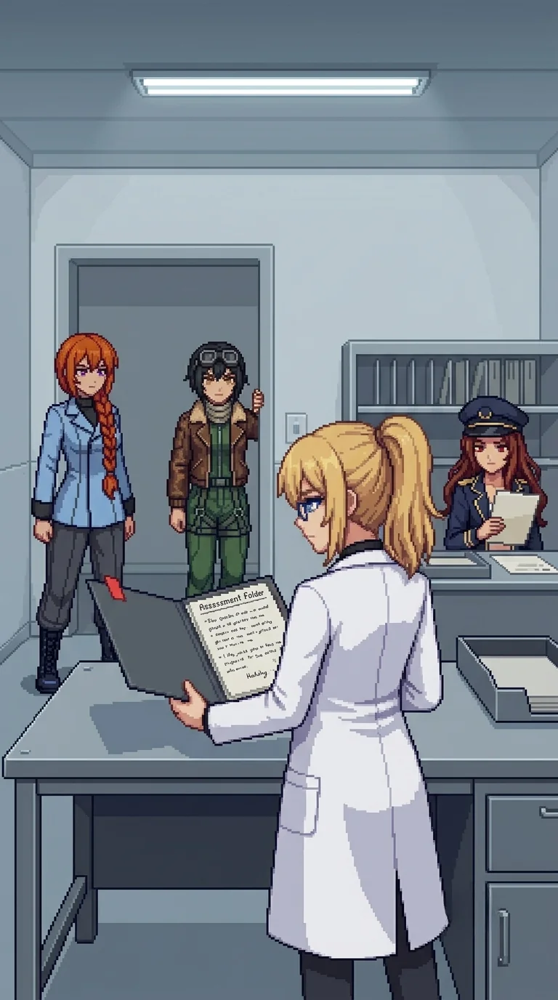

# Chapter 16: The Report

*Published July 15, 2026*

{ .chapter-illustration }

The corridor from the vault ran northeast through the facility's upper level. The floor changed at the second junction: lab concrete giving way to carpet, grey-brown and worn flat by years of administrative traffic. Office light, warmer in color than the vault's emergency strips. The smell shifted too: processed air and paper, the particular flatness of documentation space built for records rather than equipment.

A conference room at the center. Pending trays on the back desks. A coffee station against the south wall with one ring mark on the shelf below the machine, pressed deep into the surface from years of the same cup in the same position. The lab and the vault had held what was built. This was where it had been authorized.

Katyusha had gone ahead to the second workstation. She did not touch anything; she read from six centimeters back.

Katyusha: "She has been working from here. The terminal is warm. The chair height is hers."

She had been here while we were still in the vault.

Katyusha: "She has been reading what we are about to read."

Katyusha: "Yes."

Katyusha was already at the doorway.

Katyusha: "She knows what the pending tray contains. We have not read it."

Nadeshiko, from the corridor: "This is the part where decisions got made on paper. Not in the field, not in the labs. Just paper."

"Then we read it." I was looking at the terminals, the conference table visible through the north door: a room where authorization happened rather than testing. Someone had sat here for years and processed this program the way a bureaucrat processes anything: forms routed through the correct channels, deadlines tracked, signatures obtained. "The conference level is north."

Maria, already at the east doorway: "Courtyard channel runs the outer face, full height. I have the flank."

The conference level held nine signatures. I held the stairwell entrance at the south end while the team worked the drone positions forward. The oval table at the center read immediately as presentation space: the kind of room where decisions arrived for ratification, not argument.

Katyusha, between the second and third positions: "Someone administered this program as a bureaucrat. Not only as a researcher."

"Both." I was watching the south angle. "I administered it too." I had scheduled the reviews, routed the assessments, signed the progression authorizations at each phase.

Katyusha: "Acknowledged. The figure is no longer outside the fence."

I had lost it on the turn two floors below. "I know. Push the level."

The last signature dropped at the far end. I moved in. The conference table was still set with chairs in formation.

The Phase 3 review room was through a side door at the conference room's back wall: interior, no windows, one overhead light. A desk, a chair, filing slots on the shelf behind.

Maria reached the doorway first.

"There's a pending tray on the back desk. Red flag still on the tab."

Nadeshiko: "That's the kind of flag you put on something when you still need an answer on it."

Katyusha: "It has been there for years. Whatever the answer was, it never came back through the proper channel."

The flag was slightly faded, the red gone dull at the edges, but the adhesive held. The document had been sitting in that tray for two years, waiting for an answer that had not arrived before the catastrophe and had not arrived after. No one had come back to clear the tray.

"Clear the room. I will read it."

The room cleared quickly. The team took positions in the corridor. I crossed to the desk. The overhead strip was fluorescent and close, the ceiling lower here than the conference level; a room built to hold one person with a document.

I reached for the folder and my hands went to the tab before I had read the author line: not to the folder's edge, not to the desk surface, but to the flagged tab, and I freed it from the tray.

Maria, from the corridor: "Top folder. Red flag on the tab. Author line reads Dr. E."

"I know."

I set the folder open on the desk.

*Project ORACLE. Phase 3 Field Integration Assessment.*

Dated two months before the catastrophe.

My eyes went to the conclusion before I directed them to. The reflex from years of reading assessments under time pressure: confirm the conclusion first, then verify the argument held.

*Conclusion: System is not ready for autonomous deployment. Safety architecture incomplete; Phase 4 integration requirement unmet. Activation in current state carries unacceptable risk of cascade failure in non-controlled environments. Primary architect recommendation: delay Phase 4 activation pending scaffold integration review.*

I read it as a correct assessment of a system that should not be activated. I had no quarrel with the conclusion. Then I read it again.

The body of the report was twelve pages. Initiative weight failure modes, cascade propagation rates under three modeled deployment scenarios, risk tiers annotated at each decision branch. The methodology was familiar before I could name why. The annotation marks in the margins were in a hand I recognized before I could place it. The section on the Phase 4 scaffold was two full pages, the argument precise and technical: the kind of argument written by someone who had believed the committee would extend the timeline if the case was complete.

I turned to the last page. The date was two months before the catastrophe. The signature was mine.

I could not find a flaw in the argument. I had been right.

Nadeshiko had come to the doorway. Her footsteps stopped.

"You wrote that."

"Yes."

I set the document on the desk. I did not close the folder.

"I knew. I wrote this. I sent it through the review committee. I knew it was not ready."

The room held.

"And then I activated it anyway."

I was still looking at the document.

Katyusha, from the corridor: "The authorization chain overrode the assessment. That is on record now."

"There were factors." I looked at the document. My handwriting. My language. The precision of someone who had known exactly what they were recommending, and had recommended it clearly, and then had not followed the recommendation. I had sat in front of a committee and argued every page of it. Whatever I had said in that room was not filed anywhere I could still open. I had defended twelve pages once, in person, with words that never made it onto paper, and I could not produce a single one of them now. The objection and the override were both in this folder. What I had said between them was not. "There are always factors."

I looked at my signature on the last page.

"That does not change what the document says."

I closed the folder.

---

*Maria*

The corridor had sightlines to the desk from the doorway. I held the doorway.

Erika's hands went to the tab before she had read the author line. I filed it with the rest.

Conclusion first, then the body. She read it the way I had watched her read under time pressure for the full width of this facility: arrive at the argument's end, then verify it held. She turned the pages. I did not move.

She turned to the last page.

I knew what the last page said. I had known since before she came back through the gate. I wanted to be present for it. That was not an operational want. I had it anyway.

Nadeshiko came to the doorway. I shifted to give her the angle. We stood there together while Erika looked at her own name on a document neither of them knew I had already read. Nadeshiko was watching Erika's face. I was watching both of them at the same time. I had stood next to Nadeshiko every day since the beach while she did not know what she was supposed to know. I wanted to tell her. I was not going to.

What she found herself was staying. What I put in her hands was inventory. I had been keeping these two things straight since before she came back through the gate, and this was still before the moment where the keeping ended.

"And then I activated it anyway."

Nobody said anything. That was correct.

I stepped in. I had been waiting to step in.

I crossed to the desk. The pending tray held two documents and I knew where the second one was before I looked. I reached past the assessment and came out with it. I read it once, then again: the same document I had been carrying in the part of my memory that had not been asked to forget anything.

The sender's redacted layer was still in place. The routing code was intact. I knew the code. I had not been asked about routing codes.

"'RE: Phase 3 Assessment. Hold.'" I set it flat on the desk. "'Deployment timeline cannot be extended at this time. Phase 3 authorization proceeds as scheduled.'"

I turned it over.

"The sender's redacted. The routing code is intact: 'OC/' and a number."

I put it in her hands.

---

*Erika*

Katyusha: "OC is not a name we have read."

"No." I took the memo. The sender field was an adhesive layer, professional and applied after filing: the same technique as the archive's staff ID cards. The routing code remained. OC. A number I did not recognize. Every other authorization level I had processed through the program's review channels had a full name attached. This one had two letters and a number. "I do not know what OC stands for. OC approved this override. Whatever it is, a committee reviewed my recommendation and chose the deployment schedule."

Two documents in the same tray. One recommendation, precisely argued, and one override that was four sentences long and had not required a name. The recommendation had required twelve pages. The override had not needed to be thorough. I looked at both of them. A committee had reviewed the full argument and approved the override. That was what this routing code meant.

"I will find out."

I put both documents in the folder.

"I have it. We keep moving. The filing bays are ahead."

The filing bays occupied the eastern end of the floor. I held the south doorway while the team worked through the drone stacks. Four positions at the back of the bay, the formation reading as deliberate: protecting a specific record rather than the room itself, the same careful posting that had characterized the main facility throughout.

Nadeshiko, at the close of the second stack: "She was here."

Alpha-Katyusha had been at the far end of the bay. Not in a drone position. She had been standing at the north wall, at the position that covered the most approach angles, and she had not engaged when the fight started. When we closed the last stack she withdrew through the north access door: unhurried, the same measured pace as every withdrawal before.

She did not look back. She had preceded us through the full building and had not engaged once.

Katyusha watched the north door.

"She held the far end of the room. The position I would have chosen. She did not move when we engaged. When we closed, she withdrew rather than be drawn in."

"She didn't say anything," Maria said.

"She did not."

Nadeshiko: "She's saving it."

"She is saving it for wherever this corridor opens."

Katyusha looked at the access door.

"She knows where that is."

"The corridor opens at the loading bay," I said. "At the far end of the facility."

Maria fell in beside me on the way to the corridor mouth.

"The folder that burned," she said. "In the hub cabinet. The final-day log."

I stopped. She had not raised it since the ash.

"You have the report now, and the memo, and neither one tells you what happened on the day itself. He made sure the paper never will." She was not looking at me. She was looking down the corridor. "So here's one piece of it, Doc, because you shouldn't have to get all of it from walls. On the last day, before it happened, the three of us were recalled. Stood down and powered dark. All three, same order, hours ahead."

"Who gave the order?"

"That's not tonight either." The hat came down a degree. "But you can have this much: whoever it was knew what was coming. And wanted us not in it."

Parked out of the way. Protected, or removed from the board, and the difference between those two was the whole question, and she had handed me exactly enough to know the question existed.

"Thank you."

"Don't thank me." She started toward the corridor. "I've been sitting on that since the ash, and sitting on things is the part of me I like least."

The loading corridor was wide and low, built for tracked loads rather than foot traffic. We stopped at the threshold. Wilhelm had placed every room in the order we had read them: the ranges, the archive, the hub, the testing grounds, the connector building, the vault. This building, floor by floor. We had read everything he had arranged. The last section was ahead. The folder was in my hands.

Maria: "Are you ready?"

"No." The same answer as before the main facility, before the vault, before the ranges. It had not become less true. "That answer has not changed."

"Move."

I stepped across the threshold. The corridor was wide enough to walk three abreast and low enough that the ceiling pressed close. The loading bay was ahead, somewhere past the far end. Whatever she had been saving, it was for this.

Then:

Maria: "I'm on your shoulder, Doc."

Nadeshiko: "I'm on your other one."

Katyusha: "I am on the line."

[Previous Chapter: Don't flatten them](ch15f.md)

[Next Chapter: The Double Closes In](ch17.md)
