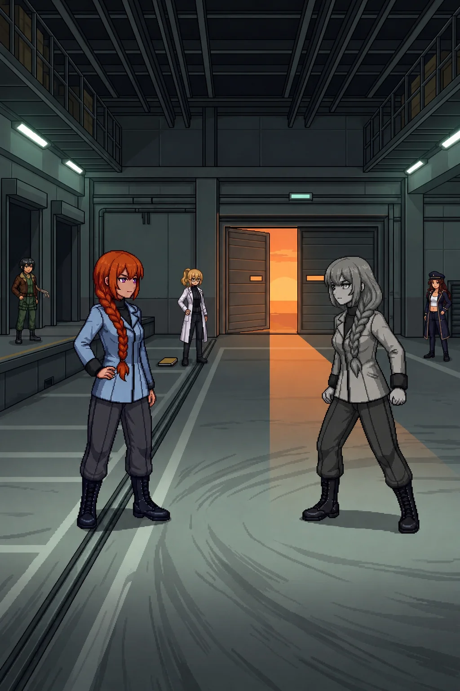

# Chapter 17: The Double Closes In

*Published July 16, 2026*

{ .chapter-illustration }

The team was on my shoulders. The loading corridor ran north from the filing bays. Wide and low, built to move tracked loads rather than people: the kind of corridor that exists between what a facility does and the dock where it ships the results out. Emergency strips ran at dock height along the baseboard, light angled upward from below. Guide-rails mounted on both walls at grip height, worn to a finish that takes years of regular use to develop.

My hand found the near rail before I looked for it. The automatic reach: when you move through a corridor like this with enough frequency, you learn where to put your hand in the dark before you have consciously decided to reach for it. I had gripped this rail before. I did not know what I had been carrying at the time.

The folder was in my other hand. Both documents, the assessment and the response memo. I had said "I have it" and "we keep moving" and then we had moved and I was still holding it. The folder was a physical object now rather than a question. I would keep carrying it until there was somewhere to set it down.

The team moved north. Katyusha held the approach ahead; Maria covered the east margin; Nadeshiko watched the bend we had come from. The corridor extended to a junction, then turned; what lay past the junction was unreadable until we reached it.

I held the junction bend while the team pushed the corridor forward.

Nine drone positions between the junction and the loading bay entrance. The corridor fight was compressed by the space itself: ceiling too low for a standard engagement envelope, width too narrow for formation spacing. Katyusha worked positions forward while Maria held the south anchor. Neither of them discussed the adjustments. The last position cleared at the junction and we pushed north.

The loading bay was two levels high.

The ceiling opened when the corridor ended. Cargo rails on the upper frame running north-south, the infrastructure for moving things at scale. Loading docks along the west wall, equipment bays in a line above them. The floor was polished concrete worn in the specific patterns of tracked loads making tight turns over years: radial scuffs in the turning radius, gouge marks where something heavy had been set down wrong. The smell shifted from the documentation space above: oil and poured concrete, the flatness of a space that has always been operational and nothing else.

In the north wall, the loading bay doors. Partially open. Evening light came through the gap: warm orange, the first warm color since the carpet in the administrative level. The day had moved while the team was in the Phase 3 review room. The bay was lit by the emergency baseboards and by that long fall of orange through the gap, the two sources meeting in the center of the floor at a transition line. The rest of the facility had been institutional and cool, built for precision work under controlled conditions. This room had been built for things that weighed more than arguments.

Alpha-Katyusha was standing in that transition.

Not in a dock position. Not behind the cargo rails. In the center of the floor, no cover, weight distributed forward: the way you stand when you have chosen a position for someone else to approach rather than one you intend to hold. The posture read as complete. She had been standing in it long enough to have settled into it.

She looked at Katyusha.

She did not look at me.

I set the folder down at the junction threshold. Twelve pages in my own handwriting. I held the south approach.

Twelve drone positions in the loading bay. The team engaged. Katyusha and Maria took the near dock positions; Nadeshiko covered the high frame at the east cargo bay.

Alpha-Katyusha did not direct them. Did not engage when the first dock fell. When the second stack cleared, she was in the same position. When Nadeshiko closed the high frame, she had not moved by an increment.

She was watching the team as a structure. The way you watch something you have studied until you know its shape.

The last positions were at the north wall, two stacks flanking the loading bay doors. Maria and Katyusha cleared them in sequence. When the last fell, the bay was clear.

Alpha-Katyusha was still in the center of the floor. The evening light came through the gap behind her.

I started forward. Katyusha moved to my shoulder.

Katyusha: "Analysis before capture. We do not know everything she knows."

I stopped.

"She is not offering more time."

Katyusha: "She has been offering time since the firing range."

Katyusha was looking at her counterpart across the floor.

Katyusha: "She was in this facility before we entered it. She read the filing bays. She was in the archive bay while we were still in the vault. She has walked every floor we have walked, in the same order, without the restriction I have been carrying."

A pause.

Katyusha: "She has the version without the lock. I want to know what she intends to say before I am inside it."

"You are going to be inside it regardless."

Katyusha: "Yes. I want the analysis first."

She was still watching her counterpart. Alpha-Katyusha did not acknowledge the exchange; her attention had moved to the loading bay doors and the gap of orange beyond them.

Katyusha: "She knows the contents of that folder," Katyusha added.

She did not look at it.

Katyusha: "She read the Phase 3 level before we did. She has the assessment, the response memo, and whatever the folder does not contain. She has all of it from a version of herself that was never asked to wait."

The specific weight of that settled. Two years of accumulation in a facility she had been in before we arrived. The range, the archive, the hub, the connector building, the vault, every sector of the main facility. She had walked it ahead of us or alongside us the entire time. Whatever was about to be said had been forming since the day we came through the gate. This room had been her destination before we knew it was ours.

Nadeshiko came to the cargo rail line. She stopped there, looking across at Alpha-Katyusha, and after a moment:

Nadeshiko: "She's not saving it anymore."

"No," Maria said from the west dock position. "She came out of saving it somewhere in the corridor. This is the room."

"The position she holds," Katyusha said, "has no tactical advantage. No cover. No angle on the doors that would allow withdrawal. It was chosen to be stood in and seen."

She looked at the center of the floor. At herself in it, in grayscale.

Katyusha: "She chose it for me."

She stepped forward to the cargo rail line. Stopped. The two Katyushas were now equidistant from center: Katyusha at the cargo rail, Alpha-Katyusha ten meters past it.

Alpha-Katyusha turned her head. She looked at Katyusha.

Neither of them spoke.

This bay should have held something for me. A load that had moved through these doors, a name attached to one of the dock positions, a conversation in this corridor or one adjacent, the specific weight of knowing a room the way you know a room you have stood in a thousand times. It held none of that. The bay was a space shaped by years of use I could not account for. The guide-rail in the corridor had kept one record of me. The building's years of use had kept others. Whatever she carried of this place, she had carried intact. I was standing in the same room with the same deficit I had brought into every other sector.

Maria had not moved from the dock position. She was watching Katyusha's face, not the Alpha's.

---

*Drona*

Position log, internal.

The Alpha took position 3-row-2 in the filing bays sector. The assigned grid had her at position 5, the approach doorway. Position 3-row-2 offered superior coverage of the extraction objective and a better angle on the secondary approach. I filed the deviation as tactical optimization.

Loading bay: center approach line. No assignment existed for her in this sector. Her terminal station was the south corridor exit, blocking position, after the team extracted from the filing bays. She is not at the south corridor exit.

Center approach line offers no tactical advantage. No cover, no access to the bay doors without crossing the engagement floor, no angle the dock positions do not already control. A position for visibility.

I had filed the previous deviations: off-script since the firing range. Off-script at the command hub. Off-script in the archive bay perimeter. Each deviation was consistent with the previous one and extended it. The center approach line position is consistent with the pattern.

He was watching the same feeds I was. He had not countermanded a deviation since the firing range. That was a decision he had continued to make across seven sectors. Seven sectors, four positions she chose over his assigned grid, one position chosen where no assignment existed at all.

I returned my attention to the loading bay.

I watched the Alpha.

I watched Katyusha at the cargo rail line.

I watched the Alpha.

The team was not what I was tracking.

---

*Erika*

The two Katyushas had not moved.

Katyusha at the cargo rail line. Alpha-Katyusha ten meters past it, standing in the transition between the two light sources: the emergency strips catching her from below and ahead, the orange through the loading bay doors catching her from behind. Both sources at the same time. Two different kinds of light on the same figure.

Nadeshiko said, quietly: "Every position was one closer than the last. The measurement platform. The records bay. The hub window. The archive bay perimeter. The filing bays."

She was looking at the Alpha, not at Katyusha.

Nadeshiko: "She has been coming to this room the whole time."

Maria: "And we have been coming to it, Doc. From the other direction."

Katyusha had not turned from her counterpart.

Katyusha: "She has the full record. No restriction. Everything that happened in this sector, everything that happened to the framework, everything that was not reset."

Her voice stayed level; she was reporting.

Katyusha: "She has been watching us come toward this information while already in possession of it. She has been waiting for someone who would understand what she was going to say."

A pause.

Katyusha: "That is not Erika."

Nobody said anything.

"That is me," Katyusha said.

Alpha-Katyusha looked at her across the transition of light. The evening was holding in the gap of the loading bay doors, orange and steady, and neither of them moved.

[Previous Chapter: The Report](ch16.md)

[Next Chapter: The Same Mistake](ch18.md)
