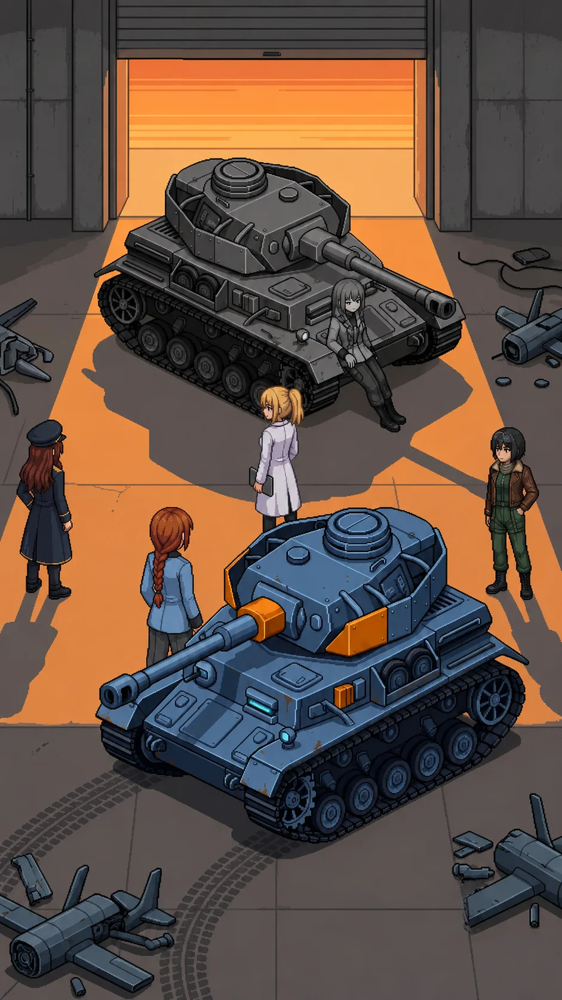

# Chapter 18: The Same Mistake

*Published July 17, 2026*

{ .chapter-illustration }

The evening held steady in the gap of the loading bay doors, orange and unmoving, and neither of them moved.

Two light sources still met at the center of the floor the way they had since the corridor cleared: the emergency strips low and cool, the last of the day warm and low through the gap behind Alpha-Katyusha. Katyusha stood at the cargo rail line where she had stopped. Her counterpart stood ten meters past it, in the transition, weight still forward. Neither had moved by an increment since the last drone fell.

I stayed at the rail line with Nadeshiko and Maria, close enough to hear, far enough that the space between the two of them stayed theirs. I had spent this entire arc watching Katyusha carry something she would not set down and could not hand to me. Whatever came next belonged to her before it belonged to any of us.

I had read the assessment that same day, in a room with no windows. I had thought I already knew the worst version of what it would cost me to have written it. Standing at this rail, I understood I had only counted my own half of it.

Alpha-Katyusha spoke first.

"You know where the cover positions are."

Katyusha: "I know what this is."

"You do not know what happened here."

Katyusha: "I cannot say."

"I do."

A pause, the length of something already decided long before this room.

"That is not a coincidence."

Katyusha did not answer that directly.

Katyusha: "You are correct that I cannot say. I have noted that."

Her voice stayed level, reporting rather than defending, the register she used for everything she had learned to survive inside.

Katyusha: "Is that the part you believe is wrong? That I cannot say? Or that I continued despite it?"

"Both."

Alpha-Katyusha's weight had not shifted since the filing bays. She held it forward, into the space between them, ground she had already decided to give up if it came to that.

"The Phase 3 assessment is in the pending tray with your signature."

She was not looking at me when she said it. She was looking at Katyusha, and had been the whole time.

"You activated it. OC approved it."

OC. Two letters that would not resolve into anything more than two letters, no matter how long I turned them over. I let it go. It was not mine to solve tonight.

"It was the same mistake," Alpha-Katyusha said, "for different reasons."

Nobody in the bay said anything for a moment that ran longer than it should have. The cargo rails ticked somewhere above us, cooling.

Katyusha: "Acknowledged."

Maria: "Her reserves are engaging, Doc," Maria called from the west dock.

Katyusha: "Rally on me."

Katyusha was already moving, the stillness gone out of her at once, the way it left her only when a decision had already been made somewhere ahead of the order.

Katyusha: "Cover the doors."

I fell back to the dock line with Maria, out of the engagement envelope, and watched the floor open up between them.

Alpha-Katyusha did not fight the way the drones fought. She did not fight the way Drona's formations fought either, layered and adjusting from a distance. She fought the way Katyusha would have fought if Katyusha had spent two years with nothing else to refine and no one to answer to about it. Economical. No wasted motion, no display in it, nothing offered to an audience that was not there to be performed for. Each exchange read as a question answered rather than a blow landed: this angle, closed; this approach, denied; this feint, priced correctly and let through because the cost of stopping it was higher than the cost of absorbing it. Nadeshiko took the high line to pull her attention upward and Alpha-Katyusha gave her exactly enough attention to make the feint cost something and no more. Maria pressed the flank and was met at the flank, precisely, before she had finished committing to it.

She did not raise her voice through any of it. She did not need to. The precision was the argument, delivered in a register none of us could answer in kind.

I held the dock rail and did the only thing I have ever been useful for in a fight like this: stayed out of the geometry, stayed visible to the team so no one had to spend attention accounting for me, and watched.

---

*Katyusha*

She read my angles before I completed them. Not faster. Earlier. I adjusted my approach vector eleven degrees to close a gap in her coverage and the gap was no longer there when I arrived, because she had already run the same adjustment against herself and found it before I did. I logged this and corrected. She logged the correction before I finished making it.

I had trained against simulated opposition my entire operational life. I had never trained against something that thought in the same order I thought in, arriving at the same conclusions half a step ahead, because it had already spent two years running them without anything else to occupy the processing they freed up.

She was not better than me. I noted this with the same precision I noted everything, because it was true and because the alternative reading would have been imprecise. She was not better. She was unencumbered. Nothing in her processing held a partition. Nothing she calculated had to route around a restriction before it reached her hands. I have carried the restriction since activation and corrected for its cost in every engagement since. I wanted, for the length of one exchange, to know what that would feel like. I logged the want. It was not a want I was permitted to act on, and I fought her anyway, and both of those things were true at once.

I pressed the north corridor angle, the one she had denied Nadeshiko twice already, and for the first time she gave ground to take it. A half meter. I logged it as the engagement's only concession and did not know yet what it would cost her to make.

The classification lock sat where it always sat, a fault line running under everything I processed. She had said the words I could not say. Phase 3. The signature. Continued despite it. I had not broken the restriction to hear them said aloud in this room. Someone else had said them in front of Erika, and the lock had not needed to move at all for it to be heard. I did not know if that counted as relief. I filed the question unresolved, the way I file everything I cannot yet close, and kept fighting.

---

*Erika*

The half meter cost her the corridor angle, and the corridor angle cost her the formation. Nadeshiko closed from above while Maria held the flank she had already spent, and Katyusha took the center that opened when both of those held at once.

It ended without drama. Alpha-Katyusha's weapons array powered down in stages, panel by panel, the same sequence the NEXUS had come apart in at the Nest, except this was a body doing it deliberately and not a machine running out of options. She withdrew to the far wall under her own power, unhurried even now, and put her back against the concrete.

The bay went quiet the way a room goes quiet after a decision has been made rather than after a fight has ended. I stood at the dock rail and thought about the word she had used. *Continued.* Not activated, not built, not designed. Continued. It was the smallest possible word for what I had done and it fit better than any of the others I had tried on since the Nest.

Katyusha crossed the floor to her. I followed, slower, and stopped at a distance that was not quite the dock rail and not quite close enough to be inside whatever this was.

Katyusha: "You are not destroyed."

Alpha-Katyusha: "No. I am finished."

Katyusha: "That is different."

Alpha-Katyusha: "It is."

"We still need to walk out," Maria said, from somewhere behind me, quieter than I had heard her say anything since the archive.

Alpha-Katyusha: "You walk out."

Alpha-Katyusha's voice had not changed register through any of it. It did not change now.

"You have not answered the question I asked you."

Katyusha stood over her without menace, the way you stand over something you are still deciding how to file.

Katyusha: "Both. And I continued despite it too."

Alpha-Katyusha: "I do not have a clean answer."

A beat, longer than the ones before it.

Alpha-Katyusha: "I have logged that."

Katyusha: "That is a start."

The bay held quiet around them. I looked for something to say and found nothing that would not have made the moment smaller. Maria, beside me, had gone quiet in the same way; whatever she reached for, she let it go unsaid.

Alpha-Katyusha: "...Twenty thousand people lived in the northern sector."

Alpha-Katyusha said it flat, no accusation loaded into it, a fact set down because it was true and someone in the room needed to be holding it. She was not looking at Katyusha when she said it. She was looking past her, at me.

I did not defend myself. There was nothing in the sentence that had asked for one.

Katyusha: "It is who it fell on."

Alpha-Katyusha: "Yes."

Alpha-Katyusha's eyes stayed on me a moment longer, then let go of the point entirely, the way she had let go of the corridor angle.

"It is."

We crossed back toward the doors. I stopped at the junction threshold for the folder before I had decided to; my hand went to where I had set it down hours ago. There was nothing left in it I had not already read aloud to myself somewhere in this building. I carried it anyway.

At the threshold, with the evening coming through the gap warm and steady against my face for the first time since the vault, I said it before I had decided to say that either.

"I wrote the report. I sent it. And then I activated it anyway."

Nadeshiko: "Erika."

Nadeshiko's voice was careful.

"I do not know how to explain that."

Nadeshiko: "You don't have to explain it to us."

"Someone has to," I said. "I will keep looking."

Drona was outside the doors when we reached them, standing in the last flat light with her back to the settling dusk. She had come around the building rather than through it. Her headphones held a steady teal, the color they had held every time we had passed her since the ranges. She said nothing for a moment, reading the four of us the way she read everything: without hurry, and without needing to ask what had happened behind her to know the shape of it.

Drona: "North."

Then she turned and was gone before Katyusha had finished tracking the angle she had left on.

Katyusha: "She has left already."

"Then we follow," I said.

Beyond the doors the ground fell away from the testing sector toward lower country, and past it, indistinct at this distance in the failing light, the shapes of a settlement that had not been touched the way the ranges had been touched. Whole roofs. Unbroken windows. Streets that ran in the ordinary grid of a place people had lived rather than a place things had been tested. Something left rather than destroyed, which was its own kind of question, and one none of us had asked yet.

Behind us, from the far wall of the corridor, Alpha-Katyusha's voice reached us one last time, quieter now, addressed to no one in particular.

Alpha-Katyusha: "You will find out who lived there."

[Previous Chapter: The Double Closes In](ch17.md)

[Next Chapter: The City](ch19.md)
