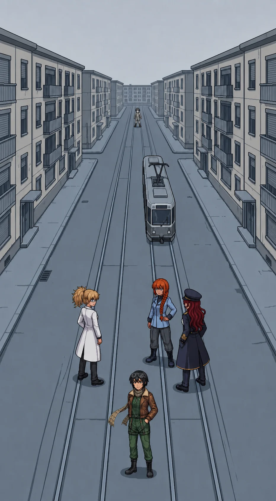

# Chapter 19: The City

*Published July 20, 2026*

{ .chapter-illustration }

The ground had been falling away from the testing sector since the loading bay doors. It kept falling, gentle and unbroken, until the arterial road climbed a low rise instead, and the first residential blocks of the northern sector came up over the crest all at once.

Four and five storeys, close-set, a tram line down the center of the avenue. Shopfronts at street level, shutters down. A storm canal ran the length of it under the south curb, thin and dark and undisturbed; Maria walked the street with the rest of us here, not the water, and did not say why. Twenty thousand people had lived here. Alpha-Katyusha's number, said flat in a bay full of orange evening light that already felt like a different day. The street in front of us now was intact and completely empty.

The cold had a different quality here than at the ranges. Not the bite of exposed ground; something flatter, held in the concrete and the dead glass, the kind of cold a building keeps once nobody is left inside to warm it. My breath showed. Nobody's did beside mine. I had slept four hours in a transit shed at the sector boundary and eaten something tinned whose label had faded past reading, and the cold had come through both without slowing down.

Nadeshiko stopped at the top of the rise and named the district before we could see past the first row of buildings.

"The market street is two blocks in from the crest. The residential towers flank the avenue. The civic center is at the far end, past a school."

"You can see all of that from here?"

"I can't see the street." She was looking north, not at me. "I know the roofline. I patrolled this sector from the air, and I never once came down to it." A pause, and something in her voice narrowed. "I have a map of this place in my head, and there's no one anywhere on it."

Whatever this place should have given me, the testing grounds had at least given me a locked file, a shape I had once worked inside, even sealed. This street offered nothing to seal. Not a file. Not even the memory of having none. Katyusha had cover positions. Nadeshiko had a roofline. I had a street I had never seen before in my life, and no way to know if that was true.

Maria was reading the doors instead of the skyline.

"This is a different empty than the coast, honey." She nodded at a shuttered flat, curtains drawn behind unbroken glass, a bicycle still up on its stand at the corner. "The coast was abandoned. This was left. Everyone here walked out and closed the door behind them, as if they were coming back for the mail."

Nadeshiko did not look away from the empty avenue.

"So why did they leave? They had the walls, they had the whole network, they had me up there over all of it, and they just opened the doors and walked out." A beat. "That's the part I can't make fit."

Nobody answered her. It was not a question with an answer waiting nearby.

---

*Nadeshiko*

The approach woke up before we reached the first cross street. Katyusha called it early: contacts ahead, and one of them not holding a line.

I saw the wrong one before I could name what was wrong about it. Light frame, no weapons profile I recognized, closing distance at a rate nothing defensive should close at. It wasn't taking a firing position. It was coming straight at us like it had already decided how the engagement would end.

"That one's wrong. It's light, it's fast, and it's coming straight at us instead of taking a firing position."

Katyusha had it a half second after I did.

Katyusha: "A Detonator. It carries its charge inside the frame and spends itself on contact. The instant it reaches one of us it detonates, and the blast takes everyone standing beside that unit."

"So we do not let it reach us, and we do not bunch up." Maria was already moving to open the spacing. "It has almost no armor, so pick it off at range and keep some space between us, Doc."

I dropped it forty meters out, clean, before it closed half the distance it wanted. It was such an easy kill I had time to think about what it was for.

It was built to keep this street safe. Somebody specced a drone whose entire function was refusing to let anything reach this avenue, and it had held that post for two years with nobody to hold it against, and now it kills whatever walks up it. We're the first thing to come back, and that's what it has for us.

I knew the roofline above this street from two hundred meters up, dozens of passes, before the reset took whatever came with the roofline and left me the shape of it. I knew where the tram stopped and where the market opened and where the school bell would have carried from. I had never once been down here on my own feet before today. The gap where the people should be is not a hole I can point to. It is just quiet where the data should be loud, and I don't know how to file quiet as a category, so I keep flying past it and calling it terrain.

Erika called it from somewhere below me: "Destroy it before it closes. Spread out. Move."

I moved. I came down out of the overwatch line to hold the street level with the rest of them, and the avenue closed back around me the way it does when you stop reading a place from above and start reading it from inside it.

---

*Erika*

We cleared the approach without losing anyone to the second Detonator or the third. The avenue kept unspooling north past shuttered kiosks and a stalled tram, doors standing open on an empty carriage nobody had ever finished boarding. The overcast held flat and colorless the whole way, the kind of grey that gives nothing back and takes nothing either, no shadow to tell you where the light was coming from because there was no particular place it was coming from.

"Contamination density at this position: within four percent of the interior peak," Katyusha reported as we walked. "And the southern projection has moved again. At the ranges I gave the clean coast under two years. The model now returns fourteen months." A pause. "Every reading since the bridge has returned a shorter number. The acceleration is itself accelerating."

Fourteen months. The beach where Maria had stood in the shallows. The gulls working the tideline. I filed the number the way I filed everything I could not act on yet, and it did not file cleanly.

At the far north end of the avenue, very small against the grey, a figure moved along the building fronts. It stopped at a doorway, did something brief, and stepped to the next door.

Maria had not looked away from it. "Tell me someone else saw that."

Katyusha was already reading the range. "I logged movement at the limit of resolution and I cannot confirm it. It registered us and discarded us. Not a threat assessment. A non-event."

Nadeshiko had the pattern before either of them finished speaking. "It's checking the doors. One after another, in order. It's not looking for us at all."

"How do you know what it is doing?"

"I don't know how I know."

We closed another block before the figure broke north, unhurried, without looking back.

"The approach is clear," Katyusha reported. "The figure broke north before we closed. It did not run. It finished its row of doors and moved on."

"It'll be at the next block." Nadeshiko was still watching the point where it had gone. "It's going door to door through the whole sector, and it has been doing it for a long time."

"Note the sequence," I said. "We move parallel."

---

The block opened off the avenue into a residential court: stairwells, a shared courtyard, laundry poles strung with nothing on them. The first interiors of the chapter waited past unlocked doors, ordinary life stopped mid-motion and tidied on the way out. A table cleared after a meal. A kettle cold on the ring. A pot on a stove in one flat, the burner long dead under it, nobody having come back to move it off the heat because there had never been any heat to move it off. A single child's shoe by a threshold, its pair long gone with whoever had been wearing it.

Nothing here was ruined. Curtains still hung straight on their rails. A calendar on one wall stopped on a date and never turned. I kept circling the fact of it and not landing anywhere.

"Doors closed, not broken." Maria ran a hand along a frame that had not been forced. "Whoever ran this evacuation had time, Doc, and they used it well."

"Time enough to be orderly." Katyusha's voice had gone careful in a way I was learning to notice. "That is its own kind of answer, and I do not like the question it implies."

"Push in. We read it as we go."

In the next stairwell the grayscale figure was working a row of doors. She opened one, stood in the entrance a moment, logged something, closed it, moved to the next. Her goggles were seated against her face the same way Nadeshiko wore hers. She was not searching. She was not grieving. She was cataloguing.

The fight reached her before we could stop it: a ground contact broke from the courtyard's far corner and the team engaged without breaking stride. She registered the noise, decided it did not concern the catalogue, and returned to the door she had been on. She did not walk away from us. We were simply not part of her task.

The last contact went down before Nadeshiko looked away from the door. "She's going through all of them."

Nobody moved toward her. Nobody moved away either.

"That's not what I would do."

Katyusha: "No."

"I would have gone up. I would have looked for the ones who were still moving."

"She is accounting for all of them. She will finish when the list is complete."

"She won't stop." Nadeshiko was still watching the door the figure had just closed. She did not have anything to put after that, and she did not reach for one.

The figure finished the row and moved to the next stairwell without acknowledging any of us had been there at all.

---

Katyusha found the card wedged in the last door's slot before Maria did, and read it without touching it. A civic residency card, the kind keyed to each address.

"There is a civic residency card in the slot beside the last door."

Maria eased it free. "Residents named, a muster point filled in, a checkmark on the line. The card says this household left, and the checkmark says someone stood here and confirmed they were gone." She turned it over. Her voice changed register, just slightly, the way it did when she had decided something was worth holding onto rather than saying out loud. "There is a time written on the back, in the same hand. It is early. Earlier than the evacuation order should have moved anyone."

"The time precedes the known order timeline. I am noting the discrepancy."

"Maybe." Maria folded the card once and put it away. "I will hold onto it until it is."

We left through the far door and pulled it shut behind us, out of a habit none of us could name. The card rode silent in Maria's pocket. She had not said the time out loud, and neither had I asked her to.

We were clear of the court before she spoke again.

Nadeshiko: "She will finish this block and start the next one, and she has finished every block before it, and she will keep finishing them whether or not we are here to watch."

"You have run that count three times since we left the court," Katyusha said. "The number does not change for being counted again."

"I know. I run it again anyway."

A pause longer than the ones around it.

"...I know." Katyusha's voice had nothing performed in it. "Stay near me through the next one."

Nadeshiko did not answer that. She fell in at Katyusha's shoulder instead, which was its own kind of answer.

I let it hold a beat longer than I needed to before I spoke.

"The muster point is ahead. We read it there."

[Previous Chapter: The Same Mistake](ch18.md)
