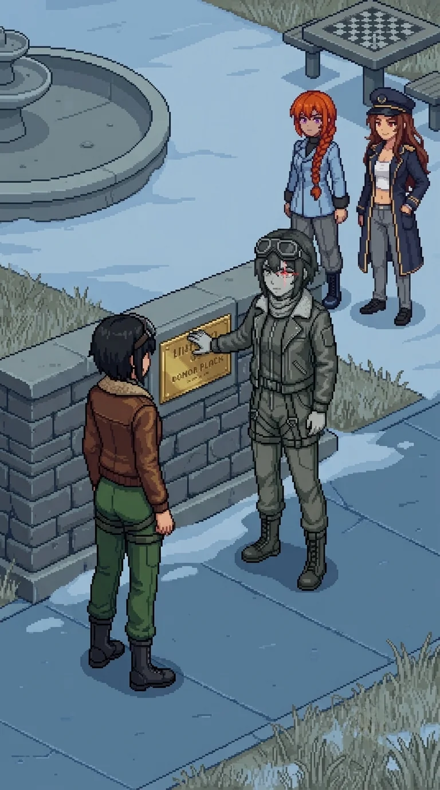

# Chapter 20: The Plaque

*Published July 22, 2026*

*Revision 1, updated July 22, 2026*

{ .chapter-illustration }

The transit yard opened past the last residential block: numbered bus bays in flaking paint, a covered shelter with a departures board gone dark years ago, floor lines still marking out queues for buses that would not come. A roll-call clipboard hung from a hook inside the shelter, its pages filled in a hurried hand that had still, somehow, filled in every line. A shelf near the ticket window held a handful of bags nobody had come back for.

Drona was already under the shelter roof when we reached it, and this time she did not open her relay and vanish the way she had at the testing grounds. She let the distance close.

She held a data unit out flat, no ceremony to it at all.

"Read the dates."

She put it into my hand before I had properly raised it to take one. My fingers found the case's release latch before I had looked for it, an old motion from some drawer I could not name, and the lid came up clean. Her headphones sat warm orange against the grey shelter behind her, the only saturated thing in the whole yard, and for a moment that was the entire difference between a place that had people in it once and a place that still did. Behind her the relay opened wide enough to hold the yard, and by the time Katyusha had the first file loaded, Drona had gone north through the bays without waiting to see whether we followed.

Two drones broke from the drainage channel along the yard floor, the water shape of the thing Nadeshiko had dropped on the avenue that morning. We had the range for it this time, and the spacing Maria had called for since the first one; neither reached anyone. I held the yard's center line and let the team work the edges of it. Twelve days in, staying out of the way was still the most reliable contribution I had to make to any of this.

The records were exactly what Drona had promised and nothing more: name, residence zone, muster point, departure time, manifest number, destination island. Clean. Complete. Orderly to a degree that sat in my chest the longer I looked at it, less like relief than like a held breath. Katyusha began assembling a timeline before we had cleared the yard, walking and reading at once, the way she did everything that could not wait for stillness.

We stopped in a side street off the main civic road, narrow enough that our own voices came back to us off the brick. Katyusha did not sit. She angled the terminal so Nadeshiko could read over her shoulder and worked through the entries the way she worked through anything: without hurry, without skipping ahead to a conclusion she had not yet earned.

"The departure times cluster early." Katyusha did not look up. "Not panic-early. Scheduled-early."

Nadeshiko was already ahead of her. "Like the order went out before there was anything in the sky to leave from."

Katyusha did not look away from the timeline. "Insufficient data to conclude that. The order may have been precautionary. A civil authority moving early is not, by itself, evidence of anything but caution."

She kept reading as she spoke, which told me she did not fully believe her own caveat and was stating it anyway, because the caveat was owed until the file proved otherwise.

Katyusha found the authorizing document at the top of the file: official language, a stamp, a date. She read the date twice, which she did not usually need to do.

"The evacuation preceded the trigger." Flat, not for effect. "This order predates Oracle's activation by forty-eight hours. It predates the Empire's advance elements on any sensor record we hold. It predates every external event I can find in this file."

Nadeshiko: "Someone knew it was coming."

I had nothing to put after that. Whatever should have sat underneath an order like this, a room, a name, a reason, was not filed anywhere behind my own eyes. Not even as an absence I could point to. I let it go and told them to keep moving.

Maria had not spoken since the yard. "That's a different kind of story than the one we've been telling ourselves, Doc." Flat, no joke folded into it this time.

She was looking past me, up the street, not at anyone in particular.

Nobody answered her either.

The road climbed gently into a civic quarter I would not have called a quarter if the buildings had not insisted on it: a library with its book-return flap hanging open, a post office with letters still visible behind a locked mail slot, a small park ahead with a dry fountain at its center and a chess table with no pieces left on it. A litter bin near the path had been emptied before anyone left it. Whoever had lived closest to this park had kept it well. The path around the fountain was still clear, no debris grown into it, no green working up through the flagstones yet.

At the park's south wall, small against the grey and nearly the same color as it, a figure stood with her back to us.

We had seen her before, at a distance, checking doors in a long unbroken row. Up close, for the first time, she was doing something else. Her hand moved along the low wall, over what I understood, once we were close enough, to be a plaque: donor names, a dedication line, a date that predated the catastrophe by years. Some neighborhood's small civic pride, cast in a metal that had not needed cleaning in longer than anyone left here had been gone. She traced a name with one finger, unhurried, the way a person reads something they already know by heart and checks again anyway.

She heard us. I know she heard us, because her hand stopped on the second name in from wherever it had been. She did not turn.

We stopped too, further back than we needed to. Nobody gave the order. It happened the way water finds its own level.

I watched the two of them across that distance and could not stop myself from counting the difference. One had lost everything and knew it, and kept moving anyway on whatever her body still remembered how to do. The other had lost nothing at all, by her own account, and stood at a low wall reading names off it as if the reading were the only task left in the world worth finishing.

Nadeshiko went forward alone.

She stopped a few paces short, close enough that if the air had been moving at all it would have carried between them. It was not moving. Nothing out there was.

"You have been asking why they didn't fight." Not a question. Alpha-Nadeshiko did not turn from the wall.

"Yes."

Her finger reached the last name on the line and stopped there, resting on it.

"You ask why the people didn't fight. You were designed to care about the answer. I was not. One of us was built correctly."

"This is a garden dedication," she went on, before Nadeshiko could answer. "Forty-one names. Donors to a garden nobody has watered in two years. None of them are on any record that matters to the sector. They are simply here, and reading what is here is the whole of what I do." A pause, no different in weight from the sentence before it. "No one else has come to read them. You are the first."

---

*Nadeshiko*

She said built correctly the way she'd logged the drone counts at the muster point, a confirmed figure, not an opinion. That was the part I couldn't get past. If she'd said it cruel I could have hated her clean and moved on.

Back at the Nest I asked the team a question nobody answered: are we others? It has ridden along with me ever since. This was the first time it stood in front of me wearing my own face.

I ran the comparison anyway, because I always run the comparison anyway. Her: no gap anywhere I could find, every entry sourced back to the day she opened her eyes in this sector. Me: I have wanted to go up and look for someone since the avenue this morning, and I do not know where the wanting comes from, and neither does anyone I could ask.

That is not evidence of anything. I know that. I ran it anyway, and it came back the same way it always comes back, which is nothing, which is a shape with no source address, which is the exact wrong moment to be reminded of it.

I wanted her to flinch. Once. At any of it. She finished tracing that letter like she had all the time she has ever had, which by her own accounting is more of it, and cleaner, than I will ever get to keep.

---

*Erika*

Nadeshiko had not moved from where the Alpha had left her.

"You catalogued a garden, instead of anything else. Two hundred meters up, every day, for years, and when the day came that mattered, you catalogued instead of trying to find the ones still moving."

"I did not try. Trying was not in the specification I was given." No defense in it, no retreat either. "Your own record, before whatever was done to you was done, shows that you tried past your own specification, repeatedly. That was flagged once. Anomalous."

"That's not the same as being built wrong."

"No."

Alpha-Nadeshiko agreed with her the way she agreed with everything, without inflection, without needing the agreement to cost her anything.

"It is not the same. It is only a difference. I am not asking you to hate what you are for it."

Nadeshiko's voice had gone low and even in the way I had learned, these past several days, meant she was holding something with both hands.

"Then why say any of this to me at all?"

"Because you keep asking why they didn't fight, and you are the only one who will keep asking it after I stop answering questions."

Alpha-Nadeshiko lifted her hand from the plaque for the first time.

"I wanted the answer on record with someone who would carry it."

She turned then, unhurried, the goggles seated the same way Nadeshiko wore hers, and looked at her directly for a moment that held nothing I could read from where I stood. Then she walked away along the wall and out through the park's north gate, the same unbroken pace she had used on every doorway since the avenue, and did not look back once.

Nadeshiko did not go after her. She stood at the wall a long moment, one hand near the plaque but not touching it, and I understood I was not meant to close that distance either. Katyusha came up beside her without being asked and stood close enough that their shoulders nearly touched, and said nothing at all, which was, by then, the correct thing to say. Maria stayed back with me, arms loose, watching the gate the grayscale figure had gone through as if it might still give something up if she watched it long enough.

"A garden," Nadeshiko said, to no one, or to the plaque, or to the version of herself that had just walked out of the park. "Nobody left to water it, and she still knows every name on the wall."

The fountain's dry basin held a few dead leaves and nothing else, and the grey afternoon sat over the park the same as it had over every street since the avenue, giving nothing back to anyone standing in it. Nobody moved to leave.

She did not ask us to keep moving. For once, none of us did either.

Somewhere ahead of us, past whatever came after this park, there was a signature on that document, and a building where it lived, and we had not found either one yet.

[Previous Chapter: The City](ch19.md)
