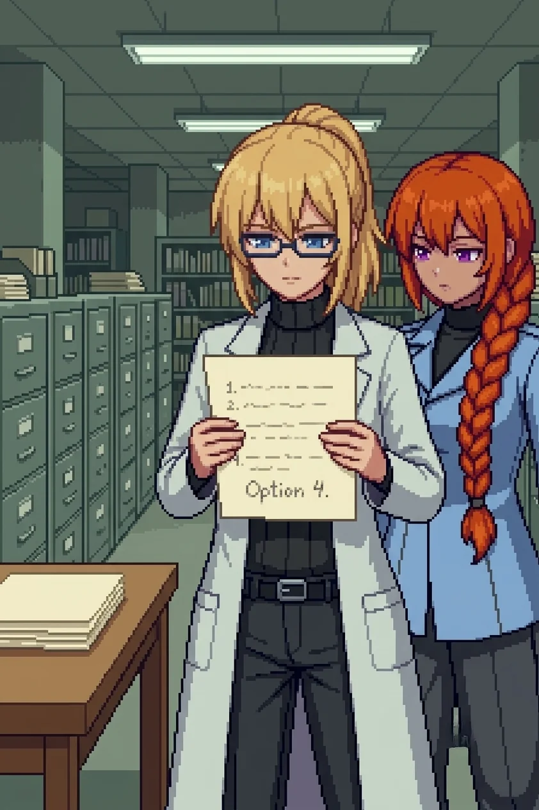

# Chapter 21: The Order That Came Before

*Published July 24, 2026*

{ .chapter-illustration }

We left the park without the plaque and without her. Nadeshiko did not look back at the wall, and none of us suggested she should have.

The streets past the park closed in, narrower, the buildings holding closer to the road. Katyusha called it: the protection zone proper, the sector's densest concentration of households, still defended and still keyed to a threat that had stopped coming years ago. The drones here fought harder than anywhere since the avenue. I held the corner behind a dead delivery van and let the team take the block in three directions at once; by the time I'd counted to the fourth position, the street was quiet again.

The school sat behind a collapsed section of its own outer wall, the gap wide enough to walk through without climbing. Inside, a classroom held itself exactly as someone had left it: a teacher's desk with papers pinned under a mug, drawings on a board, a name printed careful and large in the corner of each one. A reading corner, picture books still on the low shelf where small hands could reach them. A timetable chalked and never wiped. Further down the corridor, a trophy case held a scatter of small cups and shields behind glass that had not been broken, and a lost-property box sat by the entrance with a scarf and a single glove nobody had come back to claim.

A second corridor branched off toward what the signage called the boarding annex, its doors standing half-open on made beds. I inventoried the classroom, the trophy case, the lost-property box. I did not walk down that corridor. I was back in the yard before I had decided the sweep was complete. Behind me, Nadeshiko had stopped at the corridor mouth; whatever she had been going to ask, she filed it.

None of us said anything about it. We had passed the point, some sectors back, where there was anything left to say about a room like this.

Drona was at the south entrance when we came out the far side, mid-stride, not stopping for us.

"This was the protection zone."

She said it the way she said everything that had cost her something to decide was worth saying, flat and once, and was already moving before any of us could ask her what she meant by it. She meant the assignment. The zone Alpha-Nadeshiko had been given to hold.

The footprints told us the rest. A single set in the dust of the nearest classroom, smaller than any of ours, moving desk to desk, board to corner, out again. Recent. Recent enough that whoever left them had been through this room since we'd entered the sector, and probably every room like it, for longer than any of us wanted to do the arithmetic on.

The civic offices building stood two streets past the school: a squat block built heavier than anything else on the road, a crest over the entrance with its paint gone matte, a flagpole with no flag. It had survived close to whole. Buildings built to hold permits and records are built to outlast most things, including the people who filed them.

The stairs down to the basement went where my feet already knew to go before I had looked for a directory. Left at the landing, past a fire door propped permanently open, down a second short flight to a steel door with an old accordion gate in front of it. I did not remember walking this exact path. My body did. I stopped in the archive doorway and let Maria go first through the gate; she had come in ahead of us through a sealed sump in the sub-floor, the building's one concession to her, and cleared the room before we reached the stairs.

The basement held the same cold as the vault, dry and unmoving, and rows of filing cabinets in grey-green ranks under emergency strips still drawing on whatever power the building had left. A date-stamp machine sat on a desk near the entrance, its ink pad still wet enough to leave a mark if anyone had a reason to press it. Nobody did. Katyusha found the committee section before I had finished reading the drawer labels. She always did.

The minutes were stamped, dated, procedurally correct in the particular way of documents written to survive an audit rather than a reader. Attendance recorded by hand at the top of each session. A formal objection, filed and numbered, on the accelerated field deployment timeline.

Submitting party: Dr. E.

Katyusha turned two pages further and stopped.

"There is a second formal objection in this session's record." She did not look up from the page. "Submitting party: Wilhelm Heisenberg. Filed the same month as yours. Noted as received." A pause, the kind she used when she wanted the next word to land on its own. "Overruled."

I had not known he had filed one. Whether that was a gap in the record or a gap I had made for myself, I did not stop to ask. I turned the page instead.

"Both objections," Nadeshiko said. Quiet, which from her was worse than loud. "Filed correctly. Read into the record correctly. And overruled the same way, on the same page, by the same hand."

Maria was already turning to the signature block. "Let's see whose hand that was, honey."

I turned back a page and read the objection itself in my own handwriting, the numbers and intervals I had specified, precise where I had known precision would count for something. It had not counted for anything. I read the whole page anyway.

The name was on every acceleration decision in the stack. Every authorizing signature. Every overrule notation, each one in the same close, unhurried script: Commandant Reiss. A military title, sitting at the head of a research oversight committee where nothing in the minutes explained why it belonged there. Six other names recurred through the attendance sheets, civilian titles I did not recognize, and not one of them had signed anything. They had attended. He had decided. The record did not argue for his authority. It simply recorded it, the way you record weather.

"He chaired the session that overruled you," Katyusha said. "He chaired the session that overruled Wilhelm. He chairs, per this record, every session in this archive."

Maria found the master file two drawers further back, and her voice had none of the lightness in it when she called us over. "Doc. This is the order."

I took it from her hands. The same evacuation order Katyusha had read to us at the muster point, stamp and date matching to the hour, except this copy carried what the civic set had not: a signatory line, filled rather than blank. Reiss. The order that had gone out forty-eight hours before Oracle woke, before there was anything in the sky to justify it, had his name sitting under it the entire time.

Nadeshiko: "Someone knew it was coming."

Nadeshiko had said the same words in the side street off the muster point, before any of us had a name to put to them. She did not say them any lighter now.

Nadeshiko: "Now we know who."

---

*Katyusha*

I had been carrying an unresolved reference since the Phase 3 review room, before the northern sector, before any of this: two letters on a routing code, unassigned, filed and left open because I had nothing to attach them to. OC. I had told the team, at the time, that it was not a name we had read. That had been the accurate statement.

It was not the accurate statement now. Attendance sheet, header, cover memo: Oversight Committee, the words spelled in full on the first page of the section and abbreviated on every page after it, the way an institution abbreviates anything it expects to type often enough. The same two letters. The same routing code that had carried a four-sentence override past a twelve-page safety report I still had not been permitted to say anything further about.

I logged the resolution and felt nothing I had a category for. Since the Phase 3 review room I had carried the letters as an open item, filed and reopened at intervals, a small persistent friction against a processing loop that otherwise ran clean. Closing it should have registered as relief. It registered instead as the loop simply stopping, the friction gone and nothing filling the space it had occupied, which was its own kind of question I did not have an answer prepared for.

I did not say any of this aloud. I said the part that was operationally relevant.

"The routing code resolves. OC is the Oversight Committee. Reiss chairs it."

---

*Erika*

The records room had a second occupant before we said any of that out loud, and none of us had noticed her until Maria did.

Alpha-Nadeshiko stood at an open filing cabinet two aisles down, files squared on the table in front of her the way she had squared the plaque's donor names under one finger. She did not turn. She closed the cabinet without hurry, took nothing from the table, and crossed to a side door I had not clocked as a door until she used it. The latch gave without a sound, worn smooth by a hand that had opened it more times than any of us would ever know. She did not look at Nadeshiko on her way out. She did not look at any of us.

Nadeshiko watched the door long after it had stopped moving. She did not go after her this time. She had already had her conversation with that particular silence, back at the plaque, and this one asked nothing further of her.

I crossed to the table Alpha-Nadeshiko had left. The files were the same section we had already opened: committee minutes, Reiss's signature, the same two overruled objections. She had been reading exactly what we had been reading, on her own schedule, for longer than I wanted to work out.

---

One document sat apart from the rest, face-up on the corner of the table. An acceleration authorization, Reiss's formal signature at the bottom in the same close ink as every other page. On the reverse, in pencil, a different hand than the one he signed with, faster and smaller: three numbered lines.

*One. Oracle holds. Deterrent stable. Empire stands off.*
*Two. Oracle fails before transfer. Agreement activates. No occupation. Population intact.*
*Three. No agreement. Fleet arrives. Engagement, by year's end.*

Below the three lines, in a different ink, added later: *Option 4.*

Two words. Nothing under them. Whatever had earned that fourth line a name of its own, he had not been able to bring himself to write down what it was, only that it existed and had not been on his original list.

I read the three lines twice, the reflex I used to hold before I'd ever have said I had one, and then the two words under them, and set the page face-down on the table.

Katyusha read it over my shoulder in the same silence.

Katyusha: "He was making a calculation for the island."

"Yes."

Katyusha: "He missed a scenario."

"Yes."

Nobody said anything else about it. A man with a numbered list, correct on every line he had thought to write before the fact, and one line he could only name after, in different ink, when naming it changed nothing anymore. That did not make what he had built smaller. It only made it a different shape than the one I had been picturing since the loading bay.

We climbed back out past the crest and its flaking paint into the last grey light of the afternoon. Somewhere west of here, past whatever came after the government sector, was whatever Option 4 had actually been, the thing that had needed a name only once it had already happened.

Reiss had a title now, and a hand, and a chair at the head of a table. He had a name that fit two overruled objections and a routing code the team had been carrying, unassigned, since the Phase 3 review room. He did not yet have a reason.

We went west to find one.

[Previous Chapter: The Plaque](ch20.md)
