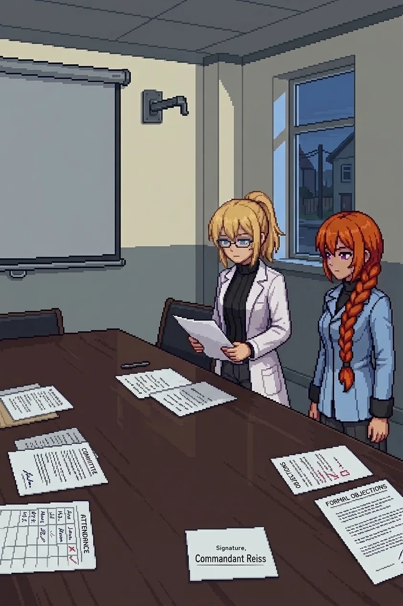

# Chapter 22: The Agreement

*Published July 25, 2026*

*Revision 2, updated July 27, 2026*

{ .chapter-illustration }

We did not get far.

The light went before the road did, three streets past the civic offices, and Maria called the stop before I had to. My legs had been telling me for an hour that walking was no longer the same activity it had been that morning, and I had been ignoring them the way I ignored most reports that did not change what came next. A municipal annex sat off the avenue with its ground floor mostly intact: a security checkpoint just inside the entrance, glass gone from the frame but the desk still standing. Behind it stood a conference room built for people who needed a long table and did not expect to be interrupted, a retracted screen on one wall and an empty projector mount above it. Maria had already circled it once from the outside before she called the stop. Katyusha checked the corners out of habit, found nothing, and checked them again.

We laid the files out in the order she had reconstructed them in the archive: the committee run, the attendance sheets, the two objections, the memo with the pencil on its back. I sorted them further into three stacks, procedure and objection and outcome. Nobody sat. The chairs were still pushed in around the table, waiting for people who were not coming back to a meeting that had already happened.

"We had orders," I said. Not as a defense. As a starting point, the way you state the last confirmed position before you plot a course from it.

"You deviated from the orders." Katyusha did not look up from the attendance sheet. "You activated Oracle before the deployment order was issued."

"I thought the Empire was coming." The sentence came out level, which was its own kind of answer. "I panicked."

I did not soften the word. It was the accurate one, and I had spent a working life being accurate about smaller things than this. "Panicked" cost nothing to say out loud that "deviated" had not already cost, and saying it plainly was the only form of payment I had left to make on it.

"But someone expected you to panic, Doc."

Maria delivered it without any of the lightness she usually put in front of a hard sentence, and that absence told me more than the sentence did.

The drones found us before anyone could sit with that for long. They came in off the side corridors fast and did not hold, three then five then more, the kind of pressure built to move a target rather than stop it.

"They are not holding a line," Katyusha reported. "They are herding us. Whoever is running them wants us moving, not dug in."

"Then we move," Nadeshiko called back, already turning, "but on our terms. I'm not getting pushed anywhere I didn't already want to go."

"Out through the front, then."

I held the checkpoint desk as cover and let the three of them take the corridor mouths, the way I had learned to be useful by being nowhere anyone needed to compensate for me.

---

*Maria*

Reading a corridor is not so different from reading a channel. You do not watch for the biggest thing coming at you. You watch for whatever is moving wrong against the current. Three drones came off the side halls wrong from the first step, too fast for a defensive posture, herding instead of holding, and I had two of them down before Katyusha finished the sentence explaining what they were.

Nadeshiko fired her line into the middle of it, the way she does everything, without waiting for a gap to put it in.

"So they planned around you breaking, and then they built the thing that would break you, and that isn't a committee. That is a trap with minutes."

I have heard that shape before. Not the words. The click a fact makes when it lands somewhere it already fits. I know exactly where I heard it and exactly why I am not saying so, and neither of those is new information tonight. What is new is how much I wanted, for about half a second, to just hand the doctor the whole thing at once instead of the pieces I have been rationing her since the relay.

I do not have a clean accounting of why I have not done that yet. Twelve days of deciding it is not time, and every time I get close to the actual reason, it turns out to be a feeling rather than an argument, and nobody built me with a drawer marked feelings in the first place. I put the round into the drone coming up the stairwell line instead of finishing the thought.

"You can't out-think a decision somebody already made about you before you made yours." I meant it mostly for the doctor and a little for myself, because I have run that exact calculation more times than I have let on, and it has never once come out different. "I've tried, Doc. It doesn't work from either direction."

By the time the last servo wound down instead of just stopping, I had already decided, again, that tonight was not the night. It has never once gotten easier to hear myself make it.

---

*Erika*

Maria came back to the checkpoint desk already looking somewhere past all of us, which was as much as she was going to give anyone tonight. Nadeshiko had already said the thing I did not have the composure to say first.

"I'm not angry at her anymore." She aimed it at the room, not at me, which somehow made it worse and better at once. "I'm angry at whoever decided the people who knew best got a form to fill out and a no."

Katyusha did not elaborate. "That is where it belongs."

The last drawer in the checkpoint desk held what the basement archive had not: a single folder, thin, marked with a session number instead of a date. Katyusha had it open before I had finished crossing the room, the way she found everything before I did.

"Doctor." One word, and then she held it out rather than reading it aloud, which from her was its own kind of warning.

That, more than anything she could have said, told me to sit down.

The folder held an instrument of agreement, the kind of document built to be read by lawyers and nobody else. It transferred Oracle's architecture, its data, its physical installation, to the Nautilus Empire's defense authority upon project completion, in exchange for the Panzer Republic's protected status as a client state. A signature closed it at the bottom, close and unhurried: Commandant Reiss. A date sat stamped beside it, one I read twice.

The date sat six months before the catastrophe. Before my safety report. Before the first objection I had ever filed against anything Oracle was doing. No one at the research table it governed had ever been told it existed at all.

I did not say any of that aloud. I set the folder down flat on the table, the way you set down something you do not want to be holding when it finishes registering, and did not pick it back up. My voice, when I used it again, came out quieter than the sentence needed and considerably more level than I felt entitled to.

Nadeshiko read over my shoulder and went very still, which from her cost more than anything she could have said instead.

"They knew we would object." Flat now, all the heat burned off it. "They filed our objections. They overruled them. And then they..."

She stopped there, the way a sentence stops when the next word is a fact rather than an accusation and the speaker has not decided she is ready to hand it over.

"And then they waited," I said.

I said it the way I had set the Option Four page face down in the basement two streets back: flat, once, no appeal folded into it. It was not absolution. I did not reach for any.

Maria had said her piece in the corridor and gone quiet through the folder, and when she finally spoke again it was not about either.

"That thing from the relay, Doc. The one I said I'd tell you on the other side of the gate." A beat, and then the door on it closed again before I could ask. "It's still not tonight. But it's closer than it was."

I did not press her. Whatever she was still deciding whether to hand over, two more streets of walking was not going to change the shape of that decision.

We stepped out through the checkpoint's blown frame into full dark, the residential street giving onto an open square somewhere past the next block, civic ground by the look of the lamp posts still standing over it, and a flagpole at the near edge with nothing flying from it. The cold had a different quality out here than it had in the conference room, less a temperature than a kind of attention.

"Whatever's left to find, Doc, it's out there in the open, not in a basement." She resettled her hat, the small tell that meant she had decided something and was not going to explain it. "No more reading. We walk into it."

"Then we walk into it."

I reached for the thought that should have followed that, some remembered shape of what waited past the square, a hallway or a room or a reason I had once known well enough to write six months of silence around. It did not arrive. It rarely did, on the nights that mattered most for it to.

The folder was in my coat now, the way the Option Four page was in Katyusha's, two documents that had been pointing at each other since the basement and had never once been in the same room until tonight. Somewhere past the square was whatever else Reiss had signed his name to, and unlike the man himself, it was not going to walk away from us.

[Previous Chapter: The Order That Came Before](ch21.md) | [Next Chapter: The List](ch23.md)
