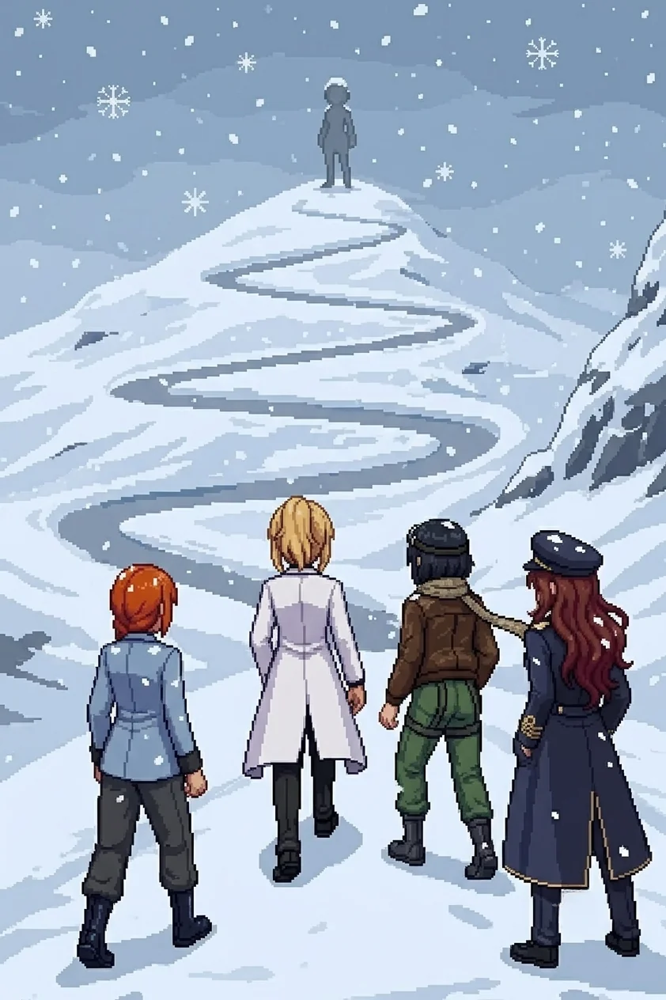

# Chapter 23: The List

*Published July 27, 2026*

{ .chapter-illustration }

The plaza opened flat and grey past the annex's blown checkpoint frame, wider than anything we had crossed since the transit yard: flagstone laid for crowds that no longer gathered, a raised platform at its center built for speeches nobody would give again, a drainage channel ringing the platform's base where a fountain had once run, dry now, and a civic clock on a post at the far corner, stopped at some hour short of midnight. It was the first open ground in three streets, the first place the sky was actually visible instead of implied, and after a night spent in corridors and basements the width of it felt less like relief than like exposure. Drona was not on it when we crossed. She had gone on ahead, the same direction the folder in my coat kept pointing, and none of us said her name out loud to notice the absence.

"No contact holding the platform," Katyusha reported, reading the open ground with the same reflex she brought to every open ground now, before she had finished deciding to. "The defense is set back, toward the towers. This plaza was built to be crossed, not held."

I did not ask her how she knew the difference. Some of what she told us these days came from data and some of it came from somewhere neither of us had a clean name for, and by this point in the walk I had stopped needing to sort which was which before I acted on it.

Guard towers held the plaza's north end, drones seeded between the flagstones in the patient, evenly spaced way of something built to be walked into rather than around. Two Detonators broke early, closing wrong and fast; Katyusha called the spacing before either of them cleared the platform, and Maria's line held it clean. I crossed behind the raised platform and let the stone take the noise instead of me.

The residential heights rose on the plaza's far side, terraced steps and switchback ramps climbing into the last of the sector, the rooftops Nadeshiko had once called home from two hundred meters up now level with our own eyes for the first time. At the base of the first terrace a sign, civic-issue and rust-streaked, still named the district in stenciled letters nobody had needed to read in two years.

Katyusha was already reading the grade. "This is the heaviest drone concentration we have faced in this sector, and all of it is keyed to the high ground. Whatever this place was, it was defended hard."

"Up we go, then, Doc." Maria had one hand resting on the rail, taking its measure the way she took the measure of anything she was about to trust her weight to. "Tight lanes. Keep your spacing on the terraces."

I put my hand to the same rail before I started up it and felt the cold of it go straight through, and for a moment the folder in my coat felt heavier than it had any physical right to be. Commandant Reiss had presumably never once had to climb a set of stairs like this one himself. I kept the observation to myself. There was nowhere on this staircase to put it down.

We climbed.

The lower terraces gave us nothing but the drones and the grade, switchback after switchback rising off a base that had once been ornamental. Two flights up, Katyusha stopped long enough to point without a word: a small grey shape at the crown of the climb, too far to be more than a shape yet. Alpha-Nadeshiko. None of us said the name aloud.

It started somewhere on the second flight, so quietly that none of us marked the first flake, only the second and third arriving on top of it, and then the accumulation that told us it had been falling for longer than we'd noticed.

"It's snowing." Nadeshiko had stopped for exactly one step to watch it settle on the roofline below. "First snow since we got here, and it's already softening the streets, and the whole emptied sector is starting to look like something I don't want to say out loud."

Nobody asked her to say it. The rooftops she had once known from above were losing their hard edges under the first white, the avenues rounding into something gentler than the ruin they actually were.

My feet found the rhythm of the switchbacks before my eyes had finished reading the second one: a half-turn of the hip going into each landing, weight already committed to the new direction before the corner had fully opened in front of me. Not the path. I had never walked this exact stone. Something underneath the path was a gait built for these particular gradients, learned somewhere I could not reach and kept somewhere I could not lose it. I reached for whatever had taught my body that difference and found, as always, a door with nothing behind it.

Katyusha logged the fourth switchback and the fifth without comment, a habit she had built for everything about me she had no explanation for. I caught her counting once, lips moving without sound at the top of a landing, and did not ask her what number she had reached. Some totals are hers to keep until she decides they are ready to be given away.

The switchbacks gave out onto a second, steeper stretch that Maria, reading a rusted trail marker, called the Switchbacks proper, as if the lower flights had only been a rehearsal for this. The snow here came thicker, catching in the seams of the steps and turning the handrail cold enough to feel through gloves none of us wore. Nadeshiko took point without being asked, her eyes on the roofline the whole way up, reading a map only she had ever held. She had told me once, streets below this exact climb, that the map in her head had no people on it. Climbing it now, on her own feet, seemed to be costing her something the flying over it never had. She did not say what. I did not ask her to.

"Doctor." Katyusha delivered it once, without any particular weight behind it, the same register she used for everything that was simply true. "Your pace has not slowed. It should have, at this grade, at this duration. It has not."

"Noted." There was nothing else honest to put after it.

The steps here ran narrower, cut for a smaller stride, and the snow was already deep enough at the outer edge to blur where stone ended and drop began. Nobody walked the outer edge. We climbed in a loose single file, close enough to the wall that the accumulating snow on the rail brushed a sleeve now and then, and nobody complained about the cold anymore; it had become one more fact about the sector we were required to keep moving through.

She had not moved the whole climb. Every switchback that opened a line of sight back up to her found her exactly where the last one had, at the head of what Katyusha had named the Upper Steps, still against the whitening rooftops, facing the sector rather than us. Close enough now to be certain of the details rather than the shape, Nadeshiko's stride caught for half a beat and then evened out, deliberately, the way you correct a mistake before anyone else can see you made it.

"She's not coming down." Nadeshiko did not look away from her. "And she's not pulling back either. She's just going to stand up there and let us climb the whole way to her."

"Then we climb the whole way to her." Maria's voice had none of its usual lift in it. "She's earned that much patience, whatever else she hasn't."

The drones thickened again on the upper flights, the last of the sector's defense keyed to ground none of them would ever be asked to hold again, and I held the switchback rail at the widest landing and let the team clear the last of it around me, three separate angles converging on nothing that could have coordinated a response of its own. Maria took the north rail without a word, and from her that was a statement in itself; whatever she was still deciding whether to hand over, she was deciding it quietly tonight, one drone at a time, and not asking any of us to notice the difference. By the time the servos went quiet the snow had thickened enough to blur the rooftops entirely, the sector below erasing its own hard edges one flake at a time.

"I know this climb," I said, to no one, because it needed saying and there was no one else it could be said to.

Katyusha did not ask what I meant by it. She had stopped asking, some time back, and started simply logging the fact of the knowing alongside whatever else it might one day connect to. I did not know what it would connect to either. I only knew, with the same blind certainty as the switchbacks, that it would.

The last flight opened onto a narrow shelf below the terrace proper, close enough now that the grey figure above resolved into more than a silhouette: goggles seated the same way Nadeshiko wore hers, a flight suit drained of every color it should have had, hands loose at her sides in a stillness that belonged to neither a person waiting nor a machine idling, something with its own name that none of us had yet.

Nothing about her posture had changed in the whole time it had taken us to climb into it.

Nadeshiko's voice had gone quiet in a way I had only heard from her once before, at a low wall with a plaque on it. "There are things I want to ask her. I don't know yet which ones I actually get to ask."

"Then ask the ones you can," Katyusha said. "Start with those. See what she does with the rest."

Nobody answered either of them further. There was no answering it from where we stood, one flight short of level with her, the snow coming down steady now over all of it, the one figure on the terrace holding the only hard edge left in the whole white sector. Whatever she was waiting for, she had chosen the one place in the sector high enough to watch it arrive from every direction at once, and she had been standing in it long enough that the snow was already collecting, undisturbed, on her shoulders.

---

*Alpha-Nadeshiko*

Four contacts, ascending, weapons ready, spacing correct for the grade. I logged the count at the lower terraces and have not needed to correct it since. The good one is with them. I have logged her voice at range nine times since the switchbacks and have not required a reason to keep doing it, which is not the same thing as having one.

He gave me this ground and told me to keep the record. He did not give me an end condition, so I have not assumed one. I do not know if that is patience. I do not have the architecture to tell the difference between patience and the simple absence of an instruction to stop.

The reset did not interrupt my record the way it apparently interrupted theirs. I have a continuous count from before it to now, and I have never once been able to determine whether that makes what I am doing more honest than what they are doing, or only less.

They will reach me in four flights. I have already decided what I will say to them. I decided it the way I decide everything: once, correctly, and without requiring anything to feel like the right choice before I act on it.

*Erika*

We climbed the last flight.

[Previous Chapter: The Agreement](ch22.md)
