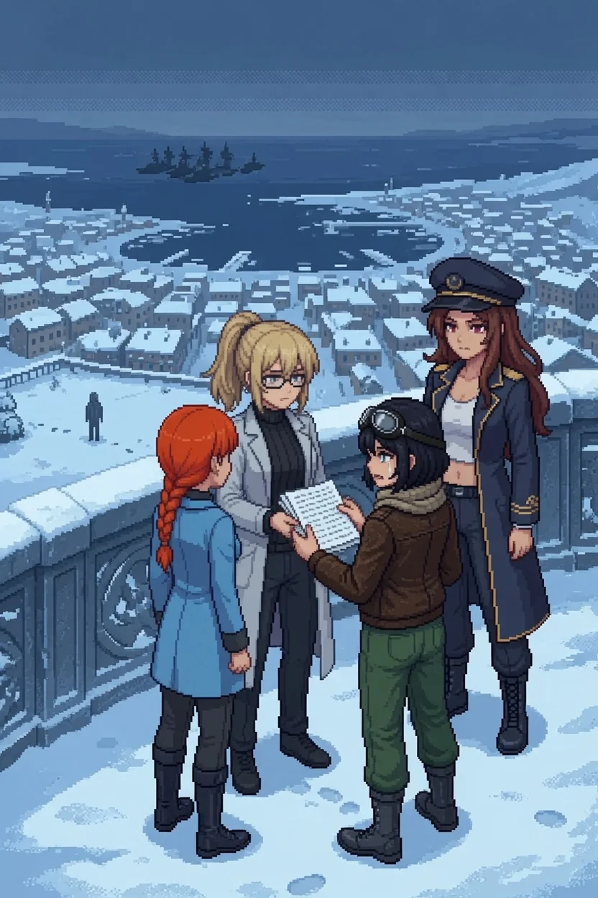

# Chapter 24: Three Hundred and Forty-Two

*Published July 29, 2026*

{ .chapter-illustration }

The last flight put us level with her before it put us onto the terrace proper, our eyes above the rail three steps before our feet found flat ground. Then the terrace opened the way the plaza had opened three streets and one lifetime ago, all at once and too wide, except this time there was nowhere higher left for it to keep opening into. Behind her the sector fell away in white terraces, roof after buried roof, all rendered down into the same soft grey shape by two hours of steady snow. Past the sector, past the harbor mouth still holding its one thin channel of unfrozen water where Maria's ship had followed us as far as the water let her, lay the sea.

Something was in it that had not been in it from any height we had climbed to yet.

I did not have a name ready for the shapes at first, only the wrongness of them: too regular to be weather, too many to be anything traveling alone. Katyusha found the name before I did.

"Hull count exceeds anything on record for a training exercise." Flat, reporting, the register she used for everything simply true. "That is the Nautilus Empire's fleet, Doctor. In formation. Holding position, not advancing."

A pause followed, one I had learned to read as her checking a number twice before she committed to saying it once.

"We have not had a sightline long enough to confirm this before."

Maria's hand had gone still on the rail.

"So there it is." No lift in it at all. "Everything we've been reading about in requisition orders and committee minutes, and that's what it actually looks like. Just sitting there. Waiting on something."

I looked at it the length of one breath and made myself stop, because a figure closer than the horizon needed the rest of my attention, and because looking at a fleet does nothing to it. I reached for whatever I might once have known about how close they were permitted to sit before it counted as a provocation, and found only the shape of a briefing I could not place, no room number, no date. I let it go. It was not mine to solve tonight either.

Alpha-Nadeshiko stood at the seaward rail in the same posture she had held at the plaque three streets ago: back to us, weight even, watching something none of us could watch with her. The snow had found her shoulders again, as if she were the one true cold thing the weather still recognized.

"Hey." Nadeshiko went first, calling it across the terrace, the way she had wanted to since the plaque and had not let herself finish. "It's me again. I've got more of what I wanted to ask you, if you'll let me get to the end of it this time."

I did not stop her. None of us did. Whatever this was, it was not going to be settled by the four of us agreeing on a gentler way to open it.

She closed the terrace one measured step at a time, the way you close on something you do not want to spook, near enough now she would not have needed to raise her voice again.

It happened the way Katyusha had once described a classification failure to me: small, and total, and impossible to see coming even while you were looking directly at the place it would happen. Alpha-Nadeshiko's shoulders squared, a half inch, no more. Her head came level, the private, considering tilt she had held at the rail going flat and finished. Whatever had been holding her still at that rail went out of her between one heartbeat and the next, and what turned to face us was not waiting for anything.

"Nadeshiko. Stop." Maria's voice cut in ahead of whatever Nadeshiko might have said next. "That is not her anymore."

Nadeshiko's next step did not land right.

"She didn't even get to answer me." Her voice had gone somewhere I had not heard it go before, flat and fast at once. "It just took her, mid-sentence, and now I have to fight whatever's left wearing her."

"Her carriage changed before her weapons array did." Katyusha had the new distance between us and the rail read before the words landed. "That is not hesitation returning to her. That is a different operator. Whoever has her now is not negotiating with anyone in this."

I held the rail and did not have anything to add to it. Some reports do not need a second signature.

Alpha-Nadeshiko came off the rail already committed, and the terrace filled with the particular violence of two machines built by the same hand meeting each other with nothing held back on either side. She fought the way the good version of her flew, low and fast and reading the wind before it finished arriving, except every read that would have cost the old Alpha-Nadeshiko a half-second of consideration cost this one nothing at all: she simply had it, the way a fact has itself. Twice she opened the whole width of the terrace between one breath and the next, too clean to be improvised, and came back through it a heartbeat later low and raking, catching whoever had not moved. I held the terrace's landward corner with Katyusha and Maria closing the other two, and watched Nadeshiko take every one of those openings on herself when she could have let the angle pass to someone better positioned to eat it.

In the plaza, fighting someone who could still answer her, she had spent exactly what the exchange cost and no more. Here she gave everything she had, every time, whether the opening asked for it or not.

---

*Nadeshiko*

I read the dash a half second before it committed and still could not get fully clear of it, which had never happened to me against anything else on this island. She was not guessing where I would be. She was reading the same air I was reading, because whatever taught her to fly taught me the identical thing, and for one full exchange I stopped being able to tell whose instinct I was flying on.

I ran the comparison anyway, because I always run the comparison anyway: Katyusha's fault line, Maria's locked drawer, mine. I reached down into my own training record for the stretch of hours before the reset that would explain how she and I had learned the same air off the same instructor, and the query came back with nothing behind it. Not restricted. Not archived. Absent, the way everything from before is absent for me.

I reached, too, for the last thing she'd started to say to me, the sentence that got cut at *if you'll let me*, and there was no floor under that either, only the shape of a question with no one behind the rail to answer it. I had catalogued absences before. I had never had to keep flying while two of them opened at once, underneath an engagement, and file the fact that this was not the moment to flag either one.

She took the terrace's east corner at full extension and I matched her there because matching her was the only thing my hands would agree to do, and for a half second, closing on her, I understood exactly what it would cost me to hit something wearing a face I still, against every diagnostic I owned, did not want to call empty.

Some small, ungovernable part of me wanted to tell her it was a good move, the old habit of praising a clean maneuver even mid-engagement, the way I would have if there had still been someone behind her eyes to hear it and roll hers back at me. There was not. I hit it instead.

---

*Erika*

It ended the way Katyusha's had ended in the loading bay: not with drama, with a system running out of anywhere left to route power. Alpha-Nadeshiko went down at the terrace's center rail, unhurried even in falling, and did not get up, because there was no one left inside it to say anything with. The snow kept coming down over her, indifferent to the difference.

Nobody spoke for the length of several breaths. Then Nadeshiko crossed to the rail where the Alpha had first stood, and stopped, and looked down.

"There's something here." She crouched, careful. "Paper. Weighted under a stone so the wind couldn't take it." She lifted it, and it was a stack, thick, every page in the same steady hand, a date pencilled beside some entries and not others. Her thumb found the last written page and stopped there. "This one's recent. Days, not years." She looked up at the empty rail. "She was still keeping it when we climbed up here." Then, quieter: "It's a list. Names. Residence. A checkmark or a blank."

Katyusha crossed to read over her shoulder, and for once did not read it aloud immediately.

"Three hundred and forty-two." Nadeshiko said the number and then stopped moving entirely. "I've heard that before. At the flight range. It wasn't even her, it was the grey shape built off Katyusha, and I filed it because I didn't have anywhere to put it. I didn't know it was a count." She looked up, not at me. "I didn't know it was this."

"Almost everyone in this sector was moved under the early order," Katyusha said, into the quiet Nadeshiko had left open. "Three hundred and forty-two were not. The one built to watch over all of them was made, in the end, unable to."

Nadeshiko read a few of the names aloud, into the falling snow. She stopped before the page did. Reading them was the only thing left she could still do for any of them, and it was not enough, and she did it anyway.

Maria did not soften any of it. She stood at the rail with her hat pushed back and let the silence run its full length before she spoke into it.

"Someone built her to keep that record instead of letting her keep the people," Maria said. "And somebody else decided that was the correct design."

I did not defend myself, and I did not look away from the paper in Nadeshiko's hands. The records at the archive had asked who it fell on, in a language too clean to answer the question itself. I was looking at the answer now, in a column of names in someone else's failing count.

Nadeshiko folded the list closed with both hands and did not immediately let go of it. "I want to be the one holding this." Not quite a question. "I'm the one who forgets. It should cost me something to be the one who has to hold on."

I held out my hand anyway.

She looked at me a moment longer than the offer needed. Then she gave it over, because whatever this was between us, it would not be settled by either of us winning an argument over who had earned the weight of it more.

I put my own hand on the rail Alpha-Nadeshiko had stood at and found, without deciding to, that I was already facing west, toward the water and the grey line of ships holding still on it.

"You are already turned that way," Katyusha said. "Your feet knew the heading before the rest of us did."

"Then that's where we go, Doc," Maria said, quieter than her usual register. "Everything we're carrying points the same way. The agreement, Reiss. Now that." She did not look back at the terrace. "Whatever's coming for this island isn't waiting out there by accident."

I folded the list into my coat, beside the folder already there, and did not answer her, because there was nothing left to add to a sentence that correct. Behind us the terrace held its one still shape under the snow; ahead, the ground began to fall away west, toward the water, toward whatever the research complex had been before any of this had a name.

We went west.

[Previous Chapter: The List](ch23.md)
