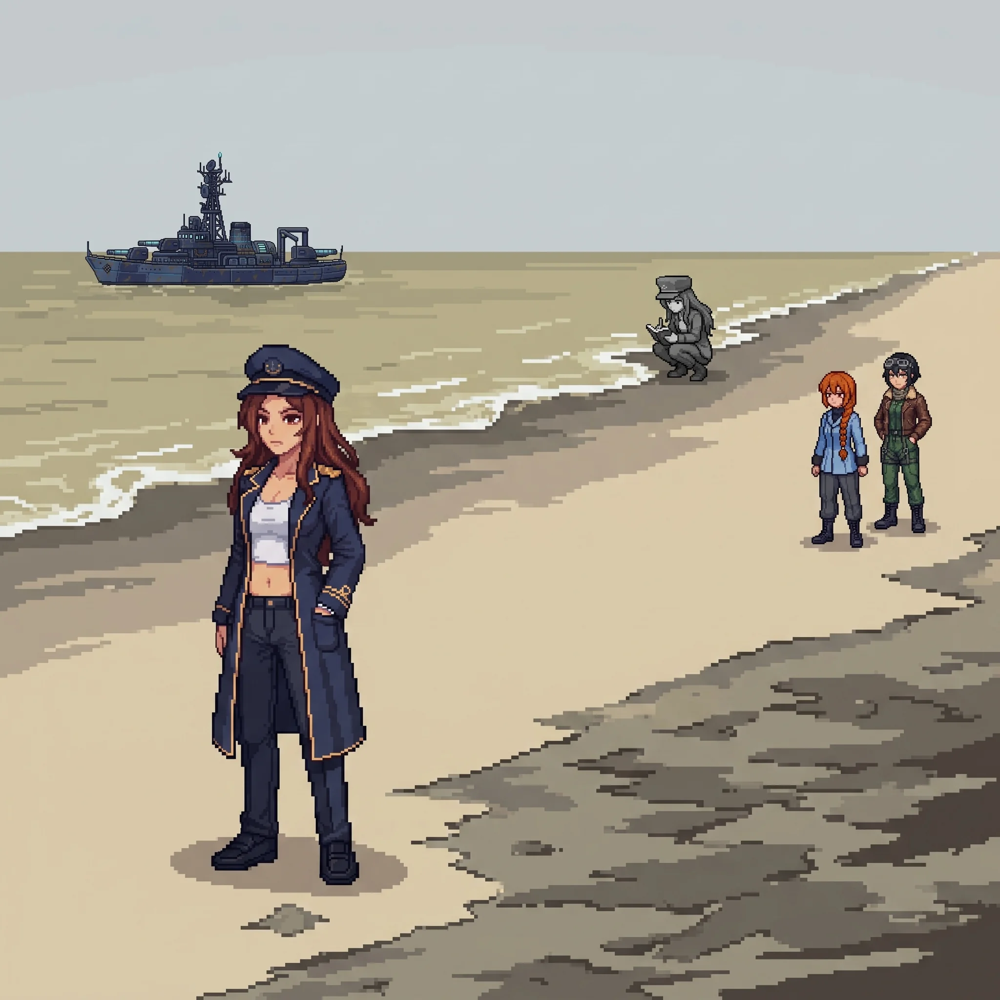

*Published July 31, 2026*

{ .chapter-illustration }

# Chapter 25: Wrong Ground

The road west held the coast for a while and then stopped being a coast; within half a kilometer the change was total. The soil went the particular grey-brown that is not a color soil is allowed to be, and the dead patches started, irregular, hard-edged, as though something had been poured across the ground and found its own level. Where the dead ran up against the living, the living had given up the argument and stopped a hand's width short.

My feet chose the turn off the road, and I arrived at the choice a step behind them.

Katyusha registered it a half-step ahead of me, level. "You have been here before."

"My feet seem to think so." I did not slow down to examine that. Not slowing down was the thing I had decided, somewhere I could not point to, not to do here.

Maria came up on my other side and read the ground the way she read weather, all at once and without hurry, her hat pushed back, her eyes doing the thing they did when she was somewhere her hands knew the shape of.

"This was mine. Not built by me. Defended by me. I know the sensor architecture out here down to the spacing." She toed the edge of a dead patch and did not step onto it. "The whole western approach was a screen. Everything past this line was worth putting a screen in front of."

"Move through it." I kept my voice flat and kept walking, out onto the grey-brown at the pace of someone who has decided the ground is a floor and not a question. Nadeshiko lifted off to take the high line ahead of us, and her downwash pulled a thin grey haze up off the dead soil. Nobody said anything about breathing it. My own exposure numbers had never moved since the first crossing, and I had stopped sealing against air that had never yet done anything to me. I told myself it was efficiency, and there was no one on the team I needed to explain that to.

At the tide's edge, a figure was working.

She was grey against the wet sand, drained of every color the shore still had, and she moved along the waterline at a fixed interval: several paces, stop, crouch, a reading, up, several paces, the same. The pattern did not break for us. She did not look up when Nadeshiko crossed above her, or when we came down the slope of dead ground and stood close enough to be seen.

"Frame match to Maria," Katyusha said. "Confirmed. It is Alpha-Maria."

The name went into the space between us and nobody handled it. There had been one of these waiting in the range and one in the snow, and the naming of them had stopped being an event three sectors ago.

"She hasn't looked at us once." Nadeshiko had throttled back to hold station over the shore, her words quieter than the voice she flew with. "She hasn't looked up from it at all."

"She's still logging." Maria had gone very still. "She has been keeping that record since the contamination reached the coast, and she has not stopped keeping it since."

"How do you know that." I did not mean it as a question, which was why it came out without the shape of one.

Maria's eyes did not come off the grey figure. "The interval. It's the one I'd use. I don't know why it's the right one. I only know that it is."

---

*Maria*

The drones came up out of the dead shallows, and for once I did not have to be told what they had been.

They held the waterline in a loose, correct picket. Not the fevered geometry of a thing hunting, the geometry of a thing defending, spaced to cover a coast against something arriving from the sea. I knew the doctrine before I finished reading the array, because it was mine, because I had held this exact line myself, or the me before the me I could reach had. The contamination had gotten into them the way it had gotten into the soil and the water, now the line they were built to hold, they held against us.

I put myself between them and the shore and took the water, because the water was the one thing out here that was still mine to stand in. I gave them a false approach off the west margin, a line no defender could resist closing, and when they committed to it I was already through the gap it opened, in among the picket where their spacing worked against them. Katyusha took the two that peeled onto the dry ground. Erika held the high margin above the tide, tucked low against a spur of dead rock, easy to miss when the rest of us got loud. I closed the picket one contact at a time, and it did not feel like winning. It felt like being right, which is a colder thing.

Alpha-Maria kept logging through all of it.

That was the part my instruments could not close. She was inside the fight's own radius. A reading, a step, a reading. She was not guarding herself, not helping us, not watching the record burn out of the drones who had held her line with her. She had a job: write down what the poison had done to the water. She was doing it, and the water she was measuring would never grow anything again, and no one alive would ever read the number.

I wanted to tell her to stop.

I could not give a clean account of where that want came from. It is not in what I am for. She was doing precisely the thing I would have done: put a defender in front of a lost coast and tell her to keep the record, and the fact that the record is useless was never once in her parameters or in mine. Someone built us both to hold and count. She never got the part where you learn to want something the specification did not issue you. I did, and I am standing in poisoned water wanting on her behalf, and I could not tell you which of us that makes the working design.

I came up out of the shallows last, and shook the grey off my deck, and the shore was quiet again except for her.

Something caught my portside plating in the exchange, small, the kind of thing Doc closes over without either of us making anything of it. I did not think about it again until later, when I noticed a stretch of before, back when the water was still mine to plan instead of just stand in, had gone a little less sharp than it used to be. Nothing gone. Just further off than it should have been. I did not mention it. There did not seem to be a version of mentioning it that was worth the words yet.

---

*Erika*

"She's been out here alone the whole time." Nadeshiko had set down on the dry margin, looking at the small grey figure. "Logging a thing no one is ever going to read."

"Then we make sure someone reads it." I said it before I had finished deciding to, and let it stand, because it was the only answer to Nadeshiko's face that was not a worse one.

We moved on. The tide came in over ground nothing would grow on again, and covered the place Alpha-Maria had just measured, and she moved up ahead of it and kept measuring.

Drona was waiting at the gatehouse where the shore road met the inner fence.

She had been hard to look at for a while now, a little more each sector, and here it was plain: something in the way she held herself had gone economical past the point of grace, a machine spending only what it had left.

Katyusha marked it before I did. "She is more damaged than at the school."

Drona did not dispute it. She looked at the facility behind the fence, fading grey into the haze, then at me, and gave the one thing she had come to the gate to give.

"The inner zone is worse."

Then she turned and put herself back on the perimeter she had been holding, alone, and did not spend another word.

Maria watched her go. "She knows what's in there." None of her usual business came with it, no tilt of the hat to carry it in sideways; she set the words down bare on the dead ground between us. "So do I."

The supply road ran straight from the gatehouse toward the complex. Nadeshiko went up to read the approach, and the fence line closed in until it funneled us to the inner gate.

Alpha-Maria was standing in it.

She had come up off the shore ahead of us, faster than the ground between should have let her, and now she stood square in the inner approach, facing us, not working, not moving, planted at the exact center of the only way through.

Katyusha read the stance and gave it back flat. "She is not guarding the gate. She is positioned as if she is the gate."

Maria took a step toward her and stopped. "Doc." She did not look back at me. "Did we build her to stand exactly there. Or does she just decide these things are hers to hold." The question came apart before the end of it. "We..."

"Wilhelm and I." I gave her the whole of it because half of it was a worse thing to give. "Yes."

Alpha-Maria heard the name, or sensed us closing the distance, and neither one moved her toward a fight. She gathered the reading unit against her side the way you close a book you intend to open again, turned, and walked into the complex, unhurried, at the pace of someone with a place to be.

Nadeshiko came down beside me and watched the grey of her thin out down the corridor. "She could have made us come through her." Her voice had the flat, fast edge it took on when working a thing she had no slot for. "She was set up perfectly to make us come through her. She just... didn't."

"She keeps doing that." Maria resettled her hat, the tilt coming back into it. "She has the whole capacity for it, and every time the range closes, she decides it isn't the thing worth doing. I keep wanting to know what she's saving it for."

Nobody had an answer to that either, so we followed her in.

Inside the first sealed corridor the air handlers were long dead, but the doors still sealed behind us, the deep pneumatic settle of a building doing the one thing it had been built to do: close, and hold, and let nothing back out the way it came. My hand went to the second panel's release before the panel lit to tell me where it was. The sequence was under my fingers, this door then that one then the interlock, and I worked it clean.

Katyusha was watching my hands. "Doctor. You knew the door sequence before the panel came up."

"I did."

Nadeshiko had stopped a pace behind me in the corridor's throat. "You are not surprised by any of it. The seals. The ratings on the walls. What all of this was for."

I could not have said what waited at the end of the sealed run, or what I had crossed a whole island of evidence to finally understand. I turned the last interlock. It gave under my fingers the way a lock gives for the person it was keyed to, and the door sealed behind us.

"I am surprised by all of it. My hands are not. That is the part I cannot put down."

[Previous Chapter: Three Hundred and Forty-Two](ch24.md) | [Next Chapter: Both Names](ch26.md)
