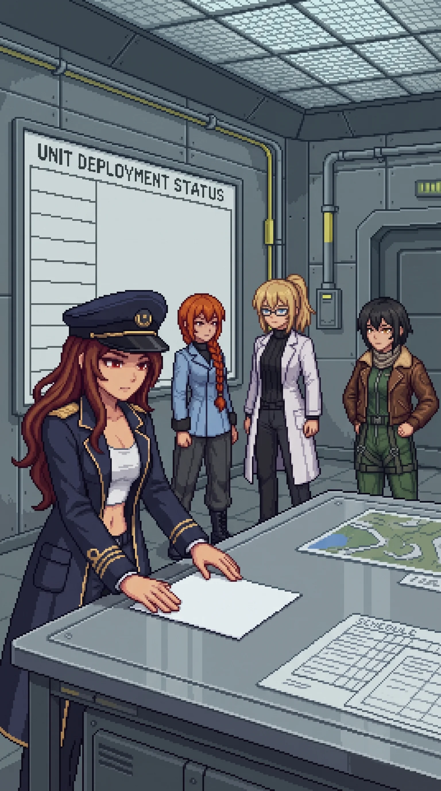

# Chapter 26: Both Names

*Published August 3, 2026*

{ .chapter-illustration }

Past the sealed corridors the facility stopped being a bunker and started being an office.

The rooms had held people once: chairs pushed back from desks, coats still on their hooks, documents everywhere, in a place where writing things down had been the work itself. The air was flat and stale, shut off from the coast years ago and left to itself. Nothing had disturbed it. It had simply waited.

Katyusha put it flat as we came into the first of the rooms. "Principal investigators, both. The records are meticulous."

I already knew whose they were before I read a word of them. Both hands were on the surfaces from the doorway in, and I knew them. Knowing it and standing in the middle of it were not the same size of thing.

Wilhelm's hand was on half of it. I knew his writing the way I knew his voice, small and level, slanted hard to the right, the letters not quite closing at the top. It was on the margins, the approvals, the initialed corners of a hundred revision blocks, and none of it surprised me.

The other half was mine.

I did not remember writing any of it. I knew it anyway, the way you know your own face in a photograph from a year you cannot otherwise account for: that is me, that is my hand, I was there, and nothing else arrives with it. My initials sat in the corner of a scope revision, small and even. I could not have told you the day I put them there, or what I believed then, or whether I had stopped first. The signature was a fact. The signing was gone.

The records went back further than the program's final shape; both of us had kept all of it, and the keeping told the whole of it without anyone having to narrate it. The legitimate chemistry came first, then the defensive applications, then a proposal, an approval, a signed extension, the scope opening one notch wider and both names under the notch. Then again. Every step reasoned in the language of the one before it, every step signed by two people who could not later claim to have been standing somewhere else while it happened. There was no page where it became what it became, only a straight, documented line from the first honest thing to the last, our names down both margins the whole way.

This was not a side project we had been pulled into. I read that off the paper, not off feeling, because feeling was not available to me and the paper was. I have learned to work with the instrument I have.

"The administrative section is ahead," Katyusha said. "The deepest of it."

We went into it, and she was not there. She had been, though, a moment ago.

There was no one at the tables, but the documents were laid out across the far surface in an order no dead building falls into on its own: by date, one set cross-referenced against another, a working spread left open mid-pass. Nothing had gone to dust. Someone had been standing here reading, and had stopped, and gone on ahead, not long ago.

Nadeshiko came down just inside the door, swept the room, and found nobody in it. "Somebody was just here. Gone now. Ahead of us again." She did not like it. "She keeps being one room ahead of us."

"Alpha-Maria." Maria crossed to the spread and read the shape of it without laying a hand on it. Nothing in her was playing at anything. "This is her. Not her writing, her. This is how I would have laid these out, down to which ones she set against which. You do not cross-reference like this on a first pass, Doc. She has stood here more than once."

Katyusha studied the arrangement. "You believe she has read them previously."

"I believe she has them memorized." It came out of Maria as a concession, not an answer. "You do not spread pages out like this to find something in them. You spread them out to sit with something you already carry. She is not reading to learn it. She is reading the way you go back to a thing you cannot put down."

I looked at the spread and kept my hands off it as well. Every page was here, all of it out, all of it ordered, not one sheet taken. Whatever she came back for, she carried out of this room in her head and left the paper lying as it was, because the paper had never been the point. The record was already inside her; the table was only where she set it to look at it again.

"Whatever she keeps coming back to," I said. "We look at what she looks at."

Past the administrative section the rooms changed character: command and logistics, where writing things down turned into sending them. Fewer documents here, and the ones that remained were of a different weight, kept apart, built to leave the building rather than stay in it.

One wall of the room was a status board, meant to hold the state of an operation while it ran: what was moving, what was committed, what was done. It was blank the way a board is blank for something that never started: a header over a column of empty fields, each waiting for an entry that never came.

At the center of the room, alone under the board, was a single prepared order.

I will describe it plainly: it was plain. Official format, the parameters section filled in and legible, not draft language, the operational specifics set down as a decided thing: the agent, the vectors, the targeting, all of it particular, all of it finished. A date sat at the top, three months before I activated Oracle. Two signatures sat at the bottom, on the authorisation line, ink, clean, unhurried. His. Mine.

It was a deployment order. It was complete. It had been ready.

It had never been sent.

Maria reached it before I did. She picked it up, and she read it, and she did not put it down.

She read it for a long time, well past the point of having read it. Whatever she was doing with it she did slowly, all the way through, and when she finally set it back on the surface, it was with a care that was the exact opposite of contempt, squared to the edge of the table, returned to the condition she had found it in.

"I know how I would hold that page." She was not looking at me. She was looking back the way we had come, toward the room where the spread still lay. "That arrangement back there. I told you it was mine. This is the same care in it. Not the handwriting. The hand behind the handwriting." She let the order rest a moment longer before she set it down. "We are made out of the same care, her and me. Somebody spent it on both of us. That is what it looks like, spent on this."

None of us had anything to set beside that.

The room was quiet. The ventilation had stopped a long time ago, and there was no sound in the facility we did not make ourselves, and for a while none of us made any.

Katyusha broke it, eventually, the way she breaks things: by naming what was on the table.

"The authorisation is complete."

"Yes."

"It was not executed."

"No."

A pause, and I understood she was not pausing for effect but because she had run the tactical account of everything since the beach through this one document and it would not resolve; she does not leave a thing unresolved without marking it.

"Why not?"

"I do not know." I did not reach for it and dress it up. There was nothing to reach for. "I do not remember."

I did reach, once. It was the reflex of checking a pocket you already know is empty. Three months between the signing of it and the morning I ran Oracle instead of this, and I was somewhere on this island being the person who did not send it, and I could not tell you a single thing about her. Not why she held it back, or whether the holding was only the shape a thing keeps until the time to do it runs out. The reach went out and closed on nothing, and I let it close.

"That is the question I would need answered," Katyusha said. She did not say it as a charge. She said it as a specification: the one line the record does not carry, the place where the reason should sit and does not. She was right on both counts: I was the only one who had ever held the answer, and I no longer did.

I did not defend myself. There was no version of the sentence that was not a lie or an excuse, and I would not make either. It is the one economy I have left.

Maria was still looking back the way we had come.

"The gap stays unfilled," she said. "Nobody ever told her to stop."

Nadeshiko turned. "What gap?"

"Her. Alpha-Maria." Maria's hat had gone level on her head, and she did not fix it. "There is one line in her record she cannot close. I have her architecture, near enough. I can feel where it would sit. Somebody set her at the tide-mark and told her to keep the count, and then the part where somebody comes back and says that is enough, you can stop now, that part never came. So she keeps it. She will keep it until the water finishes, or she does."

She looked back at the order, flat and squared where she had returned it.

"And that." She did not touch it again. "Somebody wrote that, all the way, both of you, right up to the line where you send it. And the part where somebody says now, send it, that part never came either. So it sat. Two things built all the way to the edge of the doing, and the last word never got said over either of them." She let a breath out through her nose, not a laugh. "I keep walking into the places where the word did not come, Doc. I am starting to think that is the whole island. Everything built right up to the line, and then whatever was supposed to happen at the line just did not."

The order sat between us, finished, unsent, dated, signed, both names on it in clean ink. Above it the board stayed empty. Two surfaces in one room: one holding everything a decision needs to be real, one that never recorded it becoming anything. Nobody moved to carry the order out. It had already done the only thing it would ever do: be here, complete, in a room we were leaving.

[Previous Chapter: Wrong Ground](ch25.md)
