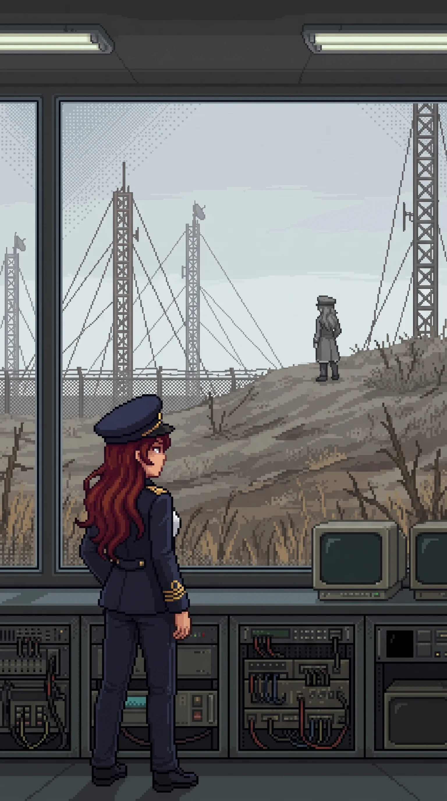

# Chapter 27: Remember It

*Published August 7, 2026*

{ .chapter-illustration }

The drones met us in the open ground east of the last buildings, four of them, out of the dead scrub along a cable run, signals pickets by their spacing, still holding a listening post that had stopped listening years ago. Katyusha took the two on the road, and Nadeshiko turned the flankers into the fence line where Maria was waiting, and it was over inside two minutes. I spent those two minutes behind the concrete anchor of a guy line, my back against ground that did not grow anything, watching the masts overhead hold perfectly still.

The masts belonged to a communications array, three rusting lattices on a rise the fence line bent to accommodate, a low receiver hall at their feet, windows intact. It was the first structure in the western sector built to face away from the island: everything else here looked inward, and this one looked out at the sea lanes.

Inside, the receiver hall was narrow and full of purpose. Racks of equipment down both walls, a navigation desk, a master console under the seaward windows. Maria went down the center aisle without slowing. She had the master bus energized and the receiver bank warming before the rest of us were past the door, each hand landing where it meant to, the same instinct Katyusha had shown on the firing range. It was not the same thing, though. Katyusha's knowledge of the range had a source she was not permitted to show me. Maria's had one she had simply never offered.

"Blockade coordination," she reported. "This station talked to the sea. Every picket line, every patrol net on the western water, they all checked in through here."

The transmission log was still mounted above the console in a metal frame, a typed table of stations and frequencies behind glass that had kept the dust off. The blockade stations were listed by designator, two letters and a number, running down the page in order of distance from shore.

I had read three of those designators before. An hour ago, in a quiet room, in the vector section of a finished order.

I did not say so. Katyusha was reading the same table, and Katyusha does not need things said.

---

The receiver bank had been warm for perhaps a minute when it spoke.

Katyusha's head came up first. "A transmission is initiating." A half beat, and the precision of what she said next was its own kind of alarm. "The frequency knows this station's receiver configuration."

It was not a broadcast, not something washing over every antenna on the coast. It was a signal built for this equipment, keyed to settings this hall had used when it was alive, sent by someone who knew them without having to look them up.

The console carried it into the room.

"You found it. I wondered if you would."

Wilhelm's voice. At the Nest it had come through glass with two years of rehearsal behind it, every word placed even as he told me the placing had failed him. This was quieter than the Nest. Not warm. Lower. The performance was not cracked but set down before transmitting, something held beneath it with an effort I could hear.

"You could have just told me."

"You need to remember it. Not be told it. There is a difference."

He stopped there. The pause was not for effect. He was giving the difference room, letting it stand, and he knew how long to leave it. That was the part I heard clearest: the pause was practiced, timed to a person he had explained things to before, measured to the length of her silences. He was waiting for someone I could not produce, and the pause ended.

"Where are you?"

He did not answer that. "The center. When you are ready."

The transmission ended. No signature, no closing procedure. The receiver bank went back to the noise floor and held there, hissing faintly.

The room stayed quiet a moment. Then Katyusha, who had been standing at the direction-finding rack with her hands still:

"He is close. The signal origin was within two kilometers."

"I know."

Maria had not moved from the console. She said it level, without turning around, with the evenness of a fact settled long ago. Not a guess confirmed. A number checked against her own and found to agree.

Katyusha and Nadeshiko looked at her. Neither asked how long she had known, and she did not volunteer it, and after a moment Katyusha returned to the rack and logged the bearing, because the bearing was hers to keep.

Nobody moved toward him. Two kilometers was nothing. We had the rest of the facility still unwalked. That was the reason I gave.

---

The receiver hall had an observation level, a half floor above the equipment, windows on three sides, built for eyes on the array field and the ground around it. I went up because the transmission had come from the northwest and I wanted it in front of me, not in my head.

Alpha-Maria was standing on the higher ground beyond the array field.

Grey against grey ground, the cap level, no reading unit in her hands. She was not working. She stood without motion, facing northwest, facing the line the signal had come down, holding the direction the way an antenna holds it. She had been inside the transmission's footprint. Every word that had reached our receiver had reached her too, and she had stopped whatever her parameters had her doing, and listened.

I had watched her measure a tide-mark under fire without looking up. I had walked through rooms she had read and left, and even that had looked like duty, a record kept because someone had told her to and no one had told her to stop. This did not look like duty. Nobody had assigned her a signal to listen for.

Maria came up the stair behind me and stopped at the rail, saying nothing, watching her.

Alpha-Maria stood a while longer. Then she turned, no glance at the array, and walked north off the rise, and the ground was just ground again.

Maria watched the empty rise a moment more, then went back down the stair, and whatever she made of what she saw, she made where none of us could watch.

---

Drona was at the foot of the array.

Not on the rise. She stood at ground level, at the edge of the field where the guy lines came down, a position with no cover and no angle, chosen by someone who had stopped spending on concealment. She was transmitting. There was no receiver in front of her and no console; whatever she used was her own. But the shape of it was legible, the stillness of her, the tilt of her head, the duration: a report. Position. Progress. Confirmation of what the recipient already suspected. One of her headphone earpieces was lit a steady orange, and the other flickered, orange and out and orange again, a small irregular light like a sign with a failing tube.

She held herself still. She had been rationing her movement since the school, more each sector, and the stillness was either discipline or all she could afford, and she did not show us which.

Then it ended. The flickering earpiece settled. And she did not walk away.

She turned her face up toward the observation windows and held still, looking at us looking at her, long enough to be sure we had seen it.

Nadeshiko had come up to the windows. "She was reporting to him."

"She has been, presumably, throughout." Katyusha gave it no weight. A known cost, already entered in the account.

"She let us see it." It was the only part I was sure of.

"That's the part." Nadeshiko's voice had the fast flat edge it took when a thing would not fit its slot. "You don't show someone the report you're writing about them. You just don't. So why..."

"Because she is telling us there are two of him she answers to, and she is not sure anymore which one she is answering."

Maria delivered it easily, leaning at the window frame, hat tilted, the usual performance back in full, which after the last hour told me more than the sentence did.

"That is speculation," Katyusha noted.

"It is. I am also right." She looked down at the small figure below, the two points of orange against the grey. "She's deciding whose side she's on."

"She might be deciding if there are sides," I said.

That one stayed where I put it. Below us Drona held her position at the guy line, facing the windows, still there when we came down, still there when we crossed the field, a sentry over a conversation that had ended, or had not.

---

We made camp that evening in a plant room off the receiver hall with one door and no windows, and I sat against the wall with the day laid out in front of me and did the accounting I do instead of sleeping.

Fourteen days since the beach, and nearly everything I knew, this island had told me: documents, signatures, a photograph, my own initials in the corners of decisions I could not surface an hour of making. The order in the logistics room had told me what I signed; nothing anywhere had let me stand inside the signing. Being told had built the entire case, and Wilhelm could have closed it with one transmission a week ago, from wherever he sat listening to us walk.

You need to remember it. Not be told it. There is a difference.

I understood the difference. It was the difference between the order and the ninety days, between the ink and the hand. The record we had walked through held everything except the one thing Katyusha had asked for, and every question that mattered now lived on the far side of that line: not what was done, but what it was like to be the person doing it, and why she stopped, if she stopped.

He was two kilometers away and not going to tell me. He had stopped telling me things; the transmission had been him saying so. Whatever I got from here on, I would have to get his way, from the inside, out of rooms this facility had not shown us yet.

The center. When you are ready.

I turned the last part over until the light was gone. He had not said ready for what. I lay down not knowing, and the not knowing followed me under.
[Previous Chapter: Both Names](ch26.md)

