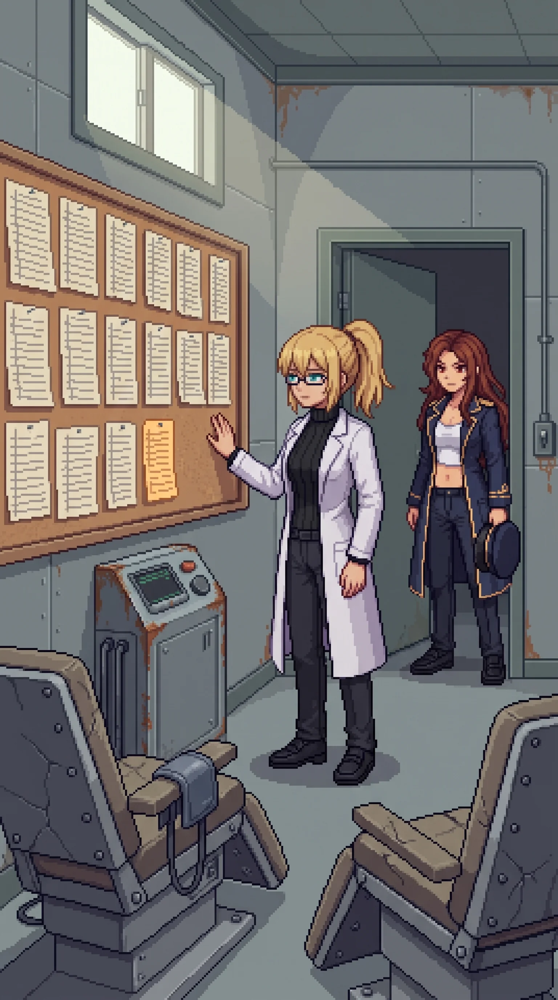

# Chapter 28: The Sessions

*Published August 10, 2026*

{ .chapter-illustration }

We broke camp before full light and went back in through the fence the way we had come. Fifteen days since the beach. Katyusha had the route logged from the evening before: back through the records section toward the archive wing, the direction Wilhelm's voice had left open for us to take when we were ready.

I did not take it.

I noticed the branch after I had already turned into it: a side corridor off the main hall, unmarked at the junction, narrower than the ones we had been walking. I stopped there and looked back at the group's line, which I had left without a reason I could hand anyone.

"Doctor." She had stopped at the junction, the others a step behind her. "That corridor does not lead to the archive wing."

"I know." I gave her nothing to work with beyond that, and she let it stand. "Give me this one first."

Nobody argued with me on the western coast anymore. That was its own kind of cost, and I had stopped totaling it days ago.

The corridor ended at a door with a placard still screwed to it, unfaded against paint gone the color of old milk: CONTROLLED EXPOSURE SUITE. AUTHORIZED PERSONNEL AND ENROLLED PARTICIPANTS ONLY. I read the second half of that twice before I understood I was reading it as a category I belonged to, not one I had once administered.

The door was not locked. I did not try the handle before I pushed it, because I already knew it would not be.

Inside: three recliner chairs bolted to the floor in a shallow arc, a monitoring cuff coiled on a hook beside the nearest one at exactly the height a seated arm would reach for it without looking. A glass-fronted booth stood against the far wall: a chair inside, a ventilation grate above it, a control panel with dials gone to rust. I crossed to the booth and my hand went to the cuff on the nearest recliner on the way past, fingers finding the buckle and pulling it two notches tighter before I stopped myself and let it fall back against the chair.

That was not competence. Competence was Katyusha's cover positions, the door sequence at the inner gate, hands that already knew how to do a thing because some earlier version of me had built the doing. This was different. It took a full breath to understand what: my hand had reached for that cuff the way a hand reaches for a strap it has worn, not one it has fastened onto someone else. The body remembering was not the builder's memory. It was the subject's.

"This was not on any floor plan we had," Katyusha noted, at the threshold, not entering yet. "There is no reference to it in the records section."

"There would not be." I said it before I had a reason ready to attach to it, and then the reason arrived a half-step behind, the way the reasons had been arriving all along this coast. "You do not file the thing you are doing to yourself in the same drawer as the thing you are building for other people."

Nadeshiko came in past Katyusha and stopped a pace inside the door, and said nothing long enough that I noticed it. She was looking at the three chairs in their arc, and I watched her count them, and I watched her not ask who the third one had been for, because none of us wanted the answer badly enough to make her.

The wall opposite the recliners held a corkboard, and pinned to it, in rows going back further than the light from the doorway reached, was the log.

I did not need long with it. Two hands had filled it, taking turns down the page, the same two names the whole way through. Heisenberg, E. Heisenberg, W. Whoever had run a session had also been the one lying in the chair for the one before it, and had come back the next week and done it to the other, and had written the result down both times in the same steady hand before either of them could talk themselves out of it.

Katyusha read it once, faster than I could, start to end. "Two participants, alternating administration. Weekly at the start, then every two weeks, then monthly." A pause, and something in her register had changed, gone precise in a way that was not quite her ordinary precision. "Your contamination readings. I logged this discrepancy twenty-two times on the firing range. I marked the entry complete because the value had stopped changing and I had run out of instruments to interrogate it with. I did not have an explanation. I closed the file without one." Another pause, not for effect. "I have an explanation now."

"You do."

"It is not a comforting one."

"No."

Maria had gone still at the edge of the corkboard, close enough to read it and not touching the pins. She read the whole chart from the top, all eleven sheets of it, in the kind of silence that told me she was not skimming.

---

*Maria*

The dates ran a full year before they thinned to monthly, and I did the arithmetic on that without meaning to, the way I do arithmetic on anything with a coastline in it. I have kept my own log since the tide-mark at the gatehouse, contamination readings, every site, every day, a habit I never asked myself why I kept. This chart is the same habit, older, aimed at two people instead of a coastline. A year of twice-weekly exposure is not a schedule. It is an investment. Somebody decided this was worth building slowly, on purpose, with the same care I would put into a defensive screen meant to last.

I am built from the same family of decision this chart records. Not the sessions. The logic under them. Calibrate for the case you hope never arrives, and calibrate early, and calibrate patiently, because the day it arrives is not the day you get to start. Someone taught me that logic before I had a self to have it with. I looked at this chart and recognized my own design in it, laid out in a stranger's hand, applied to two bodies instead of one hull.

I wanted, standing there, to find the place in the chart where it stopped mattering. Some line where I could tell Doc it evened out, that the ledger closed clean. There wasn't one. The last entry was as careful as the first. Whatever they were building toward, they finished it and kept maintaining it after, the way you keep a weapon serviced long past the point anyone's ordered you to fire it. I don't get to want things I wasn't built to have. I've made a private habit of it anyway, this whole island.

I took my hat off. I do not remember deciding to. I did not put it back on.

---

*Erika*

Maria had not looked away from the chart. Her hat was in her hand, and she was not performing anything with it, not turning the brim, not doing the thing she does with objects when she wants a room to look somewhere other than her face. "You said your numbers never moved, Doc. Since the crossing. You told yourself it was efficiency."

"I did."

"It was this."

"Yes."

Nothing came after the yes. I would not have believed her if something had.

My hand had already told me what my numbers were going to turn out to mean, buckling a cuff two notches tighter without asking me first. I had told myself I wanted to find the medical wing because a complete record needed a complete accounting. That was the reason I gave it, before I had any evidence the wing existed. It was not the reason. I wanted to find the exact size of what I had done to myself on purpose, because a wound I had chosen was easier to hold than one that had simply happened to me, and every day since the beach I had chosen which kind of easier I could stand.

I reached for something else while I stood there, a face, a voice explaining the schedule, and there was nothing behind the reach. It opened onto the same clean nothing everything before had opened onto. I let it close. I did not chase it.

There was nothing to say that was not either an excuse or a plea for something I had not earned, and I have used up my patience for both. This was not a gift I had been given by a body that happened to survive the wrong ground. It was a thing I had built into myself, on a schedule, twice a week and then once, over a year, because some earlier version of me had already known she would need to walk through what she was going to make.

Nadeshiko was the one who finally moved, crossing to the chart and reading the last few entries with her jaw set in a way I had not seen on her since the northern avenue. "Why would you do this to yourselves." Not a question aimed at me particularly. Not a question with an answer either of us was going to supply standing in that room.

"Because we believed we might have to be standing somewhere this was already in the air. And we did not want the air to be the reason we could not finish what we started."

Nobody answered that, because there was nothing in it that needed answering. It was simply the shape of the thing, flat, the only way I had left to say it.

Katyusha straightened the last sheet under its pin and stepped back from the wall. "The archive wing is still ahead of us."

"I know."

"He said the center. When we were ready."

I looked once more at the three chairs in their arc, at the cuff hanging where a hand would reach for it without looking, and understood, standing there, exactly what kind of ready he had meant. Not steady. Not resolved. Only willing, finally, to walk into the next room without asking first whether I could survive what was in it.

I was not steady. I had stopped waiting to be.

"Then let's go."

The corridor tilted the wrong direction under me, and the next solid thing was Katyusha's arm, not the floor. Her voice came flat and exact, the register she uses when she has stopped asking and started reporting.

"Doctor. You have not had an unbroken night in fifteen days. None of the broken ones have added up to rest." A pause, exact rather than gentle. "This is not an injury. I am telling you so you do not treat it like one."

There was no joke on Maria's face when she got an arm under me from the other side, and its absence told me more than my legs had. Between the two of them I arrived at the nearest recliner rather than walked to it, and the upholstery took my weight the way it must have taken theirs, once, before I stopped being able to hold onto that thought or any other.

"The archive wing keeps." Katyusha's voice was already going soft at the edge of my hearing, aimed past me now, at Maria, at whatever channel Nadeshiko was on. "It has stood for two years. It will stand for six hours."

I did not hear what either of them said back. I was already asleep, in the one room on this coast built to keep a person still.

[Previous Chapter: Remember It](ch27.md)
